# AI 开发工作流指南

> 本文档介绍 TEngine 项目完整的 AI 辅助开发工作流，包含 tengine-dev skill 按需查询架构、任务等级分级机制、会话缓存策略，以及与 openspec / unity-pipeline 的集成使用方式。

**更新时间**: 2026-04-21

---

## 前提条件

### 必需工具

在开始使用 TEngine AI 开发工作流之前，请确保已安装以下工具：

#### 1. Codex (developers.openai.com/codex)

**推荐使用 Codex** 作为主要的 AI 编程助手：

- 官方地址：[https://developers.openai.com/codex](https://developers.openai.com/codex)
- 支持本地文件操作、代码编辑、Unity Editor 自动化
- 集成 openspec、tengine-dev 等技能
- 提供上下文感知的 TEngine 开发指导

**安装方法**:
```bash
# 通过官网下载并安装
# Windows: https://developers.openai.com/codex
# 安装后登录 OpenAI 账号即可使用
```

#### 2. Codex 项目配置

项目级 Codex 配置位于 `UnityProject/.codex/config.toml`，用于声明审批策略和沙箱模式。
账号登录、模型选择和 MCP Server 配置按本机 Codex 版本的官方配置方式设置，不将密钥提交到仓库。

#### 3. 项目记忆与记忆插件（可选）

项目记忆分为两层：

- 仓库记忆：将经过确认、对后续任务有价值的事实写入 `.agents/memory/`，可审查、可提交、可跨电脑使用。
- 本机记忆插件：安装 Codex 兼容的 claude-mem 后，可自动观察会话、压缩记录、按项目检索并在新会话提供上下文。插件未安装时，仍使用仓库记忆，不阻塞开发。

项目不写死插件缓存目录，不提交插件数据库、日志、依赖目录或密钥。换电脑时重新安装或启用插件即可；需要完整历史时，再迁移用户目录下的 .claude-mem 数据目录。

### Unity 工具

#### Unity CLI/Pipeline（Unity Editor 自动化）

- 通过 Unity CLI/Pipeline 自动化 Unity Editor 操作
- 遵循 `unity-operations.md` 规则，使用 Unity CLI/Pipeline
- 规则见 [unity-operations.md](../UnityProject/.agents/skills/tengine-dev/references/unity-operations.md)

**unity-pipeline 触发词**：Unity、Unity Pipeline、in Unity、automate Unity、editor automation、创建脚本、场景分析、build scene、管理资源、Unity Editor 自动化、Unity 编辑器、Unity 技能、操作 Unity、全自动模式、半自动模式

---

## 目录

- [前提条件](#前提条件)
  - [必需工具](#必需工具)
  - [可选工具](#可选工具)
- [概述](#概述)
- [tengine-dev Skill 工作流](#tengine-dev-skill-工作流)
  - [整体流程总览](#整体流程总览)
  - [时序图一：规范获取流程](#时序图一规范获取流程)
  - [时序图二：会话内缓存机制](#时序图二会话内缓存机制)
  - [时序图三：并行多主题查询](#时序图三并行多主题查询)
  - [时序图四：规范冲突处理](#时序图四规范冲突处理)
  - [任务等级分级说明](#任务等级分级说明)
- [快速开始](#快速开始)
- [openspec 工作流](#openspec-工作流)
- [tengine-dev Skills](#tengine-dev-skills)
- [集成工作流](#集成工作流)
  - [完整开发流程图](#完整开发流程图)
  - [详细流程说明](#详细流程说明)
  - [不同场景的工作流](#不同场景的工作流)
  - [与 Codex 配合的最佳实践](#与-codex-配合的最佳实践)
- [最佳实践](#最佳实践)
  - [需求定义](#1-需求定义)
  - [代码规范](#2-代码规范)
  - [Unity Editor 自动化](#3-unity-editor-自动化)
  - [文档维护](#4-文档维护)
  - [团队协作](#5-团队协作)
  - [调试技巧](#6-调试技巧)
  - [性能优化](#7-性能优化建议)
  - [安全注意事项](#8-安全注意事项)

---

## 概述

TEngine 项目提供了一套完整的 AI 辅助开发工作流，由以下核心组件构成：

- **tengine-dev skill**: Codex 专用 TEngine 开发技能，从 `references/` 按需提供精炼规范
- **任务等级分级（L1-L4）**: 按任务复杂度决定查询深度，简单任务零开销
- **会话内缓存**: 同一主题在同一会话中只查询一次，后续任务复用
- **冲突标注**: 主动检测 references 与代码冲突，标注后以代码实现为准
- **openspec**: 规范驱动的变更管理工具
- **Unity CLI/Pipeline**: Unity Editor 自动化操作工具

---

## tengine-dev Skill 工作流

### 整体流程总览

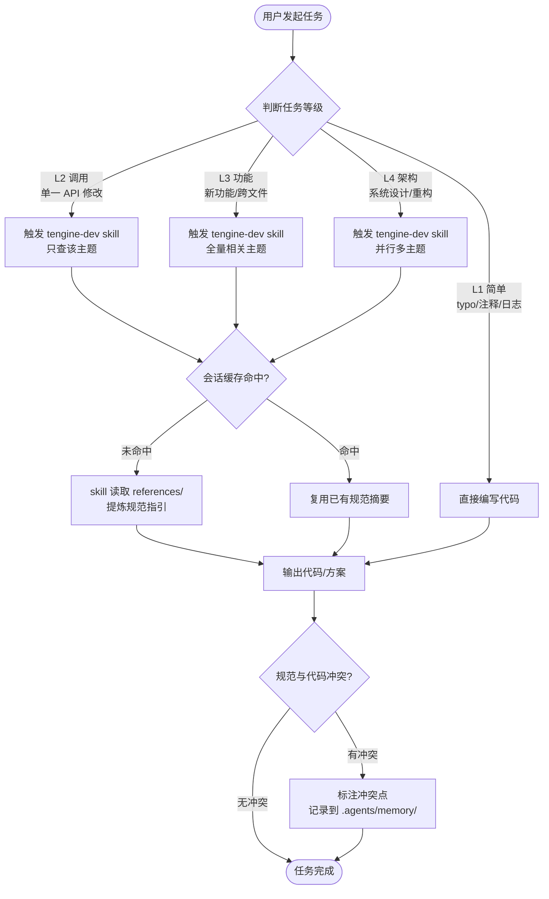

---

### 时序图一：规范获取流程

> **核心优势**：tengine-dev skill 直接从精炼的 `references/` 文档提取规范，无多余上下文噪声。

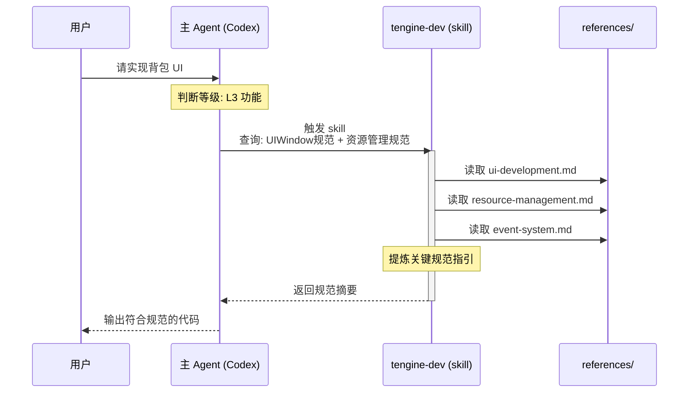

---

### 时序图二：会话内缓存机制

> **核心优势**：同一会话中相同主题只查询一次，后续任务直接复用，避免重复消耗。

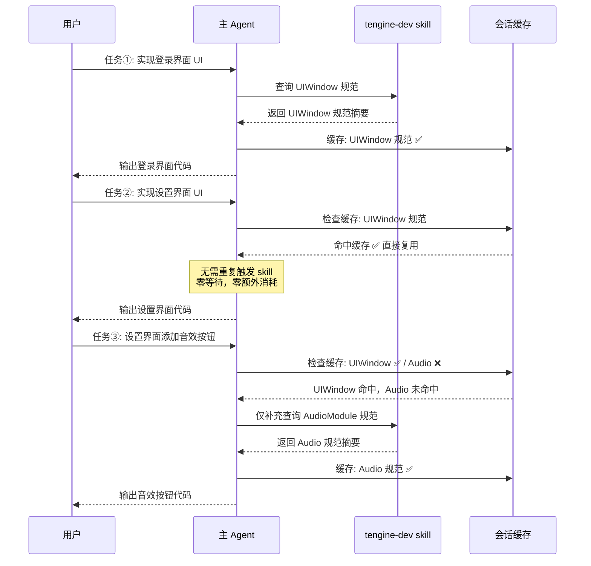

---

### 时序图三：并行多主题查询（L4 架构任务）

> **核心优势**：架构级任务并行查询多个主题，汇总后统一决策，大幅减少串行等待。

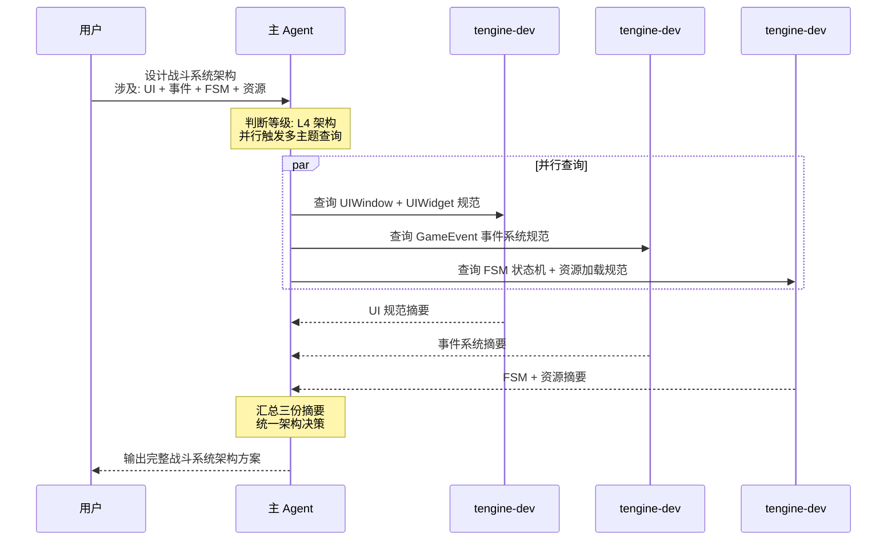

---

### 时序图四：规范冲突处理

> **核心优势**：AI 主动检测 references 与代码的不一致，标注冲突并记录，以代码实现为最终依据。

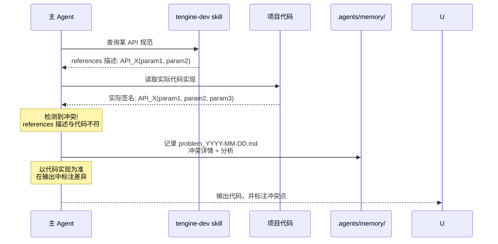

---

### 任务等级分级说明

| 等级 | 判断标准 | 知识查询策略 |
|------|---------|-------------|
| **L1 简单** | typo 修正、注释修改、日志输出、单行变量改名（前提：不涉及框架 API 名称、UI 节点前缀、事件定义或资源路径） | ❌ 跳过查询，直接编码 |
| **L2 调用** | 调用已知 API、单一模块的局部修改 | ✅ 触发 `tengine-dev` skill（只查该主题） |
| **L3 功能** | 新功能开发、跨文件修改、新增 UI/资源/事件逻辑 | ✅ 触发 `tengine-dev` skill（全量相关主题） |
| **L4 架构** | 模块设计、系统重构、多模块协作、架构决策 | ✅ 触发 `tengine-dev` skill（并行多主题） |

> **判断原则**：宁可高估等级，不可低估——不确定时上调一级。

### 工作流快速参考

```
┌─────────────────────────────────────────────────────────┐
│                   TEngine AI 工作流                      │
├─────────────────────────────────────────────────────────┤
│  Step 0  判断任务等级 L1/L2/L3/L4                        │
│  Step 1  L1 直接编码                                     │
│         L2-L4 触发 tengine-dev skill 获取规范            │
│         （会话内缓存命中则直接复用，无需重复触发）        │
│  Step 2  基于规范输出代码/方案                            │
│  Step 3  若规范与代码冲突，标注冲突，记录到 .agents/memory/│
└─────────────────────────────────────────────────────────┘
```

详细规范请参考：[AGENTS.md](../UnityProject/AGENTS.md)

---

## 快速开始

### 5 分钟上手 TEngine AI 开发

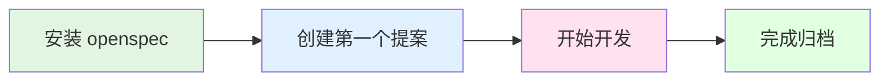

#### 第一步：安装工具

```bash
# 安装 openspec
npm install -g @fission-ai/openspec@latest

# 在 TEngine 项目根目录初始化
cd I:\WorkSpace\TEngine
openspec init

# 选择 Codex 作为 AI 工具
```

#### 第二步：创建第一个需求

```bash
# 创建一个简单的需求提案
$openspec-propose "add-simple-button"
```

Codex 会自动生成：
- ✅ `proposal.md` - 需求描述
- ✅ `design.md` - 技术设计
- ✅ `specs/` - 详细规范
- ✅ `tasks.md` - 任务清单

#### 第三步：开始开发

```bash
# 审查生成的文档后，开始实施
$openspec-apply-change
```

Codex 会：
1. 读取所有 artifact 内容
2. 逐个完成 tasks.md 中的任务
3. 自动触发 tengine-dev 技能（如果涉及 TEngine 代码）
4. 自动使用 unity-pipeline（如果需要操作 Unity Editor）

#### 第四步：测试与归档

```bash
# 所有任务完成后归档
$openspec-archive-change

# 提交代码
git add .
git commit -m "feat: add simple button"
git push
```

### 典型工作流示例

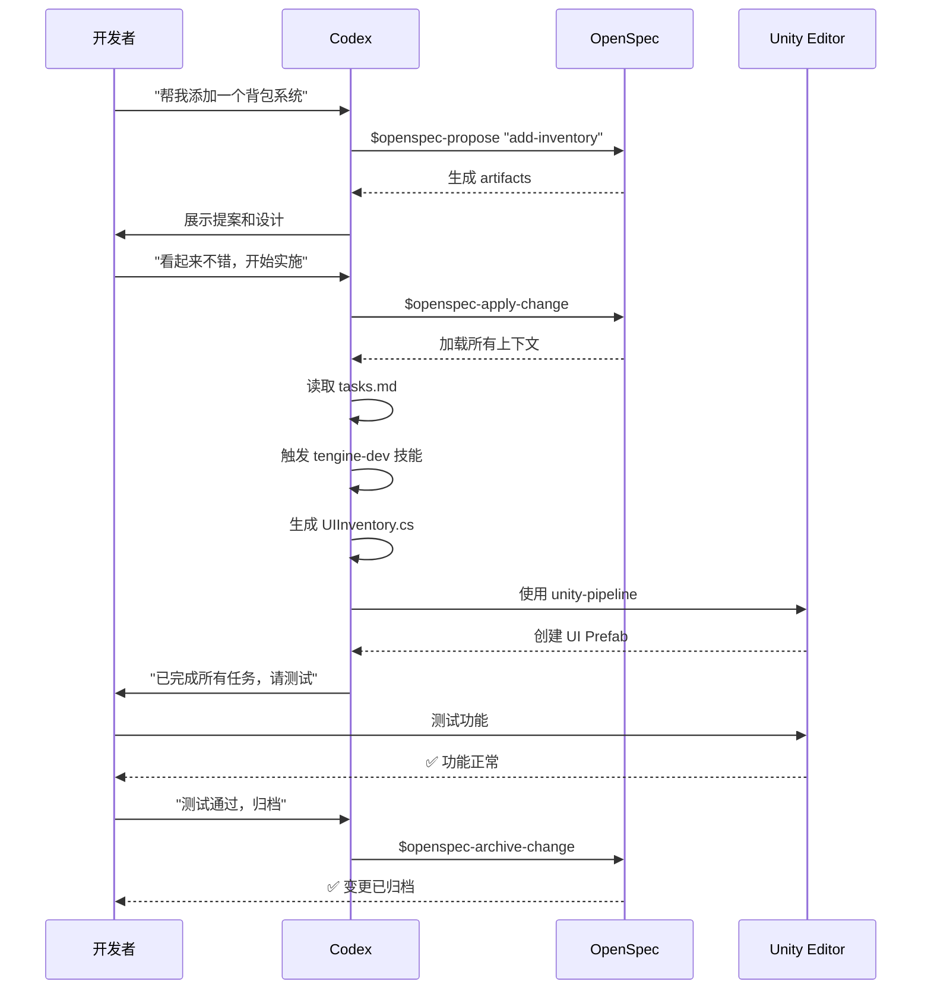

### 常见场景速查

| 场景 | 命令 | 说明 |
|------|------|------|
| 需求不明确 | `$openspec-explore` | 进入探索模式，梳理需求 |
| 新功能开发 | `$openspec-propose "feature-name"` | 创建提案并生成文档 |
| 开始编码 | `$openspec-apply-change` | 开始实施任务 |
| 查找历史经验 | `"上次怎么做的？"` | 触发 项目记忆 搜索 |
| Unity 自动化 | `"帮我创建..."`| 自动触发 unity-pipeline |
| 完成归档 | `$openspec-archive-change` | 归档变更 |

---

## openspec 工作流

### 什么是 openspec？

OpenSpec 是一个为AI编码助手设计的规范驱动开发工具，它通过轻量级的工作流程，确保人类开发者和AI助手在编写任何代码之前就能对需求达成明确共识。它通过以下方式帮助团队：

- 创建标准化的提案 (Proposal)
- 生成技术设计文档 (Design)
- 定义详细的规范 (Specs)
- 跟踪实施任务 (Tasks)

核心特点
- 🚀 轻量级：无需API密钥，最小化设置
- 🔄 现有项目优先：特别适合修改现有功能 (1→n)
- 📋 变更跟踪：提案、任务和规范差异的完整生命周期管理
- 🤖 AI工具集成：支持多种主流AI编码助手
2.为什么需要OpenSpec？
传统AI编码助手的问题
当您使用AI编码助手时，是否遇到过以下情况：
- ❌ AI根据模糊提示生成不符合需求的代码
- ❌ 遗漏重要功能要求
- ❌ 添加了不必要的功能
- ❌ 代码行为不可预测
OpenSpec的解决方案
OpenSpec通过规范驱动开发解决这些问题：
✅ 明确共识：在编码前确定所有要求
✅ 结构化变更：所有相关文档集中管理
✅ 可审查输出：AI根据明确规范生成代码
✅ 版本控制：完整追踪所有变更历史

### 安装

```bash
npm install -g @fission-ai/openspec@latest

cd your-project-directory

openspec init
```
初始化过程会：
1. 询问您使用的AI工具（Codex、Cursor等）
2. 自动配置相应的斜杠命令
3. 创建 openspec/ 目录结构

### 基础命令

```bash
# 新建议题
$openspec-propose 新建议题我要做什么

# 开始执行
$openspec-apply-change 我还要附加什么条件

# 修改完成手动归档
$openspec-archive-change

# 获取指令帮助
openspec instructions <artifact-id> --change "my-feature"
```

### 推荐配合项目记忆

### 变更结构

每个变更包含以下 artifacts：

| Artifact | 描述 |
|----------|------|
| proposal.md | 变更提案，说明"为什么"和"做什么" |
| design.md | 技术设计文档，说明"如何实现" |
| specs/*.md | 详细规范，定义系统行为 |
| tasks.md | 实施任务清单 |

---

## opsx:explore 探索模式

### 什么是探索模式？

`$openspec-explore` 是 openspec 工作流中的**思考伙伴模式**，用于在需求不明确、问题复杂、或需要调查现有代码时，先进行深度探索再决定行动方向。它不是直接生成代码，而是帮你理清思路、发现问题、评估方案。

### 核心定位

```
┌──────────────────────────────────────────────────────────────┐
│              openspec 工作流四阶段                             │
├──────────────────────────────────────────────────────────────┤
│  1. $openspec-explore  →  探索思考，梳理需求和约束               │
│  2. $openspec-propose  →  创建提案，生成设计文档和任务清单         │
│  3. $openspec-apply-change    →  实施开发，逐个完成任务                  │
│  4. $openspec-archive-change  →  归档变更，更新主规范                    │
└──────────────────────────────────────────────────────────────┘
```

> **关键区别**：`explore` 是**只读探索**，不修改任何文件；`propose` 是**写入提案**，创建变更目录和 artifacts。

### 何时使用 explore？

| 场景 | 说明 | 示例 |
|------|------|------|
| **需求模糊** | 只有一个想法，不确定具体要做什么 | "我想优化 UI 加载性能" |
| **问题调查** | 出现 Bug 或异常，需要先定位根因 | "战斗 UI 偶尔崩溃" |
| **方案对比** | 有多种实现路径，需要评估利弊 | "用 FSM 还是状态模式管理角色状态？" |
| **代码理解** | 需要深入理解某模块再决定如何修改 | "资源模块的引用计数是怎么工作的？" |
| **重构评估** | 想重构但不确定影响范围 | "把事件系统从 int 改为接口事件" |
| **架构决策** | 涉及多模块协作，需要全局视角 | "设计跨模块的战斗系统架构" |

### explore 的工作方式

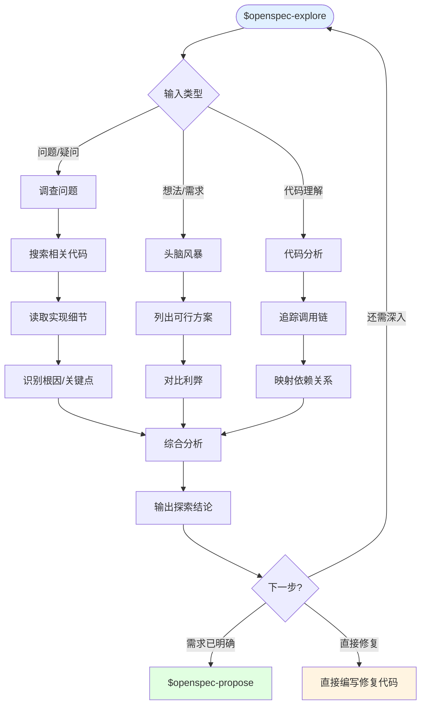

### explore 与 tengine-dev 的协作

在探索过程中，Codex 会自动触发 `tengine-dev` skill 获取框架规范，确保探索结论符合 TEngine 架构约束：

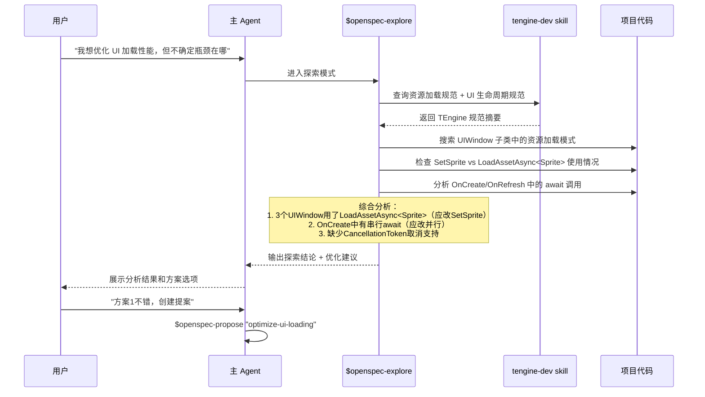

### 使用示例

#### 示例 1：Bug 调查

```
用户：$openspec-explore
      "战斗界面偶尔出现 NullReferenceException，
       堆栈指向 BattleMainUI.OnRefresh"

Codex 探索过程：
1. 读取 BattleMainUI.cs → 发现 OnRefresh 访问 _playerData
2. 搜索 _playerData 赋值位置 → 仅在 OnCreate 中赋值
3. 分析生命周期 → OnCreate 只执行一次，OnRefresh 每次都执行
4. 查找事件流 → GameEvent.Send(OnPlayerDataChanged) 可能在 OnCreate 之前触发
5. 结论：_playerData 可能在首次 OnRefresh 时尚未初始化

输出：
- 根因：_playerData 在 OnCreate 中赋值，但 ShowUI 可能在资源加载完成前触发 OnRefresh
- 建议修复：在 OnRefresh 中添加 null 检查，或在 OnCreate 中初始化默认值
- 下一步：$openspec-propose "fix-battle-ui-null-ref"
```

#### 示例 2：架构评估

```
用户：$openspec-explore
      "我想用接口事件替换所有 int 事件常量，
       需要评估工作量和风险"

Codex 探索过程：
1. 搜索所有 GameEvent.Send(int, ...) 调用 → 找到 23 处
2. 搜索所有 AddUIEvent(int, ...) 调用 → 找到 15 处
3. 搜索现有 [EventInterface] 接口 → 找到 3 个已迁移
4. 读取 event-system.md 规范 → 确认接口事件模式
5. 分析依赖 → 识别出 5 个模块需要同步修改

输出：
- 现状：23 处 int 事件发送 + 15 处 UI 监听，3 个接口已迁移
- 方案A：渐进式迁移（按模块分批，低风险，2-3天）
- 方案B：一次性迁移（需全面测试，高风险，1天）
- 建议：方案A，先迁移事件定义最集中的 IBattleEvent
- 下一步：$openspec-propose "migrate-to-interface-events"
```

#### 示例 3：性能瓶颈定位

```
用户：$openspec-explore
      "背包界面打开要 2 秒，太慢了"

Codex 探索过程：
1. 读取 BagUI.cs → OnCreate 中串行 await 5 次 LoadAssetAsync
2. 检查资源大小 → 5 个 Sprite 均小于 100KB
3. 分析 SetSprite 使用 → 未使用，手动 LoadAssetAsync<Sprite>
4. 对比规范 → SetSprite 有缓存池，LoadAssetAsync<Sprite> 没有
5. 结论：串行加载 + 未使用缓存池是主要瓶颈

输出：
- 瓶颈1：5 个串行 await → 改 UniTask.WhenAll 并行加载
- 瓶颈2：LoadAssetAsync<Sprite> → 改 SetSprite（自带缓存池）
- 预期提升：2s → ~400ms（5x 并行 + 缓存命中）
- 下一步：$openspec-propose "optimize-bag-ui-loading"
```

### explore 最佳实践

1. **先探索再提案**：任何涉及 3 个以上文件或不确定影响的任务，先用 explore
2. **带着问题探索**：给 explore 明确的疑问，而非泛泛的"帮我看看"
3. **探索结论驱动决策**：explore 的输出应直接决定是否 propose、如何 propose
4. **探索可迭代**：如果首次探索不够深入，可以继续追问，无需退出
5. **探索不修改代码**：explore 是只读的，不会修改任何文件（这是与 apply 的核心区别）

### explore → propose → apply 完整流程

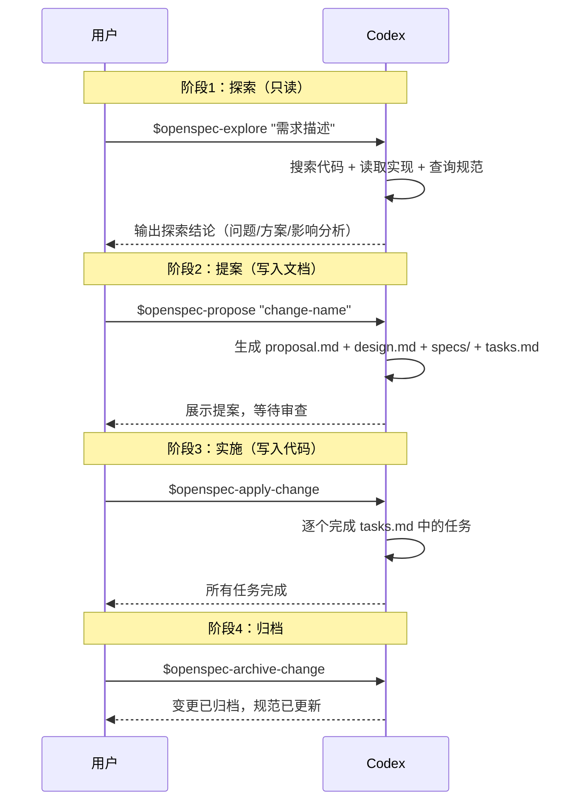

---

## tengine-dev Skills

### 什么是 tengine-dev？

`tengine-dev` 是 Codex 的技能，专门用于 TEngine 框架开发指导。

### 触发条件

在 TEngine 项目中编写或修改代码时，以下关键词会触发 tengine-dev 技能：

- **模块系统**: ResourceModule, AudioModule, TimerModule, GameModule
- **UI 开发**: UIWindow, UIWidget, UIModule
- **事件系统**: GameEvent, EventInterface, AddUIEvent
- **资源管理**: YooAsset, LoadAssetAsync, UnloadAsset
- **热更代码**: HybridCLR, GameApp, HotFix
- **配置表**: Luban, ConfigSystem

### 核心原则

tengine-dev 技能遵循以下核心原则：

1. **异步优先**: IO 操作用 `UniTask`，禁止同步加载/Coroutine
2. **模块访问**: 通过 `GameModule.XXX` 访问
3. **资源必须释放**: `LoadAssetAsync` 对应 `UnloadAsset`
4. **热更边界**: `GameScripts/Main` 不热更，`GameScripts/HotFix/` 全部热更
5. **事件解耦**: 模块间用 `GameEvent`，UI 内部用 `AddUIEvent`

### 程序集分层

```
GameScripts/Main/       → 主包（不热更）
GameScripts/HotFix/
  ├── GameProto/        → Luban 配置代码
  └── GameLogic/        → 业务逻辑（GameApp.cs 入口）
```

### 其他 Skills

#### luban-dev

Luban 游戏配置全栈工具，支持枚举/Bean/数据表的增删改查、代码生成、TEngine 集成。

**触发场景**：
- 编辑游戏配置数据（配置表/数据表/道具表/技能表/奖励表/活动表）
- 新增/修改/删除配置表结构
- 定义枚举/Bean/字段
- 导表/生成配置代码
- 编写 luban.conf 或 Schema 定义
- Luban 类型系统/校验器问题

> 即使用户未明确说"Luban"，只要是编辑游戏配置数据，也应使用此技能。

#### html-to-ugui

HTML 原型转 Unity UGUI 界面生成管线。通过 AI 生成符合 UI-DSL 规范的 HTML，烘焙为 JSON 坐标数据，再导入 Unity 自动生成 UGUI 节点树。

**触发场景**：
- 需要快速生成 Unity UGUI 界面原型
- 用自然语言描述 UI 需求并自动生成
- 创建 UIWindow/面板的初始布局
- 批量生成表单、设置、列表等标准界面

#### wiki-synchelper

Wiki 同步助手，用于"项目实现内容"与"开发 Wiki 文档"之间的双向同步，确保 AI 可基于 Wiki 快速理解项目现状并按规范继续开发。

**触发场景**：
- 用户要求扫描/比对/同步/报告项目与 Wiki 的差异
- 代码实现已更新但 Wiki 文档未跟进
- Wiki 文档需要反向修正代码结构
- 用户说"同步 Wiki"、"更新文档"、"Wiki 和代码不一致"、"扫描文档差异"

---

## 集成工作流

### 完整开发流程图

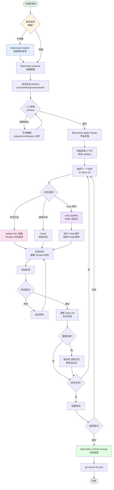

### 详细流程说明

#### 阶段 1: 需求探索与提案创建

```bash
# 如果需求不明确，先进入探索模式
$openspec-explore
# 在探索模式中思考：
# - 这个需求的真正目标是什么？
# - 有哪些技术方案可选？
# - 需要考虑哪些边界情况？

# 需求明确后，创建提案
$openspec-propose "add-user-inventory-system"
```

**自动生成的 artifacts**:
- `proposal.md` - 需求描述和目标
- `design.md` - 技术设计方案
- `specs/*.md` - 详细规范文档
- `tasks.md` - 实施任务清单

#### 阶段 2: 人工审查与完善

在 `openspec/changes/<change-name>/` 目录中检查生成的文档：

```bash
# 检查生成的文档
ls openspec/changes/add-user-inventory-system/

# 如果需要修改，直接编辑文件
# 修改后无需额外命令，opsx:apply 会自动加载最新内容
```

#### 阶段 3: 实施开发

```bash
# 开始实施，可以附加额外条件
$openspec-apply-change "使用 UniTask 异步加载，遵循 TEngine 资源管理规范"
```

**Codex 会自动**:
1. 加载所有 artifact 内容作为上下文
2. 读取 `tasks.md` 中的任务列表
3. 逐个实施任务

**开发过程中**:

- **TEngine 代码开发** → 自动触发 `tengine-dev` 技能
  - 提供模块系统、UI 开发、事件系统、资源管理等指导
  - 确保代码符合 TEngine 规范（异步优先、资源释放、热更边界等）

- **Unity Editor 操作** → 使用 `unity-pipeline`
  - 创建/修改 GameObject、Prefab、Scene
  - 配置组件、材质、动画
  - UI 布局和组件绑定

- **通用代码开发** → Codex 常规能力
  - C# 代码编写
  - 算法实现
  - 工具脚本

#### 阶段 4: 测试与验证

每完成一个任务后：
1. 运行相关测试
2. 在 Unity 中验证功能
3. 更新 `tasks.md` 标记完成状态

#### 阶段 5: 记忆保存（可选）

如果遇到重要问题或发现有价值的经验，先确认内容是否对后续任务仍有价值，再按 codex-memory Skill 的边界写入 .agents/memory/。本机记忆插件会自动记录会话观察，但不替代仓库记忆的确认和审查。

**会保存的内容**:
- 解决的技术难题
- TEngine 特定的最佳实践
- 常见错误的解决方案
- 项目特定的约定

#### 阶段 6: 归档与提交

```bash
# 所有任务完成并测试通过后
$openspec-archive-change

# 提交代码
git add .
git commit -m "feat: add user inventory system"
git push
```

### 不同场景的工作流

#### 场景 1: 新功能开发

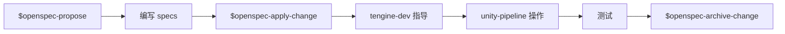

```bash
# 示例：添加背包系统
$openspec-propose "add-inventory-system"
# 审查生成的 artifacts
$openspec-apply-change "使用 TEngine 模块系统"
# 开发...
$openspec-archive-change
```

#### 场景 2: Bug 修复

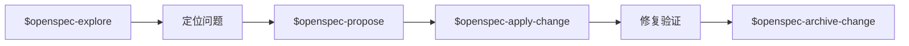

```bash
# 示例：修复资源泄漏
$openspec-explore  # 先调查问题根源
$openspec-propose "fix-resource-leak-in-ui"
$openspec-apply-change
$openspec-archive-change
```

#### 场景 3: 重构优化


```bash
# 示例：优化 UI 加载性能
$openspec-explore  # 分析性能瓶颈
$openspec-propose "optimize-ui-loading"
# 在 design.md 中详细设计优化方案
$openspec-apply-change
$openspec-archive-change
```

#### 场景 4: Unity Editor 自动化操作

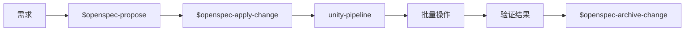

```bash
# 示例：批量创建 UI Prefab
$openspec-propose "create-ui-panels-batch"
$openspec-apply-change "使用 unity-pipeline 批量创建 10 个 UI 面板预制体"
# AI 会调用 unity-pipeline 自动化操作 Unity Editor
$openspec-archive-change
```

### 与 Codex 配合的最佳实践

#### 1. 利用技能自动触发

**无需手动调用技能**，只需在描述中包含关键词：

```
❌ 不好：请使用 tengine-dev 技能帮我创建一个 UIWindow
✅ 好的：帮我创建一个背包 UIWindow，需要加载道具图标资源
→ 自动触发 tengine-dev，提供 UIWindow、资源管理指导
```

#### 2. 分阶段处理复杂任务

```bash
# 第一阶段：UI 框架
$openspec-propose "inventory-ui-framework"
$openspec-apply-change
$openspec-archive-change

# 第二阶段：数据逻辑
$openspec-propose "inventory-data-logic"
$openspec-apply-change
$openspec-archive-change

# 第三阶段：网络同步
$openspec-propose "inventory-network-sync"
$openspec-apply-change
$openspec-archive-change
```

#### 3. 充分利用 项目记忆

```
"上次我们是怎么处理 UI 资源释放的？"
→ 使用 codex-memory Skill，通过 search -> timeline -> get_observations 查找历史经验

"帮我探索一下如何实现技能系统"
→ 使用 claude-mem 的 smart_search 或项目现有 Skill 高效扫描代码结构
```

#### 4. Unity Editor 操作自动化

```
"帮我在场景中创建一个包含 10 个道具槽位的背包 UI"
→ 自动触发 unity-pipeline
→ 按当前 Unity 实例返回的 Pipeline 命令列表执行对应操作
→ 直接在 Unity Editor 中创建完整结构
```

### 常用命令速查

| 操作 | 命令 |
|------|------|
| 探索需求 | `$openspec-explore` |
| 创建变更 | `$openspec-propose "<name>"` |
| 开始实施 | `$openspec-apply-change "额外条件"` |
| 归档完成 | `$openspec-archive-change` |
| 查看帮助 | `openspec instructions <artifact-id>` |

---

## 最佳实践

### 1. 需求定义

#### 使用探索模式澄清模糊需求

```bash
# 场景：需求不明确时
$openspec-explore

# 在探索模式中，Codex 会帮你思考：
# - 需求的核心价值是什么？
# - 有哪些隐含的边界条件？
# - 是否有现成的解决方案？
# - 需要考虑哪些技术约束？
```

#### 编写清晰的 Specs

在 `specs/*.md` 中使用场景驱动描述：

```markdown
## 场景 1: 用户打开背包

**前置条件**:
- 用户已登录
- 拥有至少 1 个道具

**操作流程**:
1. 点击主界面的背包按钮
2. 异步加载背包 UI Prefab
3. 从服务器获取道具列表
4. 渲染道具图标（异步加载）

**预期结果**:
- 背包界面在 1 秒内打开
- 所有道具图标正确显示
- 支持滚动查看更多道具

**异常情况**:
- 网络超时：显示错误提示
- 资源加载失败：使用默认图标
```

### 2. 代码规范

#### TEngine 核心原则检查清单

在每次开发完成后，确认：

- [ ] **异步优先**: 所有 IO 操作使用 `UniTask`
  ```csharp
  ✅ await GameModule.Resource.LoadAssetAsync<Sprite>(path);
  ❌ Resources.Load<Sprite>(path);  // 禁止
  ❌ StartCoroutine(LoadSprite());   // 禁止
  ```

- [ ] **资源释放**: 每个 `LoadAssetAsync` 都有对应的 `UnloadAsset`
  ```csharp
  ✅ private AssetHandle _handle;
      _handle = await GameModule.Resource.LoadAssetAsync<Sprite>(path);
      // 使用完毕后
      GameModule.Resource.UnloadAsset(_handle);

  ❌ await GameModule.Resource.LoadAssetAsync<Sprite>(path);
      // 没有保存 handle，无法释放
  ```

- [ ] **模块访问**: 通过 `GameModule.XXX` 访问
  ```csharp
  ✅ GameModule.Audio.PlaySound("click");
  ❌ ModuleSystem.GetModule<AudioModule>().PlaySound("click");
  ```

- [ ] **热更边界**: 代码放在正确的目录
  ```
  ✅ GameScripts/HotFix/GameLogic/UI/UIInventory.cs
  ❌ GameScripts/Main/UI/UIInventory.cs  // 不热更，错误！
  ```

- [ ] **事件解耦**: 使用正确的事件类型
  ```csharp
  ✅ 模块间：GameEvent.Send(EventName.OnInventoryChanged);
  ✅ UI 内：AddUIEvent(btnClose, OnCloseClicked);
  ❌ 直接引用：otherModule.OnInventoryChanged();
  ```

### 3. Unity Editor 自动化

#### 使用 unity-pipeline 提高效率

**批量创建 UI 结构**:
```
"帮我创建一个背包 UI，包含：
- 顶部标题栏（包含标题文本和关闭按钮）
- 中间 ScrollView（网格布局，3列）
- 底部按钮区（整理按钮、出售按钮）"

→ AI 自动调用 unity-pipeline 创建完整结构
```

**批量配置组件**:
```
"帮我给场景中所有名称包含 'Item' 的 GameObject 添加 BoxCollider 组件"

→ AI 批量操作，节省大量时间
```

**资源导入设置**:
```
"帮我将 Assets/UI/Icons 目录下的所有图片设置为：
- Texture Type: Sprite (2D and UI)
- Max Size: 512
- Compression: High Quality"

→ AI 批量修改导入设置
```

### 4. 文档维护

#### 及时更新项目文档

```bash
# 发现新的最佳实践时
# 直接告诉 Codex：
"这个资源释放的方案很好用，请记住：
在 UIWindow 中使用 List<AssetHandle> 统一管理所有加载的资源，
在 OnDestroy 时批量释放"

→ 经确认后写入 .agents/memory/
→ 未来遇到类似场景会自动应用
```

#### 记录常见问题

创建 `troubleshooting.md` 记录解决方案：

```markdown
### 问题：UI 加载后资源未释放

**现象**: 内存持续增长，Unity Profiler 显示大量未释放的 Sprite

**原因**:
1. 忘记保存 AssetHandle
2. 在 OnDestroy 之前就销毁了窗口

**解决方案**:
使用 List<AssetHandle> 统一管理
...
```

### 5. 团队协作

#### 统一使用 openspec

```bash
# 团队成员 A：创建需求
$openspec-propose "add-friend-system"
git add openspec/
git commit -m "docs: add friend system proposal"
git push

# 团队成员 B：审查需求
git pull
# 查看 openspec/changes/add-friend-system/
# 如有修改，直接编辑 proposal.md 等文件
git commit -m "docs: refine friend system design"
git push

# 团队成员 C：实施开发
git pull
$openspec-apply-change
# 开发...
$openspec-archive-change
git push
```

#### Code Review 检查点

提交 PR 前的自检清单：

- [ ] `tasks.md` 中的所有任务已完成
- [ ] 代码符合 TEngine 规范（异步、资源释放等）
- [ ] 已在 Unity 中测试功能
- [ ] 重要改动已记录到文档
- [ ] 变更已归档（`$openspec-archive-change`）

### 6. 调试技巧

#### 利用 Codex 快速定位问题

```
"为什么我的 UI 加载后背景图显示不出来？
代码在 GameScripts/HotFix/GameLogic/UI/UIInventory.cs"

→ Codex 会：
1. 读取相关代码
2. 检查资源加载逻辑
3. 验证 TEngine 规范
4. 提供具体修复建议
```

#### 使用 项目记忆 查找历史解决方案

```
"我记得上次遇到过类似的 UI 显示问题，是怎么解决的？"

→ 使用 codex-memory Skill 查找历史经验
→ 查找历史经验
→ 先对照当前代码和规则确认仍然适用，再应用解决方案
```

### 7. 性能优化建议

#### 资源加载优化

```csharp
// ✅ 批量预加载
private async UniTask PreloadResources()
{
    var tasks = new List<UniTask<AssetHandle>>();
    foreach (var path in iconPaths)
    {
        tasks.Add(GameModule.Resource.LoadAssetAsync<Sprite>(path));
    }
    _handles = (await UniTask.WhenAll(tasks)).ToList();
}

// ❌ 逐个加载
private async UniTask LoadResourcesOneByOne()
{
    foreach (var path in iconPaths)
    {
        await GameModule.Resource.LoadAssetAsync<Sprite>(path);
    }
}
```

#### UI 实例化优化

```csharp
// ✅ 使用对象池
var item = await GameModule.UI.CreateUIWidgetFromPool<UIInventoryItem>(prefabPath);

// ❌ 每次都创建新对象
var item = await GameModule.Resource.LoadGameObjectAsync(prefabPath);
```

### 8. 安全注意事项

#### 防止资源泄漏

```csharp
public class UIInventory : UIWindow
{
    private List<AssetHandle> _handles = new();

    // ✅ 统一管理资源句柄
    protected override async UniTask OnCreate()
    {
        var handle = await GameModule.Resource.LoadAssetAsync<Sprite>(path);
        _handles.Add(handle);  // 保存句柄
    }

    // ✅ 确保释放
    protected override void OnDestroy()
    {
        foreach (var handle in _handles)
        {
            GameModule.Resource.UnloadAsset(handle);
        }
        _handles.Clear();
        base.OnDestroy();
    }
}
```

#### 热更边界检查

```bash
# 在提交前检查热更边界
"帮我检查一下 GameScripts/ 目录下的代码是否放在了正确的热更目录"

→ Codex 会扫描代码结构
→ 指出不符合规范的文件
→ 提供修正建议
```

---

## 工具链总览

### 完整技术栈

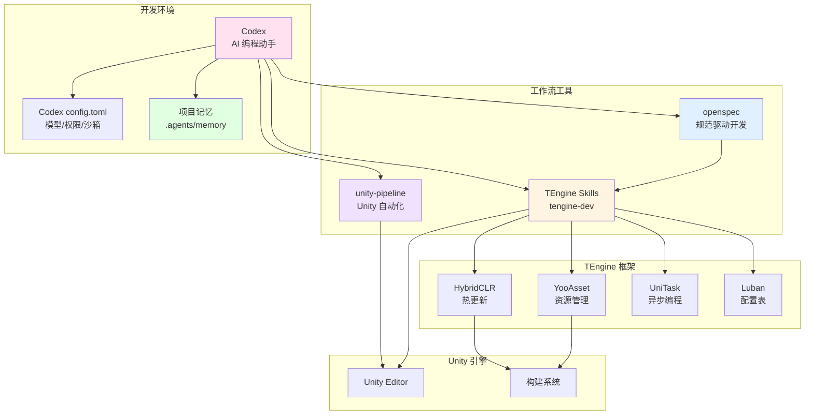

### 工具职责说明

| 工具 | 职责 | 使用场景 |
|------|------|----------|
| **Codex** | AI 编程助手核心 | 所有开发场景 |
| **Codex config.toml** | 模型、权限和沙箱 | 项目运行配置 |
| **项目记忆** | `.agents/memory/` 文件 | 记录经确认、可审查的项目事实 |
| **记忆插件** | Codex 用户级插件与本机数据目录 | 自动观察、压缩和检索跨会话上下文 |
| **openspec** | 规范驱动开发 | 需求管理、文档生成 |
| **tengine-dev** | TEngine 开发指导 | 代码开发、规范检查 |
| **unity-pipeline** | Unity 自动化 | Editor 操作、资源管理 |

### 数据流向

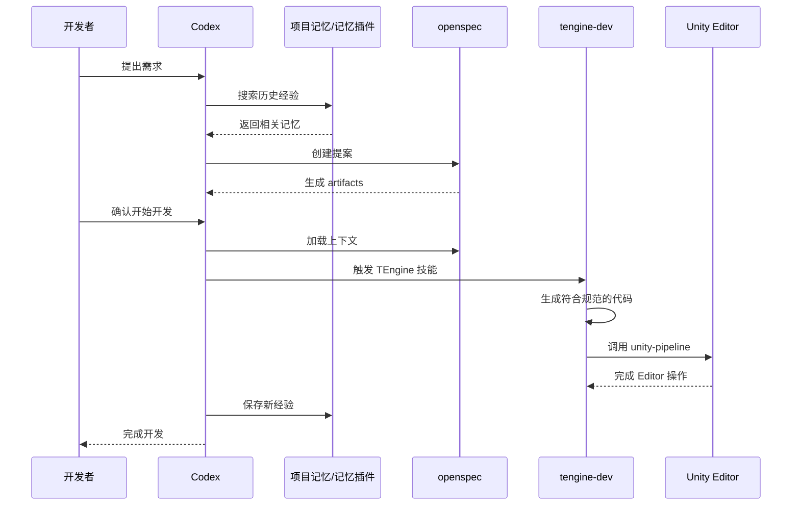

---

## 相关文档

- [openspec 官方文档](https://github.com/openspec/openspec)
- [TEngine 框架文档](Books/0-介绍.md)
- [tengine-dev 技能参考](skills/tengine-dev/references/)
- [Unity 操作规范](../UnityProject/.agents/skills/tengine-dev/references/unity-operations.md)

---

## 常见问题

### Q: Codex 项目配置放在哪里？

A: 项目配置模板位于 `UnityProject/.codex/config.toml`，用于声明模型相关运行策略、审批策略和沙箱模式。账号凭据按本机 Codex 配置管理，不提交到仓库。

### Q: 项目记忆如何使用？

A: 项目记忆有两层。`.agents/memory/` 保存经过确认的项目事实，适合提交和跨电脑使用；可选的 Codex 兼容记忆插件负责本机会话观察、压缩和检索。插件不可用时，仍可直接读取 `.agents/memory/`。

### Q: 不使用 openspec 可以吗？

A: 可以，但强烈推荐使用：
- **小需求**: 可以直接让 Codex 编写代码
- **中等需求**: 建议使用 openspec 记录设计
- **大型需求**: 必须使用 openspec 确保需求清晰

### Q: tengine-dev 技能如何触发？

A: 自动触发，无需手动调用：
- 描述中包含 TEngine 关键词即可
- 如：UIWindow、GameModule、YooAsset、UniTask 等
- Codex 会自动加载相应的开发指导

### Q: 如何验证环境配置正确？

A: 检查清单：
```bash
# 1. 检查 openspec
openspec --version

# 2. 检查 Codex 项目配置
Get-Content UnityProject/.codex/config.toml

# 3. 在 Codex 中测试
"请帮我创建一个简单的 UIWindow"
→ 应该自动触发 tengine-dev 技能

 # 4. 检查项目记忆
"上次我们是怎么处理资源加载的？"
→ 优先通过 codex-memory 检索历史；插件不可用时读取 `.agents/memory/` 中已确认的项目记录
```

---

## 进阶使用

### 自定义 openspec 模板

可以在项目中创建自定义模板：

```bash
# 在 .openspec/templates/ 目录下创建模板
mkdir -p .openspec/templates/ui-feature

# 编辑模板文件
# proposal-template.md
# design-template.md
# spec-template.md
```

### 扩展 tengine-dev 技能

在 `skills/tengine-dev/references/` 中添加自定义参考文档：

```bash
# 添加项目特定的最佳实践
touch skills/tengine-dev/references/custom-patterns.md
```

### 配置 unity-pipeline 脚本模板

在 Unity Editor 中配置自定义脚本模板，unity-pipeline 会自动使用。

---

*如有问题，请提交 Issue 或联系维护者。*


### 记忆插件接入与跨电脑迁移

Codex 兼容的本机记忆插件可自动观察会话、压缩记录、按项目检索并在新会话提供上下文。项目仓库不保存插件缓存路径、数据库、日志、依赖目录或密钥。

换电脑时，在新电脑安装 Codex 并重新安装或启用该插件；需要保留完整历史时，再迁移旧电脑用户目录下的 .claude-mem 数据目录。只需要项目长期事实时，直接克隆仓库即可，.agents/memory/ 继续可用。插件不可用时，使用 codex-memory Skill 的文件回退流程。

历史查询遵循 search -> timeline -> get_observations；摘要不足时才读取原始工具记录。自动观察不替代用户确认后的项目记忆写入。