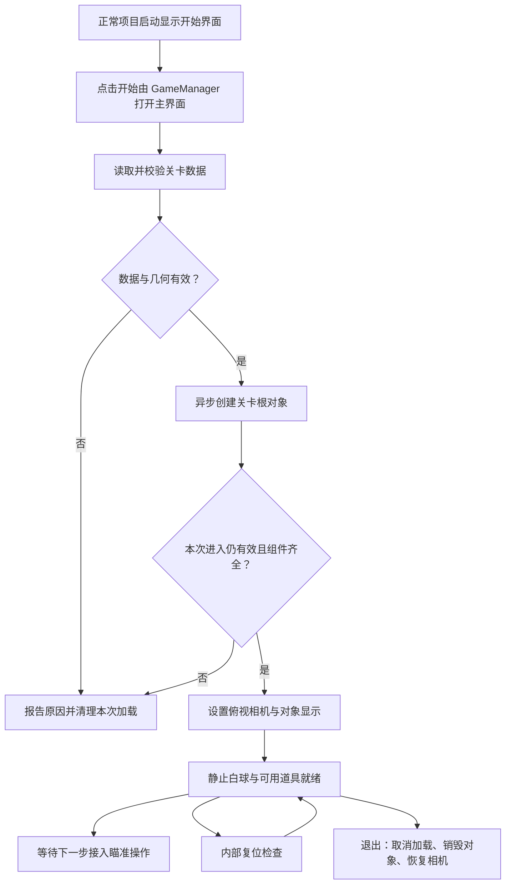

# 第一步：可运行的单关卡基础

> 2026-10-06 统一更新：脚本摆放按[当前目录归属约定](../../架构设计/数学桌球-脚本目录归属约定.md)分类；入口使用 GameManager，数据使用 LevelManager，球使用 BallManager 与 BallBase。管理器放 Module/GameModule、Module/LevelModule、Module/BallModule，具体内容在 Core 下按 Ball、Level、Rules、Session、Item、Events 分类，窗口沿用 UI。第 1～4 步完成进度来自用户报告，本文只同步设计，不要求重做已完成功能。

> 当前配置状态：本轮业务入口已按 luban-dev 调整，源表已存在但生成的 Tables 为空，完整接入仍依赖有效生成结果。后文保留第一步搭建时的历史设计与起始参数，不代表当前工程状态或本轮验证结果；以[最新 Luban 设计](../../架构设计/数学桌球-Luban配置表与数据分层设计.md)为准。

## 1. 第一步要做成什么

从项目正常启动流程进入数学桌球，看到一张俯视桌面、一颗静止白球、一个三角形和一个翻转道具。关卡对象的位置与大小来自同一份数据，目标辅助圆由三角形顶点计算得到。

完成后应当能够修改关卡摆放、重新进入并看到变化。这一步建立后续所有玩法共用的基础，不要求此时已经能击球或通关。

## 2. 现有工程从哪里接入

已核对的现状：

- 项目记录的 Unity 版本为 `6000.5.10f1`。
- 当前可访问的 `Assets/GameScripts/HotFix/GameLogic/GameApp.cs` 中 `StartGameLogic()` 的窗口调用仍是注释，未接入正式开始界面；不能据此认定开始菜单已完成。
- 主场景是 `Assets/Scenes/main.unity`，其中 `Main Camera` 当前使用透视模式。
- `Assets/AssetRaw/Actor`、`Configs`、`UI` 已有资源收集规则，地址按文件名生成。

实施时保留原有主场景和热更加载链，应用启动显示开始界面；点击开始调用 `GameManager.Instance.StartGameAsync()`，关闭开始界面并打开主界面，再准备关卡。模板资源保留，桌球只使用本局所需对象。新增资源使用唯一文件名，避免与已有资源地址冲突。

## 3. 需要准备哪些文件

以下均为拟创建或拟修改的文件，当前只输出方案。

| 文件 | 放在哪里 | 职责 |
|---|---|---|
| `GameManager` | `Module/GameModule/` | 组织进入与清理，持有关卡管理器、球管理器和本局对象 |
| `LevelManager` 与关卡数据 | 管理器 `Module/LevelModule/`；数据 `Core/Level/` | 读取、校验并提供摆放与参数，准备桌面和目标；最小接管详见 5-A1 |
| 几何与桌面显示方法 | 几何规则 `Core/Rules/`；桌面与目标显示 `Core/Level/` | 计算提示圆、缓存显示绑定，不强制每项独立脚本 |
| `BallManager`、`BallBase`、`WhiteBall` | 管理器 `Module/BallModule/`；具体球 `Core/Ball/` | 管理白球，初始化、显示、同步位置大小与复位 |
| `GameApp.cs` | 现有位置 | 接入桌球启动与释放，不改热更入口签名 |
| 单关卡数据源 | 既有 Configs/GameConfig/Datas 的两张 #billiards 源表；生成表待补齐 | 经 ConfigSystem.Instance.Tables 查询并构建业务快照 |
| 关卡根 Prefab | 复用现有 AssetRaw 收集目录 | 桌面、球、目标和道具的显示组合，序列化绑定显示组件 |
| 首批图片 | 按实际资源绑定和收集目录 | 从已交付的 PNG 中导入本步骤需要的图片 |

业务程序集是 `Assets/GameScripts/HotFix/GameLogic/`。关卡和玩法参数采用[Luban 配置表](../../架构设计/数学桌球-Luban配置表与数据分层设计.md)，生成类型保留在 GameProto，普通只读业务数据在 Core。[5-A1](05-A1-最小关卡数据管理.md)已同步当前技能入口与缺失生成结果的前提；本轮不重做显示或扩展多关，也不擅自迁移源表。

## 4. 按顺序怎么做

### 4.1 确定统一的坐标和关卡数据

采用二维 XY 平面，关卡中心为原点，横向向右、纵向向上。关卡根对象保持单位缩放，所有位置都相对它保存。

关卡数据先包含：桌面可玩范围、出生位置、初始球半径、允许的半径范围、三角形三个顶点、道具位置和触发范围。数据预留已确认的三杆默认配置，扣杆与失败循环在第七步接入，运动与蓄力参数在对应步骤加入。

背景图片覆盖的范围和可玩范围分开保存：木框属于美术边缘，出界以后应以内部可玩区域为准。

可使用下面的初始摆放进行显示验证，数值单位为关卡世界单位：

| 对象 | 初始建议 |
|---|---|
| 桌面背景 | 中心在原点，显示宽 16、高 9 |
| 可玩范围 | 横向 -7 到 7，纵向 -3.4 到 3.4，位于木框内部 |
| 白球 | 出生在 (-4, 0)，初始半径 0.35 |
| 三角形 | 顶点为 (3, 1.8)、(1.441, -0.9)、(4.559, -0.9) |
| 翻转道具 | 中心在 (-0.8, 0)，触发半径先用 0.28 |
| 半径范围 | 最小 0.2，最大 2.2，供数据合法性检查 |

这些是搭建与显示的起始值，不是最终难度参数，也不表示已证明正常出杆能够通关。加入运动和大小变化后需要重新验证并调整可解性。

### 4.2 先写数据校验与几何计算

加载后先校验，再创建可见关卡。至少检查：

- 数据字段齐全，数值有限，桌面宽高和各半径为正。
- 三角形顶点互不重合、没有共线，顶点顺序经过统一处理。
- 初始白球完整地位于桌面内，初始半径位于允许范围内。
- 三角形和道具触发区域位于桌面内；两种目标圆也完整位于桌面内。

由三个顶点算出内切圆和外接圆。显示提示圆、调试标记和后续成功判定都读取这份结果，不各自计算一套目标位置。

错误需要指出原因，例如“出生球越出桌面”或“三角形三个点共线”。不要用默认值悄悄替换错误数据。

### 4.3 搭建显示预制体

建议的对象结构：

```text
BilliardsBoardRoot
├── BoardBackground       桌面图片
├── TargetRoot
│   ├── TriangleOutline   根据顶点绘制的目标轮廓
│   ├── InscribedHint     根据内切结果绘制的虚线圆
│   └── CircumscribedHint 根据外接结果绘制的虚线圆
├── ToggleItem            道具图片
├── Ball                  白球图片
└── DebugOverlay          可玩边界、球心和真实半径辅助线
```

`BilliardsBoardView` 通过预制体中预先绑定的组件更新显示，加载后只查验绑定，不通过对象名称临时查找或运行时补组件。

从已交付素材导入桌面、常态球和可用道具即可。目标轮廓与提示圆根据关卡数据绘制，已有三角形和圆图片作为风格参考，避免图片形状与真实关卡不一致。背景、目标、道具、球和调试线依次显示，防止遮挡。

球图有透明留白：要按可见圆形的直径标定显示比例，不能把整个 128 像素画布当成球体直径。把真实半径的调试圆叠在白球上，检查轮廓贴合。像素边缘只承担视觉表现，碰撞和通关计算读取业务半径。

本步不配置自动碰撞、重力或边缘反弹。之后的运动和接触由桌球模拟逻辑驱动，目标与道具不会阻挡球。

### 4.4 设置俯视相机和窗口适配

进入关卡时明确取得并缓存主场景相机，保存原来的状态，切到面向 XY 平面的正交视角。退出关卡恢复相机状态，避免影响以后其他界面。

根据桌面宽高与当前窗口比例计算取景范围，完整显示桌面，保持球为圆形。宽屏和窄屏都通过扩大可见范围或留边适配，不拉伸桌面。相机引用供下一步的鼠标坐标转换复用。

界面后续放在框架 Canvas 内，桌球对象放在世界平面；两者分别处理遮挡与输入。不要把 Canvas 缩放后的像素坐标直接用于球心或三角形计算。

### 4.5 接上资源加载和正常启动

GameManager 在菜单切换与主界面就绪后组织以下步骤，数据加载和桌面准备委托给 LevelManager：

1. 进入加载状态，拒绝重复进入。
2. 确认 Luban 配置基础设施已异步准备并解析所需 bytes；LevelManager 查询关卡与球参数记录、构建只读快照并校验，不硬编码未经确认的资源地址。
3. 通过 `GameModule.Resource.LoadGameObjectAsync` 创建既有关卡根，明确传入本次加载的取消令牌。
4. 检查显示组件绑定，设置相机，根据数据摆放全部对象。
5. 经 BallManager 和 BallBase 初始化白球；Session 按当时阶段接入，三杆与道具状态在第六、七步正式启用。第一步只验证显示与复位，不提前写完整尝试循环。
6. 配置加载者按其持有方式配对释放源 TextAsset；LevelManager 不释放全局配置缓存。预制体实例在退出时销毁，由框架管理其资源引用。

加载返回空对象、发生异常或中途退出时，都要清理已经完成的部分。本次进入已经失效时，晚到的加载结果不能重新显示桌面；取消令牌之外再检查当前进入请求是否仍有效，失效结果立即销毁。

第一步至少在开发日志中给出加载失败的资源地址与原因，并允许再次调用进入流程；面向玩家的错误面板与重试按钮在第八步完成。异步启动的异常由入口处理，不能忽略返回结果。

### 4.6 提供复位和清理能力

第一步先提供内部复位方法：把球恢复到出生点与初始大小，把道具恢复为可用，清除临时辅助状态。反复复位不重复创建桌面对象。第七步在此基础上增加扣杆与结果规则。

退出时取消本次加载、销毁本次根对象、清除本次引用并恢复相机。以后增加的计时器和事件也由同一生命周期负责清理。普通离开关卡不调用整个框架的全局关闭方法。

## 5. 第一阶段运行流程



## 6. 第一步怎样验收

| 检查 | 通过标准 |
|---|---|
| 正常启动 | 通过原有启动链先显示菜单，点击开始后显示桌面、白球和目标；道具按本阶段需要显示占位，不提前触发 |
| 数据驱动 | 修改出生点或三角形顶点后，重新进入，相关显示和提示圆一起改变 |
| 几何正确 | 两个提示圆与调试线一致；共线顶点能被明确拒绝；近似等边示例的内外圆同心且半径比例约 1:2 |
| 球体标定 | 可见圆形与真实半径辅助线贴合，改变半径后仍保持圆形和正确比例 |
| 不同窗口 | 在 1280×720、1920×1080 和 1024×768 下桌面完整，球不被拉伸，对象不被裁掉 |
| 重复复位 | 连续复位十次，位置与大小一致，场景对象数量不增加 |
| 加载异常 | 资源缺失或数据错误有明确原因，清理后可以再次进入 |
| 加载期间退出 | 退出后不会出现晚到的桌面对象，再次进入只出现一套关卡 |
| 工程检查 | 新增脚本完成 Unity 编译检查；预制体无 Missing Script、Missing Reference；本轮无相关新增异常 |

几何计算值得做小范围自动检查，至少覆盖普通三角形、顶点顺序交换和共线输入；显示、资源引用和生命周期则需要实际进入 Unity 检查。第一步通过以后再开始第二步，避免在坐标或尺寸尚未统一时叠加操作逻辑。

## 7. 实施边界

这份文档没有执行代码修改、素材导入或 Unity 运行验证。后续实施时，普通 C# 源码可以使用文件编辑工具；预制体创建、图片导入、相机序列化修改与 Unity 验证遵循项目的 Unity CLI/Pipeline 工作流。完成后记录实际通过的检查，不把文档中的验收计划当作已经验证的结果。
