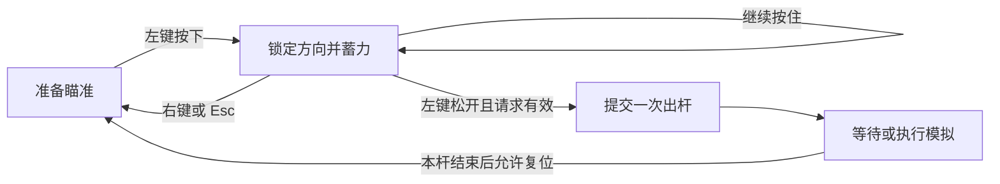

# 第二步：瞄准与蓄力

> 2026-10-06 最新方案：以[黑球入洞、六洞状态与几何解锁架构方案](../../架构设计/数学桌球-黑球入洞与六洞状态架构方案.md)为当前实施依据。用户已确认：玩家击打白球，碰撞推动黑球；全部黑球入洞才通关；洞固定在四角与两个长边中点，各洞状态为上锁、解锁可用、已进黑球、禁用；每个图形只用一种几何条件，条件用于触发道具或解锁球洞。下文的“完成全部图形通关”“几何达成立即停球”、单白球无黑球及无球洞规则保留为历史记录，已被新方案替代。Prop 架构、反弹与力度虚线预测继续纳入新版。白球犯规等未指定细节仍标为建议。本轮只修改方案文档，未改代码、配置或资源，未运行验证，旧版验收不能证明新版已实现。

## 1. 目标与前置条件

第一步已经能进入并显示关卡。本步让玩家移动鼠标瞄准、按住左键蓄力、松开提交出杆，右键或 Esc 取消。先打通操作到出杆请求的链路，实际滚动由第三步接入。

项目已经启用新 Input System，并安装对应包。沿用它读取输入，不新增旧输入系统或修改全局输入设置。

## 2. 文件职责

实际脚本摆放按[当前目录归属约定](../../架构设计/数学桌球-脚本目录归属约定.md)：BallShootComponent 在 Core/Ball/Components，出杆数据在 Core/Ball，BilliardsSession 在 Core/Session，管理器在 Module/对应名称Module。复用已有职责与实现，目录分类不增加功能组件或第二套循环。

| 文件 | 职责 |
|---|---|
| `BallShootComponent` | 统一读取输入、瞄准、蓄力、取消和生成出杆请求，不拆成多个球功能组件 |
| `BilliardsSession` | 保存本局操作许可，决定请求能否执行；以后扩展三杆规则 |
| 既有出杆请求数据 | 保存本次确认的方向和力量，提交后保持不变 |
| 唯一游戏循环 | 沿用现有帧驱动，经本局和球管理器调度组件；第三步接入模拟，不新建第二套循环 |
| 第一阶段已有对象 | GameManager 管理启停，BallManager 管理球，BallBase 同步显示，LevelManager 提供蓄力参数 |

帧调度使用同步调用，不在每帧启动异步任务，球组件不各自建立独立 Update 计时。本局管理用明确的状态枚举组织允许的操作，不需要给每个状态另建一个类。当前设计以[小球核心逻辑](../数学桌球-小球核心逻辑分步设计.md)为准。

## 3. 制作顺序

### 3.1 把鼠标转换为关卡位置

使用第一步缓存的游戏相机，把鼠标屏幕位置投影到关卡平面，再转换为关卡本地坐标。与球心的连线作为瞄准方向。

鼠标与球心过近时保留上一条有效方向，避免零方向。鼠标位于留边区域、界面按钮或弹窗上时，不接收开始蓄力；按下和松开使用边沿事件，不能每帧把“正在按住”当成一次点击。

### 3.2 显示瞄准箭头

在准备瞄准时显示箭头，从球体边缘朝鼠标方向延伸。箭头随球半径调整起点，不穿过球心。图片只是显示，真正的方向来自业务数据。

### 3.3 开始蓄力并锁定方向

只有准备瞄准状态可以开始蓄力。左键按下时复制当前有效方向，从最低有效力量开始累计；达到最大力量后保持，不自动出杆。鼠标随后移动不会改变本杆方向。

蓄力时长和最低力量写在关卡数据中。力量统一按 0 到 1 的比例表达，最低有效力量大于零，使短按也能出杆。蓄力暂停或失焦时不继续累计；暂停与失焦的完整处理在第八步接入。

### 3.4 松开提交一次出杆

本局管理检查状态、方向和力量，接受后生成不可变的出杆请求，并立即离开蓄力状态。第三步接上运动时，该请求初始化本杆轨迹。

第二步可以在开发日志中显示请求方向与力量，提交后暂时进入“等待模拟”状态；通过内部复位方法重新测试。第三步删除这项临时验证行为。不要在输入脚本中扣杆；第七步由本局管理在同一次接受操作中扣杆。

### 3.5 取消与输入恢复

蓄力时右键或 Esc 取消，清除本次力量并回到瞄准。取消与松开同时发生时优先取消。本步 Esc 在蓄力时用于取消，第八步再规定其他状态下的暂停用途。

失焦、暂停或关闭关卡时清除未提交的请求。恢复时先等待旧的左键释放，再允许下一次按下，避免把失焦期间的松开误认为出杆。

## 4. 流程

## 5. 验收与下一步

- 移动鼠标时箭头正确；改变窗口比例后，箭头仍指向鼠标对应的关卡位置。
- 开始蓄力后移动鼠标，方向保持；短按有最低力量，长按停在最大力量。
- 右键或 Esc 取消不产生出杆请求；取消与松开同帧也不出杆。
- 滚动状态、弹窗或界面按钮点击不会再次提交；一次松开只记录一个请求。
- 失焦后释放左键，再回到游戏，不产生意外出杆。

完成后交给第三步的内容是“已经确认的方向和力量”，不直接修改球的位置。完整力量条与杆数界面在第八步完成。
