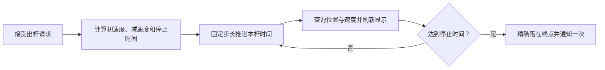

# 第三步：固定路程运动

> 2026-10-06 最新方案：以[黑球入洞、六洞状态与几何解锁架构方案](../../架构设计/数学桌球-黑球入洞与六洞状态架构方案.md)为当前实施依据。用户已确认：玩家击打白球，碰撞推动黑球；全部黑球入洞才通关；洞固定在四角与两个长边中点，各洞状态为上锁、解锁可用、已进黑球、禁用；每个图形只用一种几何条件，条件用于触发道具或解锁球洞。下文的“完成全部图形通关”“几何达成立即停球”、单白球无黑球及无球洞规则保留为历史记录，已被新方案替代。Prop 架构、反弹与力度虚线预测继续纳入新版。白球犯规等未指定细节仍标为建议。本轮只修改方案文档，未改代码、配置或资源，未运行验证，旧版验收不能证明新版已实现。

## 1. 目标与前置条件

接收第二步的出杆请求，让白球沿锁定方向直线移动并逐渐减速。没有成功或出界等提前结束时，所有力量都走同一段计划路程；大力初速度更高，到达终点的时间更短。

本步暂时保持球半径不变，下一步再加入大小变化。运动使用自定义轨迹计算，不依赖 Rigidbody 摩擦来决定停止距离。

## 2. 文件职责

| 文件 | 职责 |
|---|---|
| `BallSimulationComponent` | 合并轨迹、减速、模拟时间与停止；下一步在同一组件加入半径变化 |
| 既有本杆状态 | 保存已确认输入、轨迹起点和当前模拟结果，不与图片位置混用 |
| 唯一游戏循环与 Session | 固定步长协调模拟，后续查询规则再提交状态；不让球模拟反向调用目标 |
| `BallManager`、`BallBase` | 管理球并同步位置显示，不重复计算轨迹 |
| 已有本局与关卡文件 | 接受出杆后开始模拟；数据增加最小/最大初速度、计划路程和模拟步长 |

运动与半径采用同一个模拟组件，方法可以在内部组织，不要求另建 Motion、Radius 脚本。目录按[实际约定](../../架构设计/数学桌球-脚本目录归属约定.md)：模拟组件在 Core/Ball/Components，球基类和状态在 Core/Ball，本局在 Core/Session，管理器在 Module/对应名称Module。复用已完成实现；本文同步设计，不重做用户报告完成的运动。

## 3. 制作顺序

### 3.1 确定力量到速度的映射

力量越大，初速度越高。第一版使用单调的线性映射，最低力量对应正的最小速度，最大力量对应最大速度。所有速度和路程参数来自关卡数据，并检查为正值。

一次出杆确认后保存速度与路程，不再读取鼠标或蓄力状态。道具也不能改写这份运动轨迹。

### 3.2 使用能精确停止的减速轨迹

采用恒定减速度。按“减速度等于初速度平方除以两倍计划路程”计算本杆减速强度；停止时间等于“两倍计划路程除以初速度”。这样速度减到零时，刚好走完计划路程。

按本杆累计模拟时间直接计算位置，不把每帧位移反复累加到 Transform 上。任意时间都能查询位置、速度和已走路程，供第五、六步查询步内事件。到达停止时间时精确钳制到终点，禁止负速度和倒退。

例如计划路程为 8，初速度分别为 4 和 8 时，完整停止时间分别为 4 秒和 2 秒，终点相同。这只是逻辑检查用例，最终游戏速度由第九步试玩确定。

### 3.3 用固定步长推进

先以每秒 120 次作为模拟步长的建议起点，并写入可调整数据。唯一游戏循环累计正常游戏帧时间，够一个步长就推进一次，未满部分保留到下帧。

设置每帧最大追赶步数，防止极端卡顿导致长时间阻塞。超过上限时丢弃超出的积压并记录开发诊断；当帧表现为模拟放慢，不允许直接跳到远处终点。所有真正推进的区间都要执行完整事件检测。

显示可以在前后两个模拟结果间插值，位置与半径用同一个显示时刻。事件发生时立即使用事件结果显示，避免成功后还继续插值向前移动。

### 3.4 完成本杆停止通知

轨迹停止只报告一次，由本局管理决定接下来如何处理。当前阶段可以通过开发复位继续测试；第七步接入失败反馈与三杆循环。

后续成功、出界或道具触发时，模拟会精确推进到事件时刻。道具只改变大小变化方向；成功或出界直接终止本杆，不再走完计划路程。

## 4. 流程

## 5. 验收与下一步

- 对低、中、高三种力量，测得自然停止路程一致，停止时间随力量增加而缩短。
- 30、60、144 帧显示下，按相同模拟时间查询的轨迹一致；正常运行最终终点一致。
- 最后一个模拟步超出停止时间时仍停在正确终点，没有负速度或多走一步。
- 极端卡顿不会瞬间跳过整个模拟区间，追赶次数受到限制。
- 停止通知只发生一次，滚动中再次输入不会重置轨迹。

运动计算是纯逻辑，针对终点、停止时间和任意时刻查询做小范围自动检查。完成后，第四步在同一条时间轴上增加半径变化。
