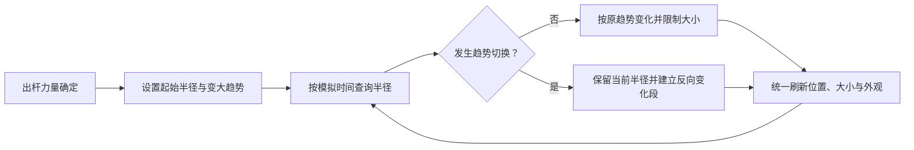

# 第四步：球的大小变化

## 1. 目标与前置条件

第三步已经能按固定计划路程滚动。本步加入“大力出球更大”和“滚动时持续变大”，同时完成变小状态的逻辑，供第六步的道具触发。

半径变化与本杆模拟时间关联，保持连续。不能通过替换球图片来决定真实大小，也不能让半径变化影响速度或计划路程。

## 2. 文件职责

| 文件 | 职责 |
|---|---|
| `BallSimulationComponent` | 在运动组件中合并半径计算，处理增长、缩小、上下限和连续分段，共用模拟时间 |
| 既有本杆状态 | 记录起始半径、趋势及最近一次切换的时刻与半径，不写回关卡配置 |
| `BallBase` | 根据真实半径同步显示大小，并应用趋势外观，不重复计算半径变化 |
| 关卡数据与校验 | 增加力量对应的起始半径范围、变大速率、变小速率和半径上下限 |

沿用[小球核心逻辑](../数学桌球-小球核心逻辑分步设计.md)的组合方式，不独立创建 BallSizeComponent、Radius 或趋势球组件；目录按[实际约定](../../架构设计/数学桌球-脚本目录归属约定.md)：模拟组件在 Core/Ball/Components，球基类在 Core/Ball，关卡数据在 Core/Level，LevelManager 在 Module/LevelModule。本次只统一文档，不重做用户报告完成的大小变化。

## 3. 制作顺序

### 3.1 将力量映射到起始半径

使用单调的线性映射：最低有效力量出球较小，最大力量出球较大。起始半径范围必须位于允许的最小、最大半径之内。

待机球使用第一步的展示半径，提交出杆后应用本杆起始半径。可加很短的显示过渡，但真实模拟半径从出杆时就确定，不延后启动判定。

如果新的出球半径在出生点已经越界，仍属于有效出杆并立即按出界处理，不能把它当成无效点击。正式关卡应通过数据校验与试玩避免不合理的最大力量配置。

### 3.2 按游戏时间连续变大

每杆开始恢复为变大状态，按配置的每秒变化量增长，达到最大半径后保持。用模拟时间计算，避免帧率不同导致长到不同大小。

半径达到上限时虽然不再增长，但趋势仍保留为“变大”。自然停止或本杆结算后不再变化，停球画面保持结果时刻的大小。

### 3.3 实现趋势切换

趋势切换时，先查询触发时刻的当前半径，将它作为新变化段的起点，再反向变化。变小达到下限后保持；处于上限时切换为变小，应立即能够缩小。

本阶段通过开发验证入口调用趋势切换，检查逻辑。玩家只能在第六步接入道具后切换，不增加额外的正式操作键。

### 3.4 为连续判定提供变化分段

一段增长或缩小是线性的，达到上下限后是一段恒定半径。把“到达半径上限/下限”的时刻提供给模拟器，后续在这些时刻分段检查事件。

道具触发也会建立新变化段。每段位置与半径都有确定的时间函数，第五、六步可以检查整个区间，不能只检查每帧末尾。

### 3.5 更新显示并预留暂停

球体外观表达趋势：青色边缘表示变大，珊瑚红表示变小；状态图标和文字在第八步添加。两张球图片的主体直径标定一致，换图只改变外观。

暂停时不推进本杆模拟时间，因此位置和半径一起冻结。第八步恢复时不补算暂停期间的真实时间。

## 4. 流程

## 5. 验收与下一步

- 低、中、高力量的起始半径单调增加，都在有效范围内。
- 用同一模拟时间查询，30、60、144 帧显示下半径结果一致。
- 切换前后的触发瞬间半径一致，球心、速度和剩余路程不变。
- 达到最大后切换能缩小，达到最小后反向验证能增长，半径不会为零或负数。
- 暂停验证入口冻结模拟时间时，球的大小保持；自然停止后也保持。
- 调试半径圆与两种球图片的可见轮廓一致。

完成后交给第五步的是“任意本杆时刻的球心与真实半径”，不是球图片的包围盒。
