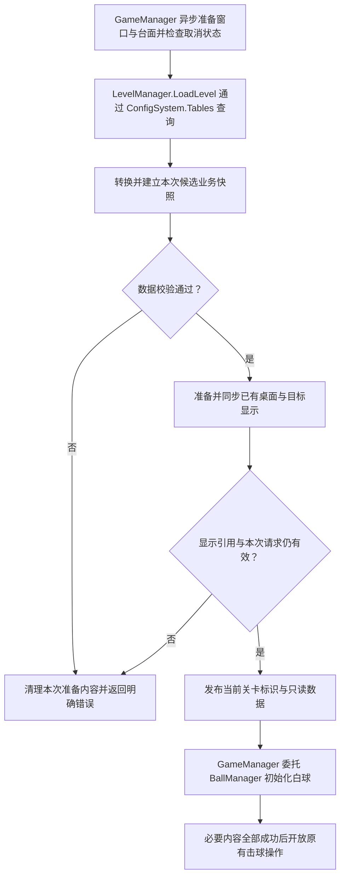

# 第 5-A1 步：最小关卡数据管理

日期：2026-10-06 · 版本：v0.2 · 任务等级：L3 · 状态：Luban 数据源已确定，功能待制作

导航：[数学桌球：文档导航（简明版）](../../架构设计/数学桌球DEMO-v0.2/00-文档导航与设计决策.md)。架构依据：[关卡管理器设计](../../架构设计/数学桌球-关卡管理器设计.md)、[脚本目录归属约定](../../架构设计/数学桌球-脚本目录归属约定.md)。本步属于[第五步目标判定](05-第五步-内切与外接判定.md)的阶段 A，先完成数据准备。

## 1. 本步只完成什么

建立最小 `LevelManager`，将当前单关卡的配置读取、校验和提供集中到一个入口。已有桌面、三角形显示和白球初始化都使用这份数据，给下一步静态目标判定准备稳定输入。

用户报告桌面、击球、运动和大小变化已完成，本步复用这些内容。新增行为只有关卡数据归属与准备流程，不增加目标判定公式、连续求解、成功停球、三杆循环、道具翻转、选关或存档。

2026-10-06 更新：按已确认的 luban-dev 对齐方案修改 LevelManager 和 GameManager 的配置入口。本轮未改变配置源、导表脚本或模板，未执行验证；空 Tables 和缺失的生成类型仍是完整接入的前提问题。

## 2. 当前 Luban 数据来源

实施前在实际功能所在工程中查清三件事：

1. 桌面范围、三角形顶点、出生位置和半径现在分别从哪里取得。
2. 现有显示脚本和球初始化通过哪些方法接收配置。
3. 数据资源与关卡根对象现在由谁加载、持有和释放。

按用户要求，已有参数按原值迁入 Luban 表，取消多处各存一套有效配置的做法。如果值暂时写在场景字段或脚本中，先记录相同数值，再接管理器；不借数据归属调整改变玩法参数或关卡摆放。

数据来源为[Luban 配置表](../../架构设计/数学桌球-Luban配置表与数据分层设计.md)。仓库根目录 Configs/GameConfig/Datas 已有 #billiards_level.xlsx、#billiards_ball.xlsx；不再要求重新建表。当前定义工作簿没有有效注册记录，生成的 Tables 为空，bytes 缺失。helper 识别出的自动导入候选表名不等同于实际生成 API；有效生成类型、引用和字段仍需明确。本轮业务继续保留原有 TbLevel、TbBall 查询，尚不能在当前空 Tables 上接入。

配置访问统一使用 ConfigSystem.Instance.Tables。现有 ConfigSystem 没有 IsReady、Initialize、Release，业务不再调用这些接口。生成代码由既有脚本维护，LevelManager 只查询并构建业务快照，不新增解码器、反射适配或默认关卡兜底。

## 3. 本步需要的数据

下表表达数据含义，实际字段名和结构复用已有工程。原方案中的 `BilliardsLevelData` 是建议名称，不要求因文档名称与现有类型不同而重建。

| 数据组 | 包含什么 | 使用者 |
|---|---|---|
| 关卡身份 | 当前关卡标识；若有资源配置，复用其资源地址映射 | LevelManager 与进入流程 |
| 桌面几何 | 逻辑可玩范围、关卡坐标约定 | 桌面显示与后续边界判断 |
| 三角形目标 | 三个逻辑顶点 | 三角形显示与后续 GoalJudge |
| 目标容差 | 内切/外接允许的贴合误差 | 后续 GoalJudge |
| 白球出生配置 | 出生位置、出生半径、已有允许半径范围 | BallManager、BallBase |
| 已有击球和模拟配置 | 当前已使用的参数，按现有结构引用或保存 | 击球与模拟组件 |

美术背景范围与逻辑可玩范围保持区别，木框不算可玩区域。UI 像素不作为三角形顶点或球半径单位。沿用已有桌面本地二维坐标，显示时由现有坐标转换处理，不另设一套判定坐标。

当前球心、速度、半径变化、累计模拟时间和操作状态属于球或本局运行数据，不写回关卡配置。以后剩余杆数和胜负同样属于 Session。

## 4. 最小脚本职责

| 对象 | 本步要做的事 |
|---|---|
| `LevelManager` | 查询已准备的 Luban 关卡与球参数记录，转换并校验，准备桌面与目标引用，发布只读快照，卸载所属内容 |
| 关卡数据对象 | 保存上述配置，供协作者读取；不自行加载、出杆或结算 |
| `GameManager` | 异步准备主界面与世界台面，检查取消状态后调用 LoadLevel；成功后初始化球与本局，失败时按原入口清理并恢复 |
| 已有桌面与目标显示脚本 | 接收管理器提供的数据并同步显示；不自己重新加载同一份配置 |
| `BallManager` / `BallBase` | 使用已准备的出生配置，沿用现有初始化和复位能力 |

LevelManager 使用普通 C# 对象，由 GameManager 持有；数据校验先作为其内部方法或复用已有几何方法，不为校验、顶点顺序、范围检查分别增加管理器或功能组件。当前不需要增加逐帧更新入口。

目录按最新分类：LevelManager 放 Module/LevelModule，关卡数据与桌面目标显示放 Core/Level；GameManager、BallManager 分别放 Module/GameModule、Module/BallModule，球基类与具体球放 Core/Ball。窗口继续沿用 UI。本轮修改既有管理器，不新增同职责配置管理器。

## 5. 配置校验与错误处理

在改动显示和初始化球之前完成校验。至少满足：

| 检查项 | 有效条件 | 失败示例 |
|---|---|---|
| 数据完整性 | 本步必需字段或引用齐全，关卡标识与请求一致 | 缺少三角形顶点 |
| 数值有效性 | 坐标、范围、半径、容差等均为有限值 | 半径为 NaN，顶点包含无穷值 |
| 可玩范围 | 最小边界小于最大边界，有有效面积 | 桌面宽度为零 |
| 出生球 | 半径为正，位于允许范围，球体完整在桌内 | 球心在桌内但圆周越界 |
| 三角形 | 顶点互异且不共线，坐标与桌面一致 | 三点共线或两点重合 |
| 贴合容差 | 非负且有限，长度单位与逻辑半径一致 | 使用屏幕像素作为容差 |
| 已有模拟参数 | 满足现有实现的有效范围和组合关系 | 允许半径上限小于下限 |

目标顶点按既有摆放规则核对与桌面范围的关系。三角形方向归一化、边参数准备复用可靠的几何方法；数值退化判断与玩法贴合容差分开。当前不制作内切、外接公式或关卡可解性证明。

错误信息应指出关卡标识、出错字段和原因，例如“当前关卡出生球体越出可玩范围”。配置错误返回准备失败，不用默认值静默补齐，不当作玩家本杆失败。

## 6. 加载与发布顺序

GameManager 保持已有关闭开始界面、打开主界面的顺序，在允许击球前完成下列关卡准备：

候选数据与当前有效数据分开：读取、解析或校验中不能让外部读取半成品。LevelManager 的“已准备”表示关卡数据与其负责的桌面/目标内容已准备；GameManager 的“游戏已开始”还需要白球和原有运行流程成功，二者不混用。

本步不创建空的 GoalJudge 或第二个 Session 来占位。已有本局流程直接接收只读关卡数据；下一步再让静态判定器使用其中的目标与容差。

若当前实现已经先创建显示对象，本步只调整数据接入及发布时机，确保校验通过前不开放交互；不重建桌面、重复实例化白球或改变现有球模拟。

## 7. 状态与只读数据

异步进入状态由 GameManager 的进入锁与取消令牌管理；LevelManager 不另建异步状态机。Current 在关卡准备成功后赋值，卸载时清空。

- 加载中重复请求明确拒绝或由既有进入锁合并，不创建第二份关卡。
- GameManager 有 Session 时拒绝重复开始请求，避免再生成台面或重新摆球。LoadLevel 本身负责准备关卡，不承诺相同 id 自动返回旧快照。
- 本阶段不接受已运行时直接切换另一关，未来切关由 GameManager 组织结束旧局后再进入。
- 当前数据发布后保持稳定；复制外部可变数组或封装集合，避免显示脚本改顶点影响判定。
- LevelManager 负责快照赋值与台面准备；GameManager 持有台面实例并负责销毁。Current 不开放外部写入。

实际接口为 LoadLevel(int id, BilliardsBoardView view, CancellationToken token)、Current、UnloadLevel(BilliardsBoardView view)。配置查询同步执行，不为已无独立异步 IO 的方法保留 Async 后缀；台面与 UI 的异步方法继续沿用原流程。

## 8. 资源与清理

台面与窗口沿用 TEngine 的异步资源接口。配置查询按指定的 luban-dev 技能使用现有同步懒加载入口；与通用异步 IO 规范的差异见 Luban 设计文档，不再要求改造模板以实现字典缓存衔接。创建 Tables 本身不能证明表资源或记录有效，当前空 Tables 更不能用于查询。

源 TextAsset 的持有方式沿用现有 ConfigSystem；本轮不新增加载器释放协议。LevelManager 不再加载或克隆 bytes、不释放全局 Tables；卸载只解除台面绑定并清空当前快照。业务快照不保留可变生成记录或资源对象供外部改写。

退出或准备失败时，GameManager 使当前进入请求失效，先解除 Runner 会话绑定，再释放 Session、清理球，由 LevelManager 解除台面绑定并清空快照，最后销毁台面实例。退出清理不通过模拟停止方法更新可能已销毁的白球 Transform，也不调用不存在的 ConfigSystem.Release。

加载过程中退出时，取消未完成准备并检查请求是否仍有效；迟到的结果只能清理，不能再次发布为当前关卡或开放击球。重复卸载不重复归还资源，已经释放的管理器不接受新的准备请求。

## 9. 本步制作顺序与验收

| 小项 | 制作内容 | 如何验收 |
|---|---|---|
| 1. 配置生成前提 | 获取有效生成结果；需要改配置时先列具体差异并确认 | 生成类型、表引用和 bytes 匹配；不手改生成代码 |
| 2. 校验与只读提供 | 在最小 LevelManager 中校验并提供有效数据 | 有效数据可读取；无效数据返回清楚错误且不发布 |
| 3. 接入原开始流程 | 按先关卡准备、再球初始化的顺序衔接 | 正常进入，桌面与球保持原有表现，加载中不能出杆 |
| 4. 清理与重复进入 | 接管持有者、取消与退出边界 | 重复请求不多生成内容，退出后旧结果不重新出现 |

以下为用户另行要求检查后的验收项目，本轮不执行。查询并校验成功后才应用快照；覆盖缺失记录、无效引用、缺失 bytes、解析失败与失败重试。至少留下以下检查记录：

- 修改表中一个目标顶点，重新导表并重新准备后，显示与提供的数据一致；白球运行状态不反向改配置。
- 出生半径无效、出生球体越界、顶点重合/共线、容差无效，各自明确准备失败。
- 准备失败后可以从原入口重试，不残留半成品桌面或第二颗球。
- 已准备时重复请求相同关卡，内容数量和出生状态不发生额外变化。
- 加载中退出与连续进入/退出时，没有旧结果发布、重复监听或重复资源释放。
- 接入后原有瞄准、蓄力、运动和大小变化仍按既有行为运行。

数据校验用纯逻辑用例检查；加载、显示接入、资源生命周期及已有球功能回归通过项目允许的 Unity 流程验证。这些是未来实施验收要求，本次没有执行或声称通过。

## 10. 完成后进入哪一步

本步功能验收通过后才进入[5-A2：静态内切与外接判定](05-A2-静态内切与外接判定.md)。下一项只使用当前准备好的球心、半径、三角形和容差，返回判定结果；不接滚动、不停球、不发送通关通知。单时刻规则、输入输出与正反例已在该文档独立展开。

第 5 步到本版最终验收的设计文档均已齐备，[5-C](05-C-停球与成功提示.md)也已展开；这不表示相应功能已经实现。导航分别记录文档进度与用户报告的开发进度，功能仍逐项验收后再衔接。

本轮修改 LevelManager、GameManager 与相关设计文档；没有修改 Excel、Defines、luban.conf、导表脚本、模板或生成代码/bytes，没有运行编译、测试、Unity 或功能验收。有效生成结果尚未补齐，不能宣称配置接入完成。
