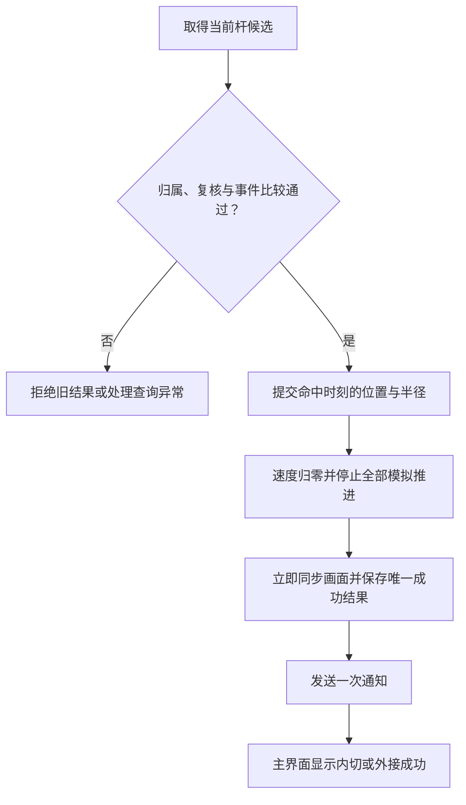

# 第 5-C 步：停球与成功提示

> 2026-10-06 最新方案：以[黑球入洞、六洞状态与几何解锁架构方案](../../架构设计/数学桌球-黑球入洞与六洞状态架构方案.md)为当前实施依据。用户已确认：玩家击打白球，碰撞推动黑球；全部黑球入洞才通关；洞固定在四角与两个长边中点，各洞状态为上锁、解锁可用、已进黑球、禁用；每个图形只用一种几何条件，条件用于触发道具或解锁球洞。下文的“完成全部图形通关”“几何达成立即停球”、单白球无黑球及无球洞规则保留为历史记录，已被新方案替代。Prop 架构、反弹与力度虚线预测继续纳入新版。白球犯规等未指定细节仍标为建议。本轮只修改方案文档，未改代码、配置或资源，未运行验证，旧版验收不能证明新版已实现。

日期：2026-10-06 · 版本：v0.1 · 任务等级：L3 · 状态：实施设计完成，功能待制作

前置：[5-B：运动区间查询](05-B-运动区间查询.md)。本步完成第五步的最后一项设计；总体规则见[加入目标判定](05-第五步-内切与外接判定.md)。这里只定义后续实施行为，不表示已完成游戏功能。

## 1. 本步目标

Session 接受当前杆最早有效的目标结果，提交那个时刻的真实球心和半径，同时停止移动与大小变化，保存唯一成功结果，并让主界面显示“内切成功”或“外接成功”。

成功后球留在达成状态，不恢复出生点，不继续走完剩余路程。当前先使用主界面文字，第八步再完善正式结果界面；三杆扣除、失败循环和道具分别按后续步骤接入。

## 2. 职责与数据归属

| 对象 | 本步职责 |
|---|---|
| `BilliardsSession` | 检查候选归属和事件先后，组织一次状态提交，持有成功结果与操作许可，通知界面 |
| `BilliardsGoalJudge` | 返回目标候选及静态复核结果，不写球、不停球、不发通知 |
| `BallManager` | 通过现有球引用转交本局的提交与停止操作，不另存胜负 |
| `BallSimulationComponent` | 按命令提交命中时刻的位置和半径，速度归零，终止同杆后续推进 |
| `BallBase` | 同步位置、大小与停止后的显示；保留原有初始化和复位职责 |
| 主界面 | 显示已提交的成功类型；重新显示时读取当前快照 |
| `GameManager` | 保留进入、退出和清理职责，不再建立一份可独立修改的本局结果 |

内部提交使用直接调用，跨模块结果通知使用项目 `GameEvent`；UI 使用 `AddUIEvent`。复用已有结果和事件定义，没有时仅增加本步实际所需内容，不新建成功管理器、停球组件或结果单例。文件位置遵循[目录约定](../../架构设计/数学桌球-脚本目录归属约定.md)：管理器在 Module/对应名称Module，球与组件在 Core/Ball 及 Components，本局与快照在 Core/Session，判定器与结果在 Core/Rules，命令和通知接口在 Core/Events。

## 3. 一次成功的提交顺序

1. 检查本局尚未关闭、当前杆仍在模拟、候选属于当前局和当前轨迹；已经处理结果时拒绝重复提交。
2. 确认输入有效且求解完成，候选位于本次区间内；按原轨迹复核球心、半径和目标条件。Session 比较出界、目标与停止的时刻，只有目标胜出才能进入成功提交。
3. 检查球引用及提交条件，在不可重入的同步处理段中屏蔽继续出杆和重复结果处理；该段不穿插异步等待或界面通知。
4. 将模拟时间提交到 `tHit`，位置和半径取同一时刻的真实值，再将速度归零，关闭运动与半径推进，丢弃该杆未处理的区间与积压。
5. 经 BallBase 立即同步画面，清除朝帧末继续插值的状态。使用真实半径，不吸附到理论目标圆，也不取帧末或出生状态。
6. 提交成功类型与命中时间等只读结果，Session 进入成功状态，最后发送一次结果通知。通知时业务状态已经确定，监听者即使立即请求重开，也不能重复结算旧杆。

提交条件不满足、球对象已失效或求解尚未完成时，不发送成功、不改写为正常未命中。保留可诊断的原状态，停止本次推进并走既有异常处理；不能带着不完整结果继续推进整段。

## 4. 停止的具体含义

| 内容 | 成功后要求 |
|---|---|
| 模拟时间 | 固定为命中时刻，不再累计本杆时间 |
| 球心与真实半径 | 保留命中值，后续帧不改变 |
| 速度 | 归零；候选中原速度仅用于复核，不作为停球后状态 |
| 半径趋势 | 可保留命中时的增长/缩小趋势信息，但趋势不再推进大小 |
| 显示插值 | 立即显示命中状态，不插值到旧区间终点 |
| 输入 | 拒绝出杆；清除旧蓄力、箭头和已排队的同杆请求 |
| 规则查询 | 不再对这颗已成功的球重复检测或广播 |

停止不能调用 BallBase 复位。成功点的大小与图片主体直径保持现有标定关系，不修改美术资源或目标几何来让画面“更像成功”。

## 5. 主界面提示

继续使用已规划的 `MainUI`，成功文本统一为“内切成功”或“外接成功”，由 Session 的目标类型映射。不会因为文字刷新而再次设置业务成功状态。

窗口在 `RegisterEvent` 使用 `AddUIEvent` 监听通知，`OnRefresh` 获取完整快照，`OnCreate` 绑定已有组件。复用现有事件定义；若使用接口事件，沿用项目 `[EventInterface]` 与 Source Generator，不手写事件生成代码，并核对原热更入口已执行 `GameEventHelper.Init()`。

每个结果包含当前本局与本杆归属，旧局通知不显示到新一局。窗口重开或晚到时读取最新已提交状态，不能依靠错过的一次通知才能显示成功。首次结果通知只发一次，快照刷新可以重复读取。

本目标判定阶段不强制创建独立结果窗口；设置按[独立音量方案](../数学桌球-设置界面与四类音量设计.md)分步接入，存档或制作详情继续占位。主界面尚无文本节点时，后续实施按项目 UI 绑定与 Unity Pipeline 流程补最小节点。

## 6. 边界、复位和清理

有效出杆应用起始半径后，在 `t=0` 已达成也按此提交；球初始已出界或出界与目标同刻时，由出界优先。目标与自然停止同刻时，先提交目标成功。两种目标同刻成立仍以内切优先。

无目标候选时沿用当前自然停止行为，第七步再把出界或停止未达成接入扣杆与失败循环。本阶段不自动扣杆、自动判整局失败或启动下一杆。

开发复位由 Session 组织：先作废旧杆和旧结果，清理输入、轨迹、积压及显示插值，再经 BallManager 调用 BallBase 恢复出生状态，最后恢复操作许可。只移动球回出生点不能解除 Session 的成功状态。正式重开在第七步实现。

退出时 GameManager 先阻止新请求、使当前局失效，再清理 Session 的模拟、监听和反馈，经 BallManager 清球，最后由 LevelManager 卸载关卡内容。窗口与未完成加载由入口统一收尾；不在此调用框架全局 Shutdown 或重新访问已释放的单例。

## 7. 流程

## 8. 制作顺序与验收

按“提交并停止 → 立即同步画面 → 保存结果并拒绝重复 → 主界面文本 → 复位与退出清理”逐项制作。使用 5-B 的固定轨迹检查命中状态，再按项目规范进行 Unity 运行和显示验证。

- 内切与外接分别停在对应命中状态，运动和半径变化同时停止。
- 高速经过时保留区间中的命中值，不能停在帧末；自然停止端点和 `t=0` 命中正确。
- 成功后持续点击、重复投递同杆结果、暂停再恢复，均不再次出杆或发送成功。
- 出界优先级正确，求解未完成不能显示成功或静默提交终点。
- 窗口重新显示能恢复正确成功文本，旧局通知被拒绝；不需要重新发送成功事件。
- 开发复位后可以再次出杆、再次成功；退出后无旧提示，输入与模拟停止。
- 30、60、144 帧显示下，停球位置、真实半径和命中时间在约定精度内一致。

5-A1、5-A2、5-B 和本步都实际验收通过，才算第五步目标判定整体完成。接下来按[第六步：翻转道具与连续事件](06-第六步-翻转道具与连续事件.md)继续实施。

本次仅完成设计文档，未新增代码、UI 节点、Prefab 或场景，未执行 Unity 编译和运行验收。
