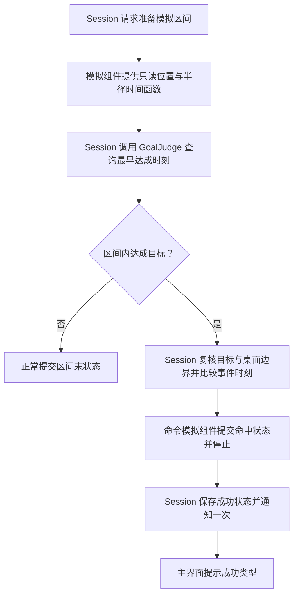

# 第五步：加入目标判定——内切与外接

> 2026-10-06 最新方案：以[黑球入洞、六洞状态与几何解锁架构方案](../../架构设计/数学桌球-黑球入洞与六洞状态架构方案.md)为当前实施依据。用户已确认：玩家击打白球，碰撞推动黑球；全部黑球入洞才通关；洞固定在四角与两个长边中点，各洞状态为上锁、解锁可用、已进黑球、禁用；每个图形只用一种几何条件，条件用于触发道具或解锁球洞。下文的“完成全部图形通关”“几何达成立即停球”、单白球无黑球及无球洞规则保留为历史记录，已被新方案替代。Prop 架构、反弹与力度虚线预测继续纳入新版。白球犯规等未指定细节仍标为建议。本轮只修改方案文档，未改代码、配置或资源，未运行验证，旧版验收不能证明新版已实现。

日期：2026-10-06 · 版本：v0.9 · 任务等级：L3

前置：[小球核心逻辑分步设计](../数学桌球-小球核心逻辑分步设计.md)。职责依据：[架构评审与目标判定职责设计](../../架构设计/数学桌球-架构评审与目标判定职责设计.md)。

关卡数据归属见[关卡管理器设计](../../架构设计/数学桌球-关卡管理器设计.md)。进入静态判定前，先由 LevelManager 接管已有配置读取、校验和数据提供，不重做已经完成的球功能。

第 5 步四项设计均已独立展开：[最小关卡数据管理](05-A1-最小关卡数据管理.md)、[静态内切与外接判定](05-A2-静态内切与外接判定.md)、[运动区间查询](05-B-运动区间查询.md)、[停球与成功提示](05-C-停球与成功提示.md)。本版后续各步文档也已齐备，功能接入仍等待 5-A1 实际验收通过。

## 1. 本步目标与当前进度

根据用户提供的进度，桌面搭建、击球操作、白球运动和大小变化已完成，下一步进入目标判定。这是本次规划采用的前提，不代表本次已经通过 Unity 验证这些功能。

目标是：白球在运动途中或自然停止时，完成三角形的**内切或外接任意一种**即可成功。第一次达成时立即停止运动和大小变化，保留成功时刻的球心与半径，并显示成功类型。

本次继续制作设计文档，不编写代码。本步不加入翻转道具、三杆循环、完整结算页面或自动重开；只完成目标判定与必要成功反馈。

## 2. 目标判定独立于小球组件

新增普通 C# 规则对象 `BilliardsGoalJudge`，内切、外接与区间内首次达成查询都放在其中。它读取目标和球的只读数据，返回判定结果，不继承 `BallComponentBase`，不挂在白球上。相关数学计算组织成内部方法，不为两种判定分别建立组件或策略类。

本局协调使用此前规划中的 `BilliardsSession`，若实际工程已有则复用；没有时只补当前需要的操作许可、模拟协调和一次成功状态。当前阶段 A 先制作目标数据与静态判定，阶段 B、C 再接入 Session，不一次实现所有流程。

| 对象 | 本步职责 |
|---|---|
| `LevelManager` | 读取、校验并提供当前关卡的三角形、容差与范围，组织目标显示准备与卸载 |
| `BilliardsGoalJudge` | 读取目标几何与轨迹数据，判断内切/外接，返回区间中的最早达成时刻；不修改球 |
| `BilliardsSession` | 组织区间查询、比较事件时刻，决定提交终点或命中状态，保存一次成功结果并通知主界面 |
| `BallSimulationComponent` | 提供同一时刻的位置和半径查询，按本局命令提交状态或停止；不调用目标规则 |
| `BallBase` | 将命中时刻的逻辑状态同步到画面，沿用初始化和复位能力 |
| `BallManager` | 管理球对象，转交本局对球的调度与操作许可，组织球的复位 |
| `GameManager` | 持有 LevelManager、Session 与 BallManager，组织准备与清理，保留游戏入口和界面生命周期 |
| 目标显示与主界面 | 目标显示读取 LevelManager 提供的几何；主界面显示“内切成功”或“外接成功” |

判定器与本局对象按[当前目录归属约定](../../架构设计/数学桌球-脚本目录归属约定.md)分别放 Core/Rules、Core/Session；模拟组件放 Core/Ball/Components，关卡数据和目标显示放 Core/Level，管理器放 Module/对应名称Module。使用现有关卡数据与球状态，结果类型按已有工程复用，不增加目标管理器、第二个单例或通用求解框架。

目标数据由 LevelManager 准备，本局初始化时接收稳定的只读快照并将几何与容差传入判定器；白球继续只配置自身能力组件。初始化时校验三角形与模拟查询能力，引用明确绑定，不运行时补组件或按名字寻找引用。判定器不持有 LevelManager，也不通过全局查找关卡。

## 3. 目标数据与显示

本步关卡数据需要三角形三个顶点和一个可调整的贴合容差 `FitTolerance`。统一采用已有桌面本地坐标及世界长度单位，与球心、半径保持一致。

由 LevelManager 从已准备的 Luban 关卡与球参数记录构建、校验并发布这一份只读业务数据，目标显示与 GoalJudge 共用；当前球状态与本局结果不写回配置表。数据分层按[Luban 设计](../../架构设计/数学桌球-Luban配置表与数据分层设计.md)，判定器接收参数，不自行读表或建立独立配置源。

三角形顶点必须有限、互不重合、不共线；初始化时统一顶点方向，预计算三条边的朝内单位法线和边线参数。目标显示与判定读取同一份数据。

如果桌面已有正确三角形，复用它；如果还没有，本步先显示一个三角形目标。三角形是几何目标，不阻挡或反弹白球。图片仅负责外观，不能根据贴图包围盒或碰撞回调判断目标。

内心、外心及对应目标圆可以用于调试和辅助显示，优先复用已有几何方法。提示圆开关与美术完善不属于本步必要范围。

## 4. 两种判定规则

### 4.1 内切成功

给定真实球心 `C`、半径 `r`，计算球心到三条边的朝内有符号垂直距离 `d1、d2、d3`。

同时满足以下条件才成功：

- 半径有效，球心位于三角形内部或边界。
- 三条边的距离都满足 `|di - r| ≤ FitTolerance`。
- 圆不明显越过任意三角形边，最多允许配置容差内的微小越界。

仅贴住一条或两条边、球心在三角形外、圆只是进入了三角形，都不能成功。朝内距离与半径贴合的条件同时约束位置和大小。

### 4.2 外接成功

计算三个顶点到球心的距离 `q1、q2、q3`，三个距离都满足 `|qi - r| ≤ FitTolerance` 才成功。

顶点应在圆内或圆周附近，允许配置容差内的误差。仅包住三角形但圆太大、只有一两个顶点接近圆周，都不能成功。

不能只检查球心接近内心/外心，必须校验三条边或三个顶点的实际贴合关系。

### 4.3 容差与结果

贴合容差属于玩法配置；浮点数误差、时间求解精度属于计算精度，二者分开。窗口缩放、图片尺寸和帧率不能改变贴合容差。

结果统一表达为未达成、内切成功、外接成功。若两种条件同刻成立，固定采用内切优先；出现此情况时检查容差是否过宽。

## 5. 由本局流程接入球模拟

判定器不在 Update 中读取显示位置。模拟组件先准备只读区间，Session 在提交该区间状态前同步调用目标判定，位置与半径来自同一个模拟时刻。求解与提交属于桌球模块内部协作；跨模块结果通知使用项目事件机制。

### 5.1 先完成单时刻判定

先用固定球心与半径验证内切、外接和反例，确认不同顶点顺序与非等边三角形都正确。这部分不改变已完成的运动逻辑。

### 5.2 再查询运动区间

本项已独立展开为[5-B：运动区间查询](05-B-运动区间查询.md)，明确轨迹分段、最早候选、完整求根、端点复核与边界事件比较；状态提交和一次成功提示仍在阶段 C 接入。

对每个模拟步检查整个区间 `[t0, t1]`，不能只检查帧末状态，也不能只等球停下才判断。高速经过目标时，步首与步尾可能都不成功，中间却短暂贴合。

沿用已有连续判定思路：按半径上下限、自然停止等时刻分段，分别求各条边/顶点的贴合有效时间区间，取条件交集，比较两种目标最早成立的时刻。

若当前运动是二次时间轨迹，半径是线性或恒定变化，可以求这些条件的边界根并检查相邻区间；需覆盖端点和相切重根。已有可靠求解工具则复用，没有时只增加判定器需要的内部求解逻辑。

不能以“多采几个点”作为不会漏判的保证。若现有模拟只能返回离散帧末状态，先补足区间内的位置与半径查询能力，再接入连续判定，不因此改动击球操作或玩法规则。

候选时刻用单时刻规则复核，数值处理不能把结果推进到候选之前或区间之外。

### 5.3 达成后统一停止

具体提交顺序、停止含义、一次通知与清理见[5-C 独立文档](05-C-停球与成功提示.md)。

Session 找到并复核最早成功时刻后，命令模拟组件同步设置：

- 模拟时间为命中时刻。
- 球心与半径为该时刻的真实值。
- 当前速度归零，停止位置与半径的后续推进。

`BallBase` 立即显示这个结果，不继续向帧末状态插值。模拟停止不调用复位，不把球拉回出生点。

Session 保存并处理一次成功结果，进入成功状态后拒绝继续击球；GameManager 不另存一份可独立修改的本局胜负。跨模块结果通知沿用项目 `GameEvent` 规范；窗口使用 `AddUIEvent` 监听，先核查现有初始化与事件定义，不重复建立第二条结算入口。

主界面只需文字提示“内切成功”或“外接成功”，不在本步新增完整结果弹窗。

## 6. 边界与复位规则

- 仅在有效出杆的模拟过程检查目标；待机展示球不自行触发通关。
- 应用本杆起始半径后，检查 `t = 0`；首次状态满足目标则立即成功。
- 自然停止时检查终点；目标达成与自然停止同刻出现时，先处理目标成功。
- 成功结果只发一次，成功后不再继续检测并重复广播。
- 本杆无目标达成时沿用当前停止行为，不在本步自动扣杆、判整局失败或重开。
- 整局/本杆复位由 Session 协调，先清除结果与操作许可，再经 BallManager 调用 `BallBase` 恢复出生状态；仅复位球不能自动解除本局成功状态。
- 出界条件必须限制成功：命中时球体应完整位于可玩范围。若运动阶段已有出界处理，比较事件时刻，不能给已出界的球判成功。
- 若出界处理尚未完成，本步至少确保进入目标查询的区间未越过最早出界时刻；出界与成功同刻时出界优先。失败反馈与三杆规则仍留到后续。
- 退出游戏内容后，旧杆或旧局的异步通知不得提交到新一局。

## 7. 本步按三个小阶段实施

| 小阶段 | 只增加什么 | 验收结果 |
|---|---|---|
| A. 目标数据与静态判定 | LevelManager 准备目标数据与显示，在独立 GoalJudge 中完成两种几何判定 | 数据来源统一，正例和反例能明确区分 |
| B. 运动区间判定 | Session 接入既有模拟，调用判定器找到最早达成时刻 | 途中成功能识别，不依赖显示帧率 |
| C. 停球与成功反馈 | Session 提交结果，命令停球并提示成功类型 | 球停在正确位置和大小，只通知一次 |

**当前下一次实施先做阶段 A 的关卡数据管理（导航 5-A1）**：最小 LevelManager 接管现有配置读取、校验与提供。通过后才按[5-A2 独立文档](05-A2-静态内切与外接判定.md)做静态判定：判定器返回结果，不接运动推进、不停球、不触发通关。A 通过后再做 B，B 通过后再做 C。三个小阶段都完成才算“加入目标判定”整体通过。

阶段 A 内也逐项推进：先完成最小 LevelManager 的数据读取、校验与提供，再完成静态 GoalJudge。不同时制作选关、解锁、下一关或存档。

## 8. 验收清单

- 精确内切圆和精确外接圆分别成功；容差范围内轻微偏差成功，明显超出容差失败。
- 只贴住一条边、只包住三角形、外接时只贴住部分顶点等反例失败。
- 交换顶点顺序与使用非等边三角形不改变规则正确性。
- 高速通过目标，步首/步尾都不成立但中间成立时，仍找到最早成功时刻。
- 出杆起始、模拟分段端点、半径到上限、自然停止时刻不漏判。
- 成功后位置与半径保持不变，继续点击不出杆、不重复通知；复位后能再次成功。
- 相同轨迹在不同显示帧率下结果类型、命中时间、位置和半径一致。
- 已出界的球不能通关；目标位于桌面边界附近时仍遵守完整球体边界条件。
- 静态几何与区间查询完成有意义的纯逻辑检查，停球与文字提示经过 Unity 实际运行检查。

## 9. 文档与验证边界

本文依据架构评审调整目标判定归属，保留当前 `BallManager`、`BallBase`、`BallComponentBase`、`BallSimulationComponent` 的结构与既有内切/外接规则；规则由 `BilliardsGoalJudge` 计算，流程由 `BilliardsSession` 协调。

用户报告的前四项已完成作为本步前置进度记录；本次目录检索未发现对应业务脚本，因此没有声称已核实实现或具体 API。实施时在实际实现所在分支或目录核对模拟查询和事件接口，复用已完成内容。

本次仅更新方案文档及分步导航，没有新增 C#、Prefab、场景或资源，没有执行 Unity 编译、Play Mode 或目标判定验证。
