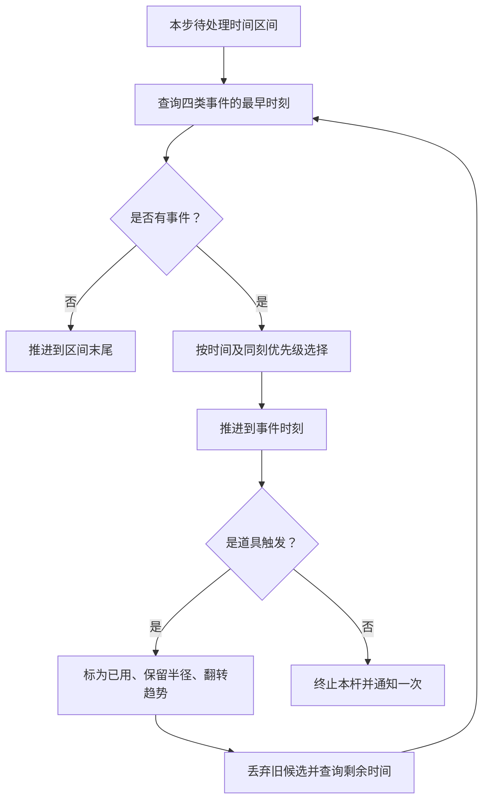

# 第六步：翻转道具与连续事件

> 2026-10-06 最新方案：以[黑球入洞、六洞状态与几何解锁架构方案](../../架构设计/数学桌球-黑球入洞与六洞状态架构方案.md)为当前实施依据。用户已确认：玩家击打白球，碰撞推动黑球；全部黑球入洞才通关；洞固定在四角与两个长边中点，各洞状态为上锁、解锁可用、已进黑球、禁用；每个图形只用一种几何条件，条件用于触发道具或解锁球洞。下文的“完成全部图形通关”“几何达成立即停球”、单白球无黑球及无球洞规则保留为历史记录，已被新方案替代。Prop 架构、反弹与力度虚线预测继续纳入新版。白球犯规等未指定细节仍标为建议。本轮只修改方案文档，未改代码、配置或资源，未运行验证，旧版验收不能证明新版已实现。

日期：2026-10-06 · 版本：v0.2 · 任务等级：L3 · 状态：实施设计完成，功能待制作

前置：[5-C：停球与成功提示](05-C-停球与成功提示.md)实际验收通过。下面是后续实施计划，开篇前置条件不表示功能已经完成。

## 1. 目标与前置条件

第五步已经能发现途中成功。本步加入白球圆周接触道具后的趋势翻转，并统一处理一个模拟步内的道具、成功、出界和停止事件。

每杆道具只触发一次，触发瞬间球的半径保持连续，方向、速度、计划路程和剩余路程都不变。

## 2. 对象职责

| 文件 | 职责 |
|---|---|
| `LevelManager` | 校验并提供一个道具的中心、触发半径和显示数据，组织内容准备与卸载 |
| 接触与边界几何方法 | 查找道具首次接触与完整球体出界的时刻；已有规则工具则复用，必要时作为普通规则对象，不做管理器或球组件 |
| `BilliardsGoalJudge` | 沿用目标区间查询，不管理道具使用状态 |
| `BilliardsSession` | 保存当前杆道具使用标记，比较候选、提交事件、处理剩余区间，拥有唯一结果 |
| `BallSimulationComponent` | 应用趋势切换，提供新半径段，保持既有运动轨迹 |
| `BallManager`、`BallBase` 与已有道具显示 | 转交模拟操作、同步球状态与道具可用外观，不重复保存规则状态 |

这些是职责归属，不要求新建每行对应的脚本。事件排序直接组织在 Session 中，不另建 EventResolver 管理器；文件位置按[目录约定](../../架构设计/数学桌球-脚本目录归属约定.md)：道具数据与显示在 Core/Item，关卡业务快照在 Core/Level，几何方法在 Core/Rules，本局在 Core/Session，球组件在 Core/Ball/Components，管理器在 Module/对应名称Module。道具布局按[Luban 设计](../../架构设计/数学桌球-Luban配置表与数据分层设计.md)增量加入关卡表，源表在 Configs、生成代码在 GameProto，本杆是否触发保留为 Session 运行状态。道具不是新的球能力组件，运动与半径仍由同一个模拟组件实现。

## 3. 制作顺序

### 3.1 明确接触范围

道具触发区域采用圆形，其半径来自关卡数据，与图片大小分开。球心到道具中心的距离不大于“两者半径之和”时接触，不要求球心穿过道具中心。

查询整个时间区间内的首次接触。沿用第五步的区间求解工具，把减速位置、变化中的球半径和道具触发半径一起计算。球因增长而碰到道具，同样需要触发。

初始就接触时可以在出杆时刻触发，但仍先检查同刻出界与成功。正好相切也算道具接触，不能依靠两端是否重叠来猜测途中是否经过。

道具半径必须有限且大于零。每段求 `|C(t)-P|²-(r(t)+R)² ≤ 0` 的首次成立时刻，其中 P、R 是固定道具中心与触发半径。复用[5-B 的完整分段与求根约定](05-B-运动区间查询.md)，包含相切重根、初始重叠、段端点及求解未完成处理；不能仅检测符号变化或增加固定次数采样。

### 3.2 增加完整球体的边界查询

对可玩矩形的四条边分别查询“球心到边界的距离减去当前半径”。跨出任何一条边都产生出界候选，增长造成的出界也包含在内。

单纯贴住边界后停止或向内离开，不算出界。确实向外跨越时以跨越时刻产生事件；用微小数值精度处理根附近误差，不用目标贴合容差放宽桌面边界。

沿用 5-B 已有的边界查询，必要时补齐其连续检测；本步统一提交出界结果并停止位置和大小推进，失败提示和下一杆由第七步接入，不建立第二份边界规则。

### 3.3 先按时间，再按同刻优先级

先分别查询出界、内切/外接、道具、自然停止的候选时刻，选择最早的那个。同刻才按“出界 → 成功 → 道具 → 停止”排序。

事件时间使用同一杆累计时间。数值精度用于确认时刻，不能将先后不同但相近的事件直接视为同刻；顺序不确定时继续细化，未完成时保留原状态并诊断。不能把整个固定模拟步里的事件都看作同时发生，也不能让未来的出界覆盖已经发生的成功。

### 3.4 道具触发后重新计算剩余区间

推进到触发时刻，记录当时球心与半径，先把本杆道具标为已用，再切换大小变化趋势。刷新球和道具外观，使用新的半径变化段重新查询本步剩余时间。

旧的成功、出界候选是在原趋势下得到的，触发后必须丢弃并重新计算。运动轨迹继续使用原出杆的时间轴，不重新起算速度，也不重新分配一段计划路程。

同一步内可以先触发道具，再成功或出界。已用标记使同一道具不再进入候选，避免零时间重复触发。上限/下限分段也必须完成，处理游标不能倒退。事件循环上限用于防止异常阻塞，达到限制时保留已提交状态、停止本次推进并报告诊断，不能在异常时跳过未检查的剩余区间。

### 3.5 结算通知保持唯一

成功、出界和自然停止都是终止本杆的候选，最终由 Session 接受一次结果。道具触发先写入已用标记并更新半径段，再发布必要显示变化；不结算、不扣杆、不修改本局剩余机会。目标胜出时沿用 5-C，出界胜出时停在出界事件时刻，自然停止胜出时停在计划终点。

同刻接触与自然停止时先处理道具标记及趋势，再检查同刻目标和停止；半径切换瞬间连续，不追加停止后的增长或缩小。下一杆/重开清除本杆使用标记，暂停不恢复道具次数。

## 4. 流程

## 5. 验收与下一步

- 低速接触、高速完全穿过、仅圆周擦到、半径增长碰到道具，都能触发。
- 持续重叠只翻转一次；下一杆复位后又能触发一次。
- 翻转瞬间半径、球心、速度和剩余路程保持一致。
- 同一模拟步先触发再成功，能按翻转后的半径识别成功。
- 成功先发生、出界后发生时结算成功；真正同刻出界与成功时结算出界。
- 接触与自然停止同刻时，先处理道具，再检查切换后同刻状态与停止；不会无限循环。
- 单纯贴边不失败，跨界以及因变大跨界都被发现。

按“接触查询 → 单次翻转与连续半径 → 剩余区间重查 → 统一终止结果”逐项验收，不同时制作尝试循环。

完成后把唯一的本杆结果交给[第七步](07-第七步-三杆尝试循环.md)。用真实模拟轨迹做连续事件检查，再按项目 Unity Pipeline 规范核对外观反馈。本次仅完成文档，没有游戏代码或 Unity 验收结果。
