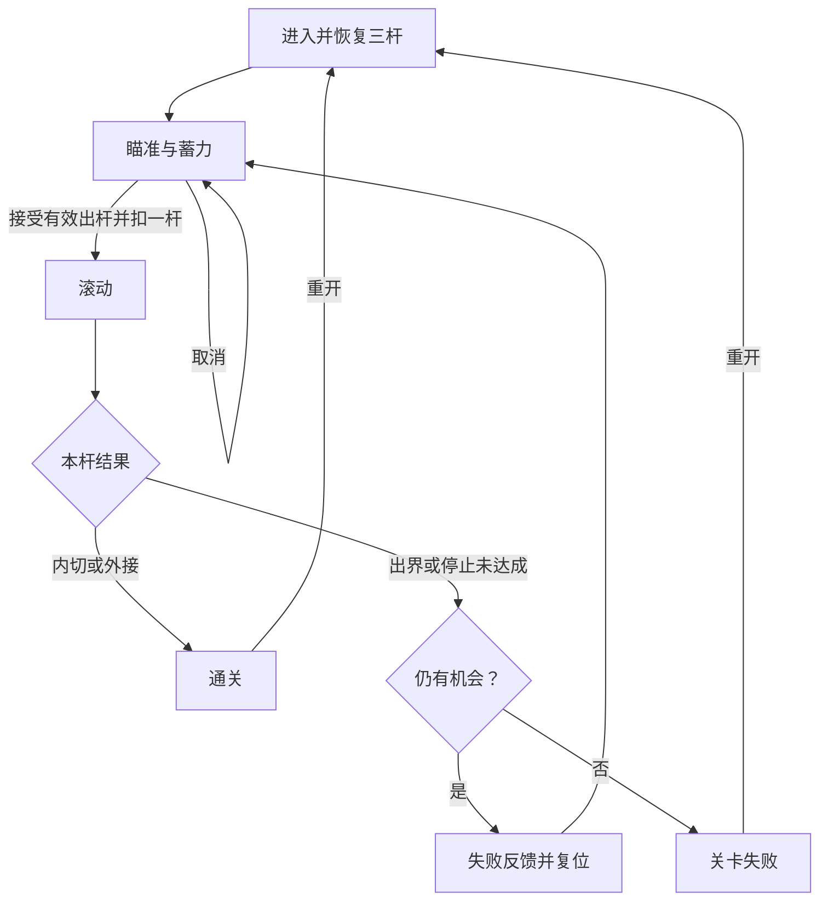

# 第七步：三杆尝试循环

> 2026-10-06 最新方案：以[黑球入洞、六洞状态与几何解锁架构方案](../../架构设计/数学桌球-黑球入洞与六洞状态架构方案.md)为当前实施依据。用户已确认：玩家击打白球，碰撞推动黑球；全部黑球入洞才通关；洞固定在四角与两个长边中点，各洞状态为上锁、解锁可用、已进黑球、禁用；每个图形只用一种几何条件，条件用于触发道具或解锁球洞。下文的“完成全部图形通关”“几何达成立即停球”、单白球无黑球及无球洞规则保留为历史记录，已被新方案替代。Prop 架构、反弹与力度虚线预测继续纳入新版。白球犯规等未指定细节仍标为建议。本轮只修改方案文档，未改代码、配置或资源，未运行验证，旧版验收不能证明新版已实现。

日期：2026-10-06 · 版本：v0.2 · 任务等级：L3 · 状态：实施设计完成，功能待制作

前置：[第六步](06-第六步-翻转道具与连续事件.md)实际验收通过。以下前置与完成描述均指后续制作顺序，不表示已运行验收。

## 1. 目标与前置条件

第六步已经能报告成功、出界或自然停止。本步完成从进入关卡到瞄准、出杆、失败复位、机会耗尽、成功与重开的完整循环。

有效出杆消耗一杆，取消不消耗，失败不重复扣杆。第三杆只要成功就正常通关。

## 2. 文件职责

| 文件 | 职责 |
|---|---|
| `BilliardsSession` | 统一拥有状态、剩余杆数、当前出杆编号、当前结果和重开规则 |
| 既有本杆结果数据 | 区分内切成功、外接成功、出界、停止未达成，不复制另一份结果 |
| `GameManager`、`LevelManager` | 入口持有并清理本局；关卡管理器提供三杆配置和出生数据，不参与扣杆 |
| `BallManager`、`BallBase`、击球/模拟组件 | 遵守操作许可，提交球状态，恢复出生状态与组件状态 |
| 反馈接口 | 先提供必要文字或开发反馈，第八步统一接到正式窗口 |

本步继续扩展第二步建立的本局管理，不另建一套扣杆或结算脚本。

复用当前 Session 与 GameManager，不因早期文件表新建 BilliardsGame 入口。脚本摆放按[目录约定](../../架构设计/数学桌球-脚本目录归属约定.md)：GameManager 在 Module/GameModule，另两个管理器在对应 xxModule 目录，本局与尝试状态在 Core/Session，球与组件在 Core/Ball 及 Components。状态用已有枚举或最小状态数据表达，现阶段不要求每个状态独立脚本。

## 3. 状态与允许的操作

| 状态 | 允许的主要操作 |
|---|---|
| 准备瞄准 | 瞄准、开始蓄力、暂停、重开、退出 |
| 蓄力 | 更新力量、出杆、取消；暂停先取消蓄力 |
| 滚动 | 只允许暂停和退出，屏蔽重开与再次出杆 |
| 本杆失败反馈 | 等待复位或立即重试，允许暂停反馈倒计时或退出 |
| 通关 | 查看成功类型、重开或退出 |
| 关卡失败 | 查看原因、重开或退出 |
| 已关闭 | 不再接受输入、事件或异步反馈 |

暂停作为覆盖在当前状态上的限制，不另建一套滚动状态。暂停与失焦细节由第八步完成。

加载及加载失败归 GameManager 的进入流程；Session 尚未准备好时不接受击球，加载失败不扣杆、不作为关卡失败。表中的退出应用请求交给 GameManager 清理入口处理。

## 4. 制作顺序

### 4.1 在接受出杆时统一扣杆

本局管理验证仍在蓄力、机会大于零、方向与力量有效，并在同一处理内完成“生成本杆编号、扣一杆、进入滚动、启动模拟”。外部不能分别请求扣杆和启动，避免只成功其中一半。

接受前检查本局准备完成、参数有限且模拟计划可建立。真正接受后，即使本杆起始半径导致立即出界也消耗一杆；缺资源或无效参数导致未接受则不扣。启动内部异常不能留下扣杆后仍能重复提交的半完成状态，应保留诊断并走异常收尾，不伪装成正常本杆失败。

提交后的重复松开或点击被状态拒绝。同一杆的回调必须携带出杆编号与本局版本，只接受属于当前滚动杆的结果。

### 4.2 先处理本杆结果，再看剩余杆数

内切或外接成功，立即进入通关并保留停球状态，剩余杆数为零也不改变结果。

出界直接成为本杆失败。自然停止则先执行第五步的终点目标检查，确实没有成功才记为“停下未达成”。本杆失败不再扣杆。

失败且还有机会时进入短反馈，再恢复出生点继续瞄准；没有机会时进入关卡失败。不能仅因为出杆后剩余为零，提前终止仍在滚动的第三杆。

### 4.3 完成下一杆复位

复位内容包括球心、待机半径、变大趋势、道具可用、蓄力和箭头、旧轨迹、旧结果、模拟积压时间。保留已经扣除后的剩余杆数。

短反馈结束与“立即重试”按钮使用同一个复位入口，状态不匹配时拒绝重复执行。提示时长从数据读取，使用 `GameModule.Timer` 安排一次回调，立即重试、重开或退出时移除该计时器。

### 4.4 完成重开

重开恢复配置的三杆与关卡初始摆放，取消旧反馈，增加本局版本以使旧回调失效。一般复用已有桌面对象，只重置业务状态与显示。三杆上限只来自 LevelManager 提供的同一份配置，UI 不保存独立可改杆数。

滚动中隐藏或禁用重开入口，后台收到相同命令也拒绝。蓄力中重开先取消蓄力；结果窗口的连续点击只执行一次重置。

### 4.5 唯一结果与清理

结果首次被接受后立即离开滚动状态，后续通知被拒绝。离开关卡先停止输入与模拟，再移除本局计时器和事件，最后释放显示对象。

延迟反馈在执行前检查本局版本和当前状态，不能靠计时器取消一项措施保证所有旧反馈都消失。普通重开也不调用全局 `GameEvent.Shutdown()` 或 `GameModule.Shutdown()`。

## 5. 流程

## 6. 验收与下一步

- 连续取消蓄力十次仍有三杆；有效出杆才扣一次。
- 第一、二杆失败后分别剩两杆、一杆；第三杆滚动期间正常运行。
- 第三杆成功进入通关；第三杆失败进入关卡失败，均只出现一个结果。
- 同一杆重复提交结果、旧杆晚到的结果，都不重复结算。
- 立即重试与自动复位同时到达，只执行一次复位。
- 重开后球、道具、杆数与结果完整恢复，旧提示不会再次出现。
- 滚动中重开命令被拒绝；退出后输入、模拟和反馈停止。

按“有效出杆扣除 → 失败结果与剩余机会 → 下一杆复位 → 重开与旧回调作废”逐项制作。本局状态转换、重复结果、第三杆成功与零机会失败做有意义的纯逻辑检查。

[第八步](08-第八步-界面与生命周期.md)将这些真实状态接入完整界面，不让窗口自己维护另一份杆数。本次只补全文档，未编写业务或测试代码，未执行实际功能验收。
