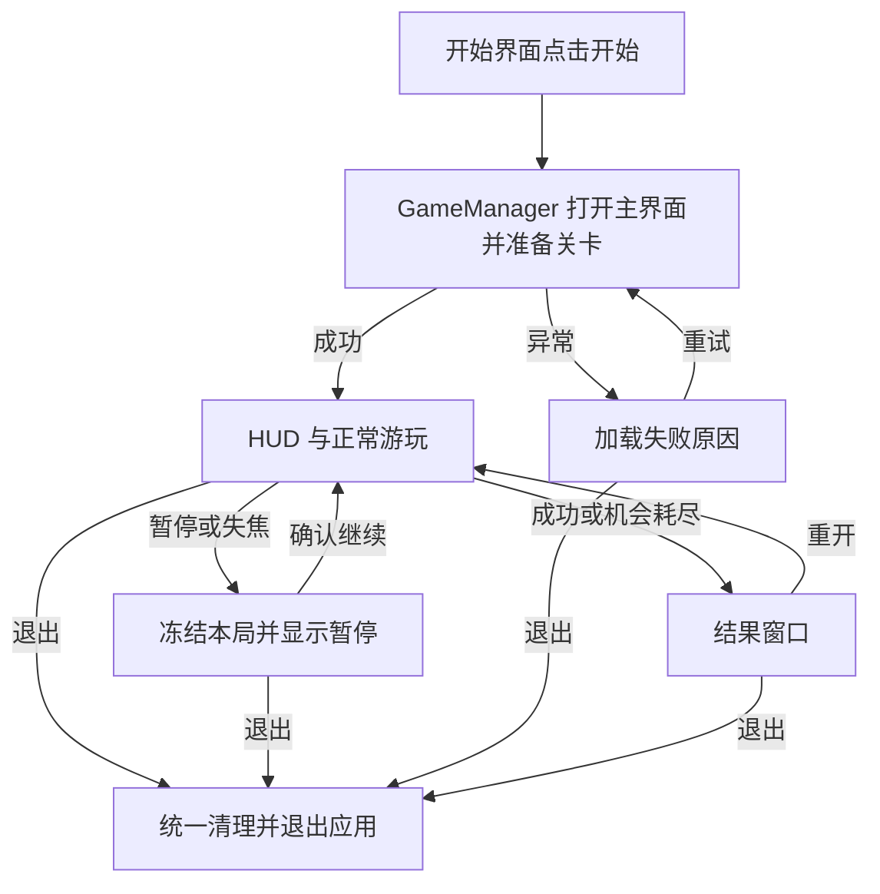

# 第八步：完整界面与生命周期

> 2026-10-06 最新方案：以[黑球入洞、六洞状态与几何解锁架构方案](../../架构设计/数学桌球-黑球入洞与六洞状态架构方案.md)为当前实施依据。用户已确认：玩家击打白球，碰撞推动黑球；全部黑球入洞才通关；洞固定在四角与两个长边中点，各洞状态为上锁、解锁可用、已进黑球、禁用；每个图形只用一种几何条件，条件用于触发道具或解锁球洞。下文的“完成全部图形通关”“几何达成立即停球”、单白球无黑球及无球洞规则保留为历史记录，已被新方案替代。Prop 架构、反弹与力度虚线预测继续纳入新版。白球犯规等未指定细节仍标为建议。本轮只修改方案文档，未改代码、配置或资源，未运行验证，旧版验收不能证明新版已实现。

日期：2026-10-06 · 版本：v0.2 · 任务等级：L3 · 状态：实施设计完成，功能待制作

前置：[第七步](07-第七步-三杆尝试循环.md)实际验收通过。入口沿用[GameManager 设计](../数学桌球-核心入口与GameManager单例设计.md)，开始和退出沿用[已确认按钮行为](../数学桌球-开始与退出按钮功能设计.md)。

## 1. 目标与前置条件

第七步已打通完整游玩循环。本步把操作和结果接入正式界面，完成提示圆开关、暂停恢复、失焦处理、退出与加载失败重试。

界面只显示本局真实数据并发送操作请求。球的位置、半径、杆数和结果仍由业务层管理。

## 2. 文件职责

脚本摆放按[当前目录归属约定](../../架构设计/数学桌球-脚本目录归属约定.md)：窗口沿用 UI，管理器放 Module/对应名称Module，本局与快照放 Core/Session，业务命令与通知定义放 Core/Events。实现时再次核对生成器和 Prefab 配置。

| 文件 | 位置与职责 |
|---|---|
| `StartUI` | 全屏，fullScreen: true；五个菜单按钮，开始进入主界面，设置打开弹窗，退出应用，存档与制作详情保留占位 |
| `MainUI` | 全屏，fullScreen: true；沿用已规划主界面，扩展 HUD、结果、暂停与加载反馈 |
| `SettingsUI` | 非全屏，UILayer.Top、fullScreen: false；四行独立图标点击开关与音量滑块、关闭按钮，见[独立设置方案](../数学桌球-设置界面与四类音量设计.md) |
| 结果、暂停与加载面板 | 优先使用主界面内的面板；实际复用和布局需要独立窗口时再拆分，不强制提前创建四套窗口脚本 |
| `IBilliardsUI.cs`、`IBilliardsCommand.cs` | Core/Events；定义业务状态通知与界面操作请求，复用已有事件组 |
| `BilliardsUISnapshot.cs` | Core/Session；用于首次显示与刷新的一份本局状态快照 |
| `GameManager` 与 `BilliardsSession` | 分别在 Module/GameModule 与 Core/Session；入口协调加载退出，本局保存暂停限制及反馈状态 |
| 对应 UI 预制体与图片 | 复用已有 AssetRaw/UI 收集目录与资源绑定；具体地址在实施时核对，不预设 Billiards 子目录 |

复用项目 `UIWindow` 与现有 Canvas。主界面使用普通 UI 层；如拆分独立结果/暂停窗口则使用弹窗层，独立加载窗口使用系统层。使用内嵌面板时由遮罩和交互顺序隔离输入，不能假定它们自动拥有独立窗口层级；保持资源地址唯一。

## 3. 制作顺序

### 3.1 搭建必要界面

HUD 显示三颗杆数标记、力量条、青色加号或红色减号与“变大/变小”文字、目标说明、提示圆开关、暂停、重开和退出。滚动中禁用重开，后台业务同样校验状态。

本文 HUD 指 MainUI 的游戏信息区域，不是新的主界面类。应用启动仍先显示 StartUI；点击开始调用 `GameManager.Instance.StartGameAsync()`，关闭开始界面、打开主界面，再完成关卡与本局准备。准备完成前主界面显示加载反馈并禁用击球，不跳过菜单直接进入关卡。

成功显示“内切成功”或“外接成功”。本杆失败且还有机会时在 HUD 给出短提示与立即重试入口；最终失败显示“机会耗尽”并注明本杆出界或停下未达成。

采用现有像素面板、按钮、力量条、杆数和结果图标。文字使用独立组件，布局留在桌面重要目标之外，不能完全依靠颜色传达状态。

节点使用 `m_btn_`、`m_img_`、`m_tmp_`、`m_slider_`、`m_toggle_` 等项目规定前缀，组件绑定沿用生成工具。图片在预制体中绑定或使用 UI 的 `SetSprite`，不单独手动加载 Sprite。

### 3.2 接入状态通知与操作请求

状态通知接口标记 `[EventInterface(EEventGroup.GroupUI)]`，操作请求接口使用 `GroupLogic`。由项目 Source Generator 生成事件桥接，不手写生成类。

窗口在 `RegisterEvent` 中用 `AddUIEvent` 监听通知；本局使用局部 `GameEventMgr` 监听请求，退出时 `Clear()`。在 `OnCreate` 中绑定按钮，在 `OnRefresh` 中请求当前快照，关闭清理在 `OnDestroy`，不使用不存在的 `OnClose`。

状态快照至少包含当前状态、剩余杆数、蓄力进度、变大/变小趋势、结果和提示圆开关。新窗口先请求一次完整快照，之后只更新发生变化的内容；力量条连续刷新无需每帧分配新对象或打开窗口。

操作请求附带当前本局版本，已关闭或旧局发来的请求被拒绝。直接的入口操作仍可调用 GameManager，不为开始按钮增加不必要的事件中转。跨模块事件发送前必须完成 `GameEventHelper.Init()`；当前可访问 GameApp.Entrance 中该行仍为注释，实施时需先确认接口事件生成结果并正确初始化，不把设计前提当作现有已运行能力。

### 3.3 规范暂停和恢复

暂停冻结输入、蓄力、运动、半径变化与失败反馈倒计时。使用本局暂停标记控制推进，不修改全局时间缩放，以免其他框架界面跟着停住。

暂停状态只由 Session 持有，窗口显示该状态并提交请求。失焦时先设置业务暂停限制，再异步显示面板，避免等待窗口创建时模拟仍向前推进。已经成功或关卡失败时不恢复为滚动；退出应用仍可请求。

滚动时记录暂停前状态，恢复后继续同一杆。蓄力时暂停或失焦，先取消蓄力，恢复后回到准备瞄准。Esc 在蓄力时只取消；其他游玩状态下用于打开暂停；继续由暂停窗口明确操作。

失焦自动暂停，重新获得焦点后显示继续入口，不自动出杆。恢复时清空模拟积压时间，丢弃暂停期间的输入，并等待旧左键释放。失败反馈计时器用 `GameModule.Timer.Stop/Resume` 同步暂停，不能在弹窗背后自动进入下一杆。

### 3.4 完成提示圆和结果显示

开关只改变辅助圆的可见性，不修改目标几何、容差或判定。两种目标圆使用第一步计算结果，本局内保留开关选择，重开不强制改变玩家的提示偏好。

结果窗口只在本局状态进入通关或关卡失败时打开一次；暂停窗口只能在允许暂停的状态打开。避免每帧刷新时反复创建窗口。

使用内嵌面板时同样只在状态变化时切换显示；窗口销毁或隐藏不能自行解除业务暂停。关闭提示圆只改变可见性，不删除目标数据，重开后保持本局玩家选择。

### 3.5 处理加载失败与重试

第一步加载异常接入 GameManager 的“加载失败”状态，区别于 Session 的三杆耗尽“关卡失败”。主界面未创建成功时恢复开始界面；主界面已就绪但关卡准备失败时显示错误面板并允许重试。展示简洁原因，例如资源缺失、关卡数据无效，开发日志保留资源地址和异常细节，不消耗杆数。

重试前取消旧请求并清理半成品，再创建新的进入版本。加载中禁用重试，连续点击也只启动一次。HUD 等依赖窗口通过 `GameModule.UI.ShowUIAsyncAwait` 等待完成，并检查当前进入是否仍有效。

该 UI API 不提供关卡取消令牌，不能把 `CancellationToken` 当作显示数据传进去假装取消。对未完成的窗口创建追踪其任务与归属；退出后晚到的旧窗口需要关闭。新局进入与旧局窗口清理串行安排，防止旧回调关闭新局同类型窗口。

### 3.6 退出时统一关闭本局内容

退出先标为已关闭，再停止输入、模拟、反馈计时器与事件；取消资源加载，处理未完成窗口任务，关闭本局窗口，销毁根对象并恢复相机。

本版“退出”沿用用户已确认要求：桌面 Player 退出游戏应用，Editor 验证时结束 Play Mode，保留编辑器。开始界面、主界面、暂停和结果区域的退出都由统一应用退出入口处理，不改为返回简单入口，不增加确认弹窗或自动保存。

退出先锁定退出状态、作废当前进入请求并做必要清理，再请求正常应用退出；重复请求只处理一次。框架释放沿用已有销毁回调，不强制终止进程，也不在关卡业务提前调用全局 Shutdown。Editor 专用逻辑按既有按钮文档保留条件编译边界。内部清理本局内容是生命周期操作，不能把它当作另一个含糊的“退出”按钮行为。

## 4. 流程

## 5. 验收与下一步

- 杆数、力量、趋势与真实状态一致；重新打开窗口时能立即显示当前值。
- 在 1280×720、1920×1080、1024×768 下按钮和文字不溢出，不遮住球、道具和目标。
- 点击界面按钮不会穿透开始蓄力；禁用重开时也不能通过旧事件重开。
- 关闭提示圆不影响成功判定；状态颜色之外还有文字或图标说明。
- 滚动暂停十秒再恢复，位置与半径继续原进度；蓄力失焦取消且不会意外出杆。
- 失败反馈暂停期间不自动复位；恢复后按剩余提示时间推进。
- 缺失资源后给出加载失败原因，修复后重试只产生一套关卡。
- 加载中退出、弹窗打开中退出、连续启动与退出后，没有旧窗口或旧反馈出现。
- 开始进入仍按先关闭菜单再打开主界面执行；启动失败能够恢复入口并重试。
- 开始菜单设置打开非全屏弹窗，点击四类图标切换对应开关，滑块即时调整音量；关闭分类保留音量值，关闭弹窗后菜单可用。存档、制作详情仍占位；退出在 Editor 和 Player 分别遵守已确认行为。

按“主界面状态展示 → 暂停与失焦 → 加载失败重试 → 应用退出与收尾”逐项制作。新增或修改的 UI 应完成组件绑定、资源引用、编译、运行与多分辨率检查，Unity 操作统一通过项目 Pipeline。

最后交给[最终验收](09-第九步-关卡调试与最终验收.md)。本次只完成设计，没有新增 UI 资源、事件接口、代码或实际运行结果。
