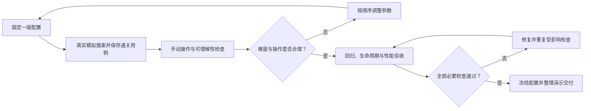

# 第九步：关卡调试与最终验收

> 2026-10-06 最新方案：以[黑球入洞、六洞状态与几何解锁架构方案](../../架构设计/数学桌球-黑球入洞与六洞状态架构方案.md)为当前实施依据。用户已确认：玩家击打白球，碰撞推动黑球；全部黑球入洞才通关；洞固定在四角与两个长边中点，各洞状态为上锁、解锁可用、已进黑球、禁用；每个图形只用一种几何条件，条件用于触发道具或解锁球洞。下文的“完成全部图形通关”“几何达成立即停球”、单白球无黑球及无球洞规则保留为历史记录，已被新方案替代。Prop 架构、反弹与力度虚线预测继续纳入新版。白球犯规等未指定细节仍标为建议。本轮只修改方案文档，未改代码、配置或资源，未运行验证，旧版验收不能证明新版已实现。

日期：2026-10-06 · 版本：v0.2 · 任务等级：L3 · 状态：验收方案完成，实际验收待执行

此项是简明八步中“提示和检查”的最终验收展开，不增加第十项功能，也不改变当前实际开发进度。前置是[第八步](08-第八步-界面与生命周期.md)及此前各项实际验收通过。

## 1. 目标与前置条件

前八步已完成完整功能。本步把“程序能够运行”推进到“正常操作能够通关、玩家能理解、重复游玩稳定”，并记录真实验收结果。

不增加多关、黑8、钥匙、球袋、反弹或联网功能。本版继续保持单关卡范围。

## 2. 文件与交付职责

| 内容 | 职责 |
|---|---|
| 当前单关卡数据源 | Luban 表保存最终摆放、速度、路程、半径变化、贴合容差等可调参数；沿用 5-A1 的配置来源，调参后重新导表并重新准备本局 |
| 几何、运动、事件和本局逻辑检查 | 通过项目测试目录或最小验证入口执行可重复的纯逻辑检查，不增加第二套游戏算法 |
| 开发重放工具与用例数据 | 记录方向、力量、暂停操作和预期结果，用真实模拟器重复验证；仅开发环境使用 |
| 验收记录文档 | 使用[验收记录模板](验收记录/00-验收记录模板.md)，记录版本、配置、环境、操作与实际结果 |
| 程序与策划文档 | 参数或行为改变时同步说明，保持开发方案与最终玩法一致 |

测试基础设施在实施时按现有工程选择；需要新增测试程序集时，仅用于测试，不改变业务程序集划分。当前文档没有创建测试代码、运行记录或正式构建。

验证分为纯逻辑、Unity Editor、目标平台 Player 三层。纯逻辑覆盖几何、区间、事件、扣杆等规则；Pipeline 负责实际编译、引用、运行和 UI 检查；Player 检查真正退出应用、最终性能与构建运行。不能拿某一层通过代替其余层。

## 3. 调试顺序

### 3.1 先证明正常操作有解

固定一版关卡数据，用真实的出杆请求和模拟器搜索方向与力量，不能直接设置球到目标中心或手动改半径来证明可解。

从指向目标圆心的方向开始，在附近小范围改变角度；扫描有效力量，再细化成功附近的区间。记录是否经过道具、成功类型、发生位置、半径与时刻。力量到成功的关系可能不单调，不能只假定一个方向调整就一定能找到解。

正式验收需要记录：

- 一次内切成功。
- 一次外接成功。
- 一次已经触发道具之后的成功，可与前两项中的某次重合。
- 开发配置关闭道具后，内切与外接判定分别正常；正式玩法仍保留一个道具。

自动搜索只证明存在合法输入，还要用鼠标手动完成，确认蓄力和瞄准精度足够。若成功窗口过窄或找不到解，回到关卡参数调整，不跳过条件或把瞬移当成解。

每个用例记录出生数据、归一化方向、力量、配置版本、是否经过道具、最早命中时间、球心及半径，并按当前 Session 的正式出杆入口重放。目标、道具、出界与扣杆不能在重放中被绕过。记录搜索范围和预算：未搜索到只能写“当前搜索未找到”，不能据此断言关卡数学上无解。

### 3.2 按固定顺序调整难度

先调整出生点、三角形和道具位置，让路径清楚、目标不贴边；再调整计划路程与速度范围；然后调整起始大小、增长和缩小速率；最后调整贴合容差与提示。

尽量一次只改一类参数，并重新执行之前保存的用例。不能靠无限放大容差修复不可解关卡，也不能为了让大力走得更短而破坏“每杆计划路程相同”的已确认规则。

### 3.3 检查玩家是否看懂

让未接触方案的人按画面提示尝试，观察能否理解方向锁定、力量影响大小与到达时间、道具翻转、两种成功条件和三杆机会。

反馈应该能解释下一杆怎么调整：位置偏了、球太大或太小、越出桌面，避免仅显示一个叉号。必要时调整目标说明、球状态文字或提示圆，而非先添加新机制。

### 3.4 检查重复游玩和异步边界

覆盖取消、失败复位、第三杆成功、三杆耗尽、重开、暂停恢复、失焦、加载失败重试和退出再进入。重复执行时检查对象、计时器、事件和资源引用是否持续增长。

开启关闭结果和暂停窗口时，不应出现重复扣杆、双重结算、晚到对象或旧提示。构造同一模拟步内先后事件与真正同刻冲突，确保遵守第六步的规则。

先约定重复轮次，例如连续重开 20 次、加载失败重试 5 次，再记录对象数、监听和计时器等对比。缓存正常保留与持续增长要区分；具体计数来源在实施时核对工具能力。计数未取得时填未执行，不猜测为零。

### 3.5 检查性能

以 Windows 桌面实际目标设备为基准，记录 CPU、GPU、分辨率和运行方式。使用 Unity Profiler 或等效帧统计观察输入、模拟、区间求解、UI 与渲染耗时。

目标为稳定 60 帧以上，对应每帧约 16.7 毫秒预算。同时观察平均耗时、较慢帧和持续卡顿，不用编辑器里一次顺畅画面代替性能结果。重点检查连续事件求解的最坏情况，以及正常滚动中是否出现持续分配和 GC 尖峰。

发现瓶颈后针对性修复：缓存组件和几何数据、复用候选事件缓冲区、减少不必要 UI 刷新、限制可证明安全的计算范围。不能以降低检查频率、跳过短暂目标或跳过道具触发作为性能优化。

## 4. 最终验收表

| 类别 | 必须通过的用例 |
|---|---|
| 操作 | 短按、满蓄力、方向锁定、右键与 Esc 取消、按钮不穿透、滚动不能再出杆 |
| 入口 | StartUI、MainUI 全屏，开始调用 GameManager，准备期间不能击球；设置弹窗非全屏，四个图标开关、音量保留、滑块调整、音乐恢复与关闭重开正确；存档、制作详情占位 |
| 运动 | 不同力量自然停止路程相同，大力用时更短，末步不越过终点 |
| 大小 | 起始大小随力量增加、趋势切换连续、上下限正常、暂停冻结 |
| 目标 | 内切、外接、短暂途中达成、停止时达成、几何反例被拒绝 |
| 道具 | 高速经过、圆周擦到、增长接触、同杆一次、下一杆恢复 |
| 事件 | 先按时间处理，同刻按出界/成功/道具/停止；触发后重算剩余区间 |
| 杆数 | 取消不扣、出杆扣一次、失败不再扣、第三杆可成功、三杆失败后重开 |
| 生命周期 | 暂停恢复、失焦取消蓄力、加载中退出、失败后重试、关闭后旧回调失效；Editor 结束 Play Mode，Player 退出应用，再次启动仍正常 |
| 显示 | 三种约定分辨率下无溢出或拉伸，状态和杆数一致，结果文字清楚 |
| 稳定性 | 无本轮相关编译/运行异常，重复游玩无持续资源或监听增长，性能达到记录的目标 |

区间用例还必须覆盖旁切圆和大包围圆反例、相切重根、孤立命中、零容差、半径分段端点、相近但不同事件、求解未完成。结果用例覆盖第三杆成功、自动复位与立即重试同时到达、重复成功通知、旧局消息拒绝及重新打开界面的快照恢复。

## 5. 流程

## 6. 最后交付什么

交付可以正常打开的 Unity 工程、最终单关卡数据、已接入的美术与界面、操作说明、验收记录，以及已知问题清单。每个通关用例保留可重复的方向和力量记录，注明使用的配置版本。

验收记录区分“通过、失败、未执行”，没有实际运行的数据不能填写通过。本轮只完成实现文档，因此目前没有任何 Unity 编译、运行、性能或可解性验证结果。

交付门槛是必要用例已实际通过，失败项修复并重验，未执行项明确说明影响且不能计入已通过。需求外的多关或菜单占位按钮不阻塞当前单关版本；实际通关、应用退出和目标性能未验证则不能宣称完整演示已验收。

若后续需要独立可执行演示包，再按项目 Unity 操作规范完成有明确目标平台的构建与启动验证，不默认在这个文档任务中执行构建。
