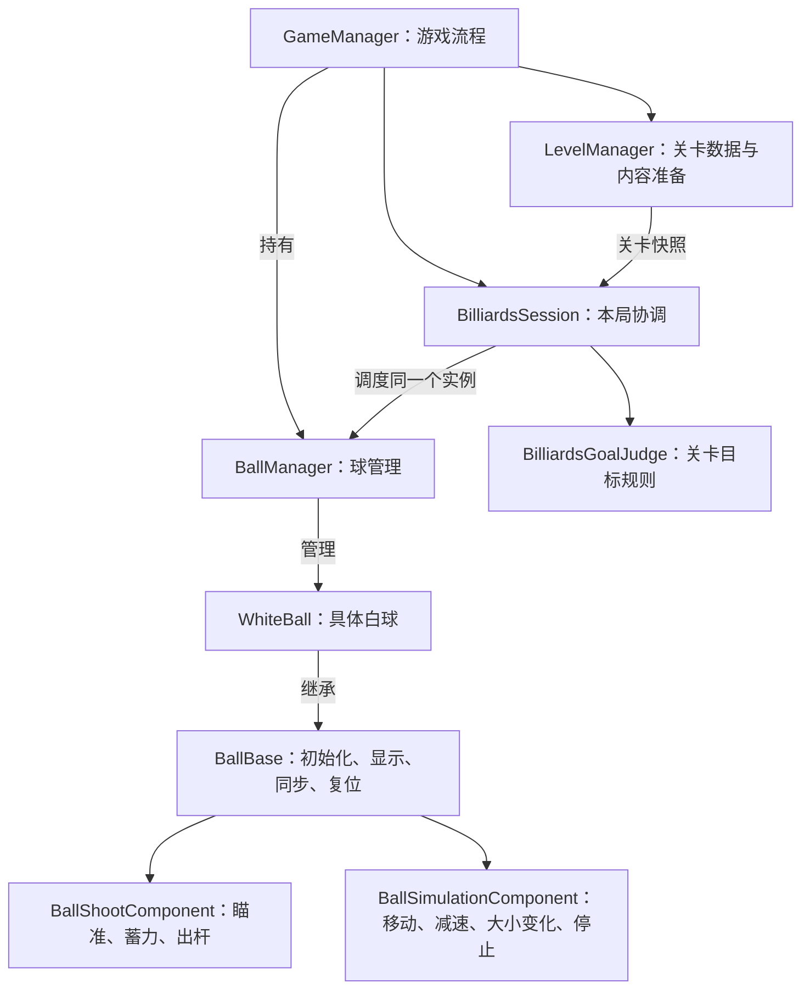

# 数学桌球：小球核心逻辑分步设计

日期：2026-10-06 · 版本：v0.9 · 任务等级：L4

前置：[核心入口与 GameManager 单例设计](数学桌球-核心入口与GameManager单例设计.md)。玩法依据：[数学桌球玩法说明](../架构设计/数学桌球DEMO-v0.2/07-玩法说明.md)。本次只更新设计文档，不编写代码、不搭建 Unity 对象。

> 当前进度更新（2026-10-06，按用户提供）：已完成桌面搭建、击球操作、白球运动与大小变化。按[文档导航简明版](../架构设计/数学桌球DEMO-v0.2/00-文档导航与设计决策.md)进入第 5 步：先补最小关卡数据管理，再逐项完成[内切与外接判定](数学桌球-代码实现方案/05-第五步-内切与外接判定.md)。下文第一至六步保留为小球能力开发顺序记录，不等同于简明导航的八步编号，也不表示当前待实施起点。

> 架构评审更新：目标达成属于关卡规则，由独立 `BilliardsGoalJudge` 计算、`BilliardsSession` 协调，替代此前推荐的 `BallTargetComponent`。GitHub 源码参考、七大原则与模式取舍见[架构评审与目标判定职责设计](../架构设计/数学桌球-架构评审与目标判定职责设计.md)。当前先做静态判定，后续再接连续查询与成功反馈。

> 2026-10-06 补充：[LevelManager](../架构设计/数学桌球-关卡管理器设计.md) 独立负责关卡数据和关卡内容准备。先接管当前关卡的数据读取、校验与提供，再做静态目标判定。

## 1. 设计原则

采用 **球管理器 + 球基类 + 具体球子类 + 功能组件组合**。球类型通过继承表达，球的能力通过组件组合。

初始化、显示、位置与大小同步、复位是所有球的共用基础行为，直接由 `BallBase` 实现，不拆成组件。独立玩法能力按完整的行为划分：**瞄准、蓄力、取消与出杆统一由击球组件处理；移动、减速与大小变化统一由球模拟组件处理**。

球的位置和半径都随同一杆的模拟时间变化，适合由同一个组件计算。出杆后统一生成同一时刻的球心、速度和半径，再由基类同步显示，暂停、停止和复位也统一清理模拟状态。

组件可以包含多个相近的内部方法，保持职责完整。每项独立能力一个组件，不要求每个方法或每个开发步骤对应一个新脚本。

开发逐步进行：一个组件也可以分几次完善。用户已报告基础显示、击球、运动与大小变化完成，当前进入目标判定阶段，**先做最小 LevelManager 的关卡数据管理，再做静态判定**，其他后续机制继续分开制作。

## 2. 管理器、基类与具体球

| 对象 | 职责 |
|---|---|
| `GameManager` | 游戏启动、界面切换与整体生命周期；持有关卡管理器、本局对象与球管理器并组织创建、释放 |
| `LevelManager` | 读取、校验和提供关卡数据，组织桌面与目标的准备、卸载；不管理球运动或胜负 |
| `BilliardsSession` | 本局操作许可、模拟区间与规则查询的协调、唯一成功结果；按当前步骤逐渐补充 |
| `BallManager` | 专门管理本局球、当前白球、注册/注销、初始化、复位与统一调度 |
| `BallBase` | 球专属抽象基类；实现初始化、显示、位置/大小同步、复位，持有球状态与配置并组织组件生命周期 |
| `WhiteBall : BallBase` | 具体白球脚本，表达白球身份及必要差异 |
| `BilliardsBallState` | 每颗球独立保存球心、真实半径和当前状态 |
| `BallComponentBase` | 所有球功能组件的共用基类，提供必要生命周期约定 |

`GameManager` 沿用已有单例与 `StartGameAsync()`。建议 `BallManager` 为本局普通管理对象，由 `GameManager` 持有并清理；球管理器专门负责球，不打开 UI，也不处理存档和关卡胜负。

进入目标判定阶段后，同一个 `BallManager` 交给普通本局对象 `BilliardsSession` 调度；GameManager 仍负责最终释放。本局状态与结果由 Session 统一维护，球模拟只维护本杆状态。若实际工程已有本局协调对象，直接复用，不创建第二份。

球出生配置和模拟参数由 LevelManager 准备后交给 BallManager；球只接收所需配置，不持有关卡管理器。目标显示与判定器使用同一份已校验的关卡数据。静态参数采用[Luban 关卡表与球参数表](../架构设计/数学桌球-Luban配置表与数据分层设计.md)，LevelManager 转为只读业务数据；击球与模拟参数合并配置，球和组件不直接查询 Tables，当前球状态不写回表。

`BallBase` 设计为抽象 MonoBehaviour，实际挂载具体的 `WhiteBall` 脚本；白球直接复用基类的基础行为。`BallComponentBase` 同样为抽象 MonoBehaviour，实际挂载各玩法组件。独立玩法能力不写进管理器或复制到每个球子类。

当前只设计白球，其他球类型有实际需求时再新增子类。

## 3. 功能组件划分

| 组件 | 合并的内容 | 引入时间 |
|---|---|---|
| `BallShootComponent` | 瞄准、方向箭头、锁定方向、蓄力、取消、提交出杆 | 第二步开始，逐步完善 |
| `BallSimulationComponent` | 运动轨迹、减速、固定路程停止；力量到起始半径的映射、变大/变小、半径限制与趋势切换；统一模拟时间与停止通知 | 第三步开始做移动，第四步加减速，第六步加大小变化 |

两个组件均继承 `BallComponentBase`。`BallShootComponent` 决定“按什么方向、用多少力量出杆”，生成一次确定的出杆请求；`BallSimulationComponent` 接收请求，执行这一杆的位置、速度与半径计算。管理器经球基类组织请求和状态切换，击球组件不重复计算位移或半径。

`BallBase` 的大小同步只负责把真实半径应用到显示比例；`BallSimulationComponent` 负责计算半径如何随力量和时间变化。基础显示与玩法计算的职责分开，不在两处重复计算半径。

`BallSimulationComponent` 内部用独立方法组织轨迹计算、半径计算与趋势切换，共用累计模拟时间。后续加入变小及趋势切换时继续完善这个组件；道具触发本身留到后续任务，不提前建立单独的增长、缩小和翻转脚本。半径趋势改变不改写已确认的速度轨迹或计划路程。

脚本摆放按[当前目录归属约定](../架构设计/数学桌球-脚本目录归属约定.md)：BallManager 放 `GameLogic/Module/BallModule/`；BallBase、WhiteBall、球状态与出杆数据放 `GameLogic/Core/Ball/`；BallComponentBase 与击球、模拟组件放 `Core/Ball/Components/`。其他管理器同样放 Module/对应名称Module，规则与本局分别归 Core/Rules、Core/Session；窗口沿用 UI。分类目录随功能实施创建，本轮不创建或移动脚本。

这些类名是职责设计，实际实现优先复用用户已完成的工程。白球 Prefab 第一阶段只配置 `WhiteBall` 与预先绑定的 SpriteRenderer，基础显示引用由 `BallBase` 持有；击球与模拟组件按开发阶段加入。组件列表通过序列化字段配置，不运行时补组件或按名称查找来弥补绑定缺失。

## 4. 组件协作规则

所有组件使用该球的一份逻辑状态。常规运行中，击球组件产生方向与力量，模拟组件统一写入同一时刻的球心、速度与半径，`BallBase` 读取结果并同步显示。初始化与复位时，由 `BallBase` 恢复公共出生状态。

`BallBase` 负责初始化、复位、显示同步和释放的统一入口，玩法组件按需接收初始化、状态清理、推进与释放通知，方法名在实现时统一确定。整球复位由基类执行：先通知组件清除未提交操作和轨迹，再恢复出生状态，最后同步显示；组件之间不递归调用整球复位。

运动阶段由唯一游戏循环经本局协调推进球管理器，再通过球基类调度组件。输入采样、模拟推进、显示刷新分阶段执行，运动与半径共用同一模拟时间。目标阶段先准备区间数据，Session 查询规则后再决定提交时刻；模拟组件不持有目标或反向调用规则。组件不各自使用独立 Update/FixedUpdate 计时，静止球第一步不增加逐帧模拟。

依赖和顺序在初始化时检查，例如提交出杆前需要模拟组件已准备完成；不依赖 Inspector 中组件出现的偶然顺序。同一颗球不重复配置承担相同职责的组件。

## 5. 逐步开发顺序

**组件划分与开发步骤分开：同一个组件可以按小步骤逐次完善。**

| 步骤 | 只增加的行为 | 实现位置 |
|---|---|---|
| 1. 显示与复位 | 进入主界面看到静止白球，复位同一对象 | `BallBase` |
| 2. 瞄准 | 鼠标转换为桌面坐标，箭头显示方向；球不动 | 击球组件，先做瞄准部分 |
| 3. 固定参数出杆 | 用固定力量提交一次出杆，球移动到计划终点，半径保持不变 | 击球组件的出杆部分 + 模拟组件的移动部分 |
| 4. 减速停止 | 加入减速，保持计划路程与精确终点，半径仍保持不变 | 完善同一个模拟组件 |
| 5. 蓄力出杆 | 按下锁方向并蓄力，松开出杆，支持取消 | 完善同一个击球组件 |
| 6. 大小变化 | 力量决定起始半径，滚动中逐渐变大 | 在同一个模拟组件中加入半径计算 |

第三步的固定参数出杆是开发中的临时操作，第五步接入按住蓄力、松开出杆后移除，避免重复提交。

合并组件不等于同时实现全部内容。模拟组件先完成固定半径的移动与停止，验收后再加入大小变化；不在移动阶段提前实现半径增长、缩小或道具切换。

每一步只验收当前新增行为和之前已完成的功能，不预先实现整套后续机制。出界、道具、内切/外接判定与三杆循环仍是之后的独立任务，实际开发时再确定必要的组件归属。

当前按用户进度进入目标判定，新增独立 `BilliardsGoalJudge`，内切与外接归入同一个规则对象。先做给定球心、半径和三角形的静态判定；通过后，由 Session 组织模拟区间查询与命中状态提交，再加入成功反馈。球保留自身能力组件，具体实施和验收以链接的目标判定文档为准。

## 6. 首步范围记录：白球显示与复位

### 6.1 最少数据与坐标

配置只需桌面可玩范围、`SpawnPosition` 与 `SpawnRadius`。运行状态只需当前 `Position`、`Radius` 和 `Idle`。

球沿用二维 XY 世界平面，桌面中心为原点，X 向右、Y 向上。主界面位于框架 Canvas，不把 UI 像素坐标直接作为球的逻辑位置。

可用已有方案中的出生位置 `(-4, 0)`、半径 `0.35` 作显示验证起点，数值放在配置中。检查数值有限、半径大于零、出生球完整位于木框内部的可玩范围。运动中的出界结算留到后续。

### 6.2 初始化与复位流程

1. 开始按钮调用 `GameManager.Instance.StartGameAsync()`，关闭开始界面、打开主界面。
2. `GameManager` 委托 LevelManager 准备关卡数据与桌面，再将球配置交给本局 BallManager 初始化。
3. 球管理器通过框架加载或取得白球 Prefab，注册预先绑定的 `WhiteBall`，指定为当前白球。
4. `BallBase` 校验出生配置与显示引用，初始化出生位置、半径与静止状态，并同步显示；第一步玩法组件列表可以为空。
5. 主界面与白球初始化都成功后标记游戏已开始；失败清理本次创建内容并恢复菜单。

`GameManager.OnInit()` 不提前生成球。小球初始化由开始游戏函数委托给球管理器执行。

内部 `BallManager.ResetBall()` 定位当前白球，调用 `BallBase` 的复位流程，由基类恢复公共状态并更新画面。复位复用同一颗球，不重载图片或销毁重建。第一步通过开发验证入口测试，不新增正式重开按钮、不扣杆、不处理胜负。

### 6.3 显示与清理

`BallBase` 使用现有 `ball_normal.png`，按可见圆形直径标定缩放，不把含透明留白的整张画布宽度当成真实直径。正交俯视下球保持圆形，窗口改变不拉伸球，逻辑球心与显示球心一致。

桌面/球实例通过 `GameModule.Resource.LoadGameObjectAsync` 加载，图片使用预先绑定的 Sprite 或 `SetSprite`。资源导入、Prefab 搭建与引用绑定通过项目 Unity Pipeline 执行。

退出时由 `GameManager` 通知球管理器释放球及其组件，清空注册和显示引用，再销毁本次实例。异步加载结果不得注册到已结束的本局；重复清理不重复释放。应用退出仍沿用现有单例释放流程。

### 6.4 第一步验收

- 主界面出现一颗静止白球，由球管理器管理。
- `WhiteBall` 继承 `BallBase`，初始化、显示、位置/大小同步与复位均由基类承担，未挂玩法组件时也能完成这些行为。
- 球心与配置一致，真实半径与可见圆形贴合。
- 连续复位十次后位置、大小一致，对象数量不增加。
- 不存在自动移动、自动变大或重力下落。
- 在 1280×720、1920×1080、1024×768 下白球仍为圆形。
- 退出后无残留对象，下次进入不叠加第二颗球。

## 7. 后续运动与既有方案

沿用已确认玩法：每杆完整计划路程相同，力量改变速度和大小，球直线减速，球体越过桌面边界算失败，木框不使球反弹。

模拟组件的运动部分采用已有[固定路程运动方案](数学桌球-代码实现方案/03-第三步-固定路程运动.md)。给定初速度 `v0` 和计划路程 `D`，减速度为 `v0² / (2D)`，停止时间为 `2D / v0`。按模拟时间查询轨迹并精确钳制终点，避免帧率造成距离差异。

已有[瞄准与蓄力方案](数学桌球-代码实现方案/02-第二步-瞄准与蓄力.md)作为击球组件的规则参考，按第二、三、五步逐渐接入同一个组件。已有[大小变化方案](数学桌球-代码实现方案/04-第四步-球的大小变化.md)在第六步接入模拟组件，变小和道具联动后续完善。

界面显示力量和杆数时遵循项目事件规范。当前组件内部协作共用球状态，不为每个小动作增加全局事件。

## 8. 当前交付状态

v0.5 将移动与大小变化合并为 `BallSimulationComponent`，玩法组件收敛为击球和球模拟两类。初始化、显示、位置/大小同步和复位继续由 `BallBase` 负责，保留 `BallManager`、具体球子类和 `BallComponentBase` 的结构。开发步骤保持逐项验收，同一个模拟组件先做移动，再逐步加入减速和大小变化。

本次仅修改文档，没有新增小球脚本、Prefab、场景或输入功能，没有执行 Unity 导入、编译或运行验证。

后续进度：用户报告桌面、击球、运动与大小变化已完成；已补充下一步目标判定文档及导航。本次未重新运行验证此前功能，目标判定仍处于设计阶段。
