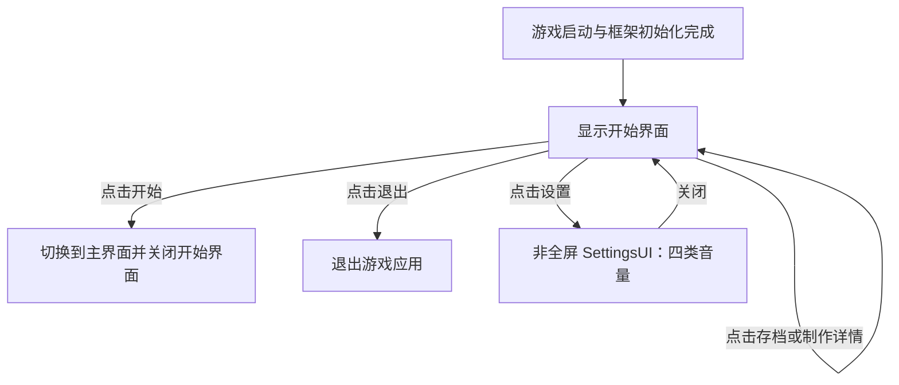

# 数学桌球：开始与退出按钮功能设计

日期：2026-10-06 · 版本：v0.2 · 任务等级：L3

关联：[开始界面设计与制作流程](数学桌球-开始界面设计与制作流程.md)。本文记录开始界面之后的按钮功能要求；原有美术、五个按钮顺序和布局保持原方案。

> 后续设计更新：开始按钮调用 `GameManager.Instance.StartGameAsync()`，由管理器关闭开始界面并打开主界面。详见[核心入口与 GameManager 单例设计](数学桌球-核心入口与GameManager单例设计.md)。本次仍只更新文档。

## 1. 本阶段范围

本次仅补充设计文档，暂不编写代码或搭建 Unity 界面。开始、退出以及新增的设置入口行为如下，按各自文档分步实施：

| 按钮 | 点击后的行为 |
|---|---|
| 开始 | 关闭开始界面，打开主界面 |
| 退出 | 退出游戏应用 |
| 设置 | 打开非全屏 SettingsUI，调整背景音乐、游戏音效、界面音效和声音四类音量 |
| 存档 | 暂不实现，保留显示，不注册业务点击回调 |
| 制作详情 | 暂不实现，保留显示，不注册业务点击回调 |

设置的最新范围见[设置界面与四类音量设计](数学桌球-设置界面与四类音量设计.md)。StartUI、MainUI 都是全屏窗口，SettingsUI 是非全屏弹窗。本阶段不扩展存档读写或制作详情子页面。“打开主界面”不等于已经完成关卡加载、击球逻辑或游玩循环。

## 2. 界面流程

启动后显示开始界面，不直接打开主界面。点击开始后由 `GameManager` 通过 UI 管理器关闭开始界面，再异步打开主界面。关闭菜单应释放窗口，而不是只停用某个背景对象。

## 3. 开始按钮

1. 仅绑定开始按钮 `m_btn_Start`，通过现有 `UIWindow` 的组件绑定方式取得 Button。
2. 点击后调用 `GameManager.Instance.StartGameAsync()`，按钮不再直接处理界面切换。
3. 管理器在第一次 await 前锁定启动状态，防止重复调用产生多份主界面。
4. 管理器通过 `GameModule.UI.CloseUI<StartUI>()` 关闭开始界面，再通过 `ShowUIAsyncAwait<MainUI>()` 打开主界面。
5. 校验返回窗口的 `IsPrepare` 及有效对象；确认准备完成后才标记游戏已开始。
6. 若加载失败，清理本次失败的主界面加载，恢复开始界面并解除启动锁，输出明确错误，允许再次点击开始。

正常顺序为先关闭开始界面、再打开主界面；失败时由管理器恢复菜单。开始按钮发起管理器调用后，不再访问可能已经销毁的菜单组件。完整状态与单例释放规则见核心入口设计文档。

## 4. 退出按钮

1. 仅绑定退出按钮 `m_btn_Exit`。
2. 桌面 Player 中请求退出应用，预期关闭整个游戏进程，而不是仅关闭开始窗口或返回其他页面。
3. Editor 验证时预期结束 Play Mode，保留 Unity Editor，不关闭编辑器本身；Editor 专用逻辑必须位于 `UNITY_EDITOR` 条件编译范围内。
4. 使用正常应用退出入口，具体 API 及热更域可用性在实现时核查；框架清理沿用项目已有销毁回调，不手动提前销毁全局模块，也不使用强制终止进程。
5. 本阶段不增加确认弹窗、自动保存或存档检查。

## 5. 实现前置检查

- 开始界面当前仅有文档和 UI 图片，尚无 `StartUI.prefab` 或窗口脚本，需要先完成组件与资源绑定。
- 已有 `Assets/AssetRaw/UI/MainUI.prefab`，但其内容包含生命/魔法/经验信息与摇杆等框架示例节点，未发现对应的 `MainUI` 窗口类。它不能直接被认定为已经完成的数学桌球主界面。
- 后续正式主界面类名按核心入口方案命名为 `MainUI`，新 Prefab 与资源地址暂定 `GameMainUI`；实施前核对地址唯一性与收集配置。保留已有示例资源，不覆盖 `MainUI.prefab`。
- `GameApp.StartGameLogic()` 当前没有打开窗口，接入时需让它显示开始界面。不要在菜单 Prefab 缺失时先改启动入口，造成启动加载错误。
- 仍遵循项目 `tengine-dev` 的 UI、资源与热更边界规范。按钮只做窗口切换时不额外建立跨模块事件系统。
- 资源导入、Prefab 创建与保存、节点引用、编译和运行验证统一通过 `unity-pipeline`；禁止拼接 Unity YAML 或运行时临时创建菜单来替代 Prefab。

## 6. 验收标准

- 启动后能看到开始界面与全部五个按钮。
- 点击开始，出现正确主界面，开始界面已关闭，不留下可拦截输入的隐藏菜单。
- 开始按钮通过 `GameManager.Instance.StartGameAsync()` 进入统一启动流程；连续点击只产生一份主界面，切换失败后恢复菜单并能够重试。
- 点击退出，在 Editor 中结束 Play Mode；桌面 Player 中退出应用。未验证的运行环境不得标为已通过。
- 设置按独立方案打开非全屏弹窗，四项音量与项目分类一致；关闭后返回可操作的开始界面。
- 存档、制作详情只有视觉反馈，不打开窗口、不读写文件、不发送业务事件。
- 窗口关闭时监听清理正确，资源引用有效，没有本轮新增的编译或运行错误。

## 7. 当前执行记录

已按用户确认完成按钮功能设计文档，并核查现有入口代码与主界面资源。原开始界面设计文档已增加本次需求更新链接，后续按钮行为以本文为准。

本次未编写或修改 C#，未导入资源、搭建 Prefab、修改启动入口、编译或运行游戏。按钮行为已定义，尚未在游戏中接入。

后续实现时需先核对正式主界面资源与可用的 Unity CLI/Pipeline 环境，再搭建界面、分步接入开始、退出和设置按钮并按各自方案验收。
