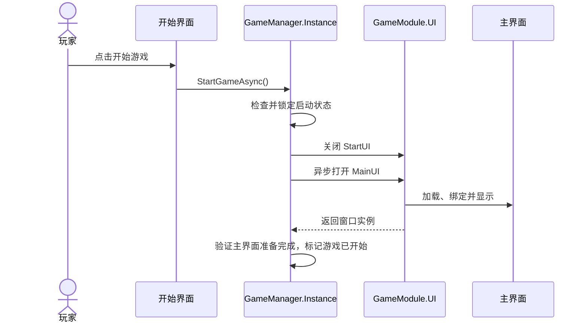

# 数学桌球：核心入口与 GameManager 单例设计

日期：2026-10-05 · 版本：v0.1 · 任务等级：L3

前置文档：[开始界面设计与制作流程](数学桌球-开始界面设计与制作流程.md)、[开始与退出按钮功能设计](数学桌球-开始与退出按钮功能设计.md)。本次继续制作下一步文档，不编写业务代码或修改 Unity 资源。

> 后续小球设计：[小球核心逻辑分步设计](数学桌球-小球核心逻辑分步设计.md)。采用独立 `BallManager`、`BallBase`、具体球子类及功能组合。`GameManager` 持有球管理器，球的初始化、复位和释放由球管理器组织；第一步仅做显示与复位。实施该步时，`StartGameAsync()` 在主界面及白球初始化都成功后才标记游戏已开始。

> 目标阶段的职责补充见[架构评审与目标判定职责设计](../架构设计/数学桌球-架构评审与目标判定职责设计.md)：GameManager 保留本入口职责并持有、释放本局 Session 与 BallManager；Session 协调目标判定与成功流程，独立 GoalJudge 计算规则。GameManager 不增加几何公式或另一套本局胜负状态。

> 2026-10-06 增加[关卡管理器设计](../架构设计/数学桌球-关卡管理器设计.md)：GameManager 持有 LevelManager，委托其读取、校验数据与准备桌面/目标；再初始化 BallManager 与 Session。所有必要内容准备成功后才标记游戏已开始。清理时先停本局、再清球、最后卸载关卡内容。

> 2026-10-06 配置方式更新：[Luban 配置设计](../架构设计/数学桌球-Luban配置表与数据分层设计.md)统一关卡和球参数来源。进入关卡前由 GameManager 确认配置异步准备与解析成功，再委托 LevelManager 查询、校验并提供只读快照；配置失败不开放输入。当前同步加载模板的适配属于后续实施，不在本轮修改代码。

## 1. 本步目标

先建立游戏核心入口：玩家点击开始游戏按钮后，调用 `GameManager` 单例的开始游戏函数，由该函数关闭开始界面并打开主界面。

本步完成的是“开始按钮 → GameManager → 主界面”的调用链。后续桌球初始化和玩法功能可以从这个入口继续扩展，本步不提前实现瞄准、蓄力、球运动、关卡判定或存档。

退出按钮沿用退出应用行为。设置按[四类音量设计](数学桌球-设置界面与四类音量设计.md)打开非全屏弹窗；存档、制作详情继续保留显示，暂不实现功能。开始界面和主界面均全屏，设置入口不调用 StartGameAsync。

## 2. 正常执行流程

按本次要求，正常顺序为：**点击开始 → 调用开始游戏函数 → 关闭开始界面 → 打开主界面 → 完成启动**。函数调用后由管理器执行整个流程，不在按钮回调中先切换一次、再在管理器中重复切换。

游戏应用启动时只打开开始界面；不能在 `GameApp.StartGameLogic()` 中直接调用本业务的开始游戏函数，否则会跳过菜单。

## 3. GameManager 单例

| 项目 | 设计 |
|---|---|
| 类名 | `GameManager`，沿用用户指定名称 |
| 命名空间 | `GameLogic` |
| 基类 | 项目现有 `Singleton<GameManager>` |
| 访问方式 | `GameManager.Instance` |
| 开始游戏函数 | `public UniTask StartGameAsync()` |
| 文件归属 | `GameLogic/Module/GameModule/GameManager.cs`；管理器按 xxModule 目录分类 |
| 生命周期 | 首次访问创建，使用现有 `SingletonSystem` 统一管理与释放 |

根据项目实际 `Singleton.cs`，`Instance` 首次访问会创建对象、调用 `OnInit()` 并执行 `SingletonSystem.Retain()`；`Release()` 会调用 `OnRelease()` 并清空实例。复用这套机制，不另写静态实例字段，也不创建场景中的 MonoBehaviour 管理器。

`GameManager` 保留可被基类 `new()` 约束使用的公共无参构造方式，业务侧通过 `Instance` 访问，不手动 `new GameManager()`。`OnInit()` 只初始化管理器状态，不自动开始游戏。

开始函数包含异步窗口加载，因此采用项目规定的 `Async` 后缀与 `UniTask`，名称确定为 `StartGameAsync`；它就是本需求中的“开始游戏函数”。

## 4. 各文件职责

| 文件或对象 | 本步职责 |
|---|---|
| `StartUI` | 显示五个菜单按钮；开始按钮调用管理器，退出按钮沿用退出行为 |
| `GameManager` | 统一处理开始游戏、防重复启动、界面切换和启动状态；后续组织 LevelManager、BallManager 与 Session 的初始化和清理 |
| `LevelManager`（关卡阶段） | 读取、校验并提供关卡数据，组织关卡桌面与目标的准备、卸载 |
| `BallManager`（后续小球阶段） | 独立管理球对象，组织注册、初始化、复位与释放；功能算法由球组合的组件执行 |
| `MainUI` | 主界面窗口，显示本阶段主界面内容；不在自身生命周期中再次启动游戏 |
| `GameApp.StartGameLogic()` | 框架启动完成后显示开始界面 |
| `SingletonSystem` | 沿用现有管理与释放流程，不改框架实现 |

UI 窗口类按用途命名，省略项目名前缀：开始界面为 `StartUI`，主界面为 `MainUI`。当前没有检索到同名窗口类，但存在框架示例 `MainUI.prefab`，因此主界面的新 Prefab 和资源地址暂定 `GameMainUI`，保留既有示例资源。类名与资源地址通过 Window 特性明确绑定，不要求相同。

脚本按[当前目录归属约定](../架构设计/数学桌球-脚本目录归属约定.md)沿用实际 UI 目录及生成器配置：当前默认实现目录为 `GameLogic/UI/`，绑定代码目录配置为 `UI/Gen/`，不预设 UI/Billiards 子目录。Prefab 资源位置与地址唯一性仍在实施时核对实际收集与绑定。

主界面使用 `UIWindow` 与普通 UI 层，资源地址暂定为 `GameMainUI`，完整窗口标记可采用 `[Window(UILayer.UI, "GameMainUI", fullScreen: true)]`，窗口类名为 `MainUI`。首版只需提供能够显示的主界面与后续玩法容器，详细主界面布局另行设计；不直接把框架示例里的生命、魔法、经验和摇杆当作桌球功能。

## 5. 开始函数的执行规则

### 5.1 防止重复开始

管理器维护两个简单状态：`IsStarting` 表示正在启动，`IsGameStarted` 表示本次启动已经完成，均只由管理器修改。函数入口先检查状态，再在第一次 await 之前锁定 `IsStarting`。

正在启动时再次调用，或已经开始后收到旧菜单的重复请求，都不创建第二份主界面、不重复初始化。UI 不再另建一套业务启动状态。

### 5.2 关闭菜单并打开主界面

1. 将状态设为正在启动。
2. 通过 `GameModule.UI.CloseUI<StartUI>()` 关闭开始界面。
3. 通过 `GameModule.UI.ShowUIAsyncAwait<MainUI>()` 异步打开主界面。
4. 检查返回实例、`IsPrepare` 与窗口对象有效性，确认主界面已经准备完成。
5. 成功后设置 `IsGameStarted = true`，解除 `IsStarting`。

实际 `ShowUIAsyncAwait` 的内部等待有超时返回逻辑，await 返回本身不是加载成功的充分条件。不得跳过窗口准备状态检查。

开始按钮回调只发起 `GameManager.Instance.StartGameAsync()`，按项目约定处理 UniTask 的返回，例如使用 `.Forget()`；管理器负责记录与处理预期的启动失败。菜单可能在函数开始执行时就被关闭，因此按钮回调不能在调用之后继续读写已销毁的菜单组件。

### 5.3 启动失败

因为正常流程先关闭开始界面，主界面加载失败后必须恢复入口：记录明确错误，清理本次失败的窗口加载，保持 `IsGameStarted = false`，恢复开始界面，解除启动锁，允许玩家重试。

若框架等待超时而底层加载仍未结束，实现时需核查并处理本次未完成任务，避免返回菜单后又出现旧主界面。恢复菜单失败也应明确报告，不能把空白画面标为启动成功。

本步不新增进度条、加载弹窗或重试子页面；按上述规则恢复原菜单即可。

## 6. 初始化与退出清理

- `GameManager.OnInit()` 将启动状态初始化为未开始、未启动中，不加载关卡、不打开窗口。
- 无需在启动菜单时提前创建管理器；第一次点击开始后访问 `Instance` 即可按现有框架创建。
- 应用退出沿用现有 `GameApp.Release()` → `SingletonSystem.Release()` 路径，管理器通过 `OnRelease()` 清理自身状态与未来增加的资源。
- 实施时核查应用退出中未完成的异步任务，退出后不得再打开菜单或提交游戏已开始状态；不通过再次访问 `Instance` 来重新创建已释放管理器。
- 本步不添加每帧轮询接口，不修改 `Singleton<T>`、`SingletonSystem` 或 UI 模块内部实现。

## 7. 后续实施顺序

1. 先按既有设计搭建开始界面，并确认主界面正式名称与资源地址。
2. 制作可以显示的 `MainUI` 窗口，使用暂定 `GameMainUI` 的新 Prefab 与资源地址，核查绑定和收集配置。
3. 在热更业务目录 `GameLogic/Module/GameModule/` 建立 `GameManager : Singleton<GameManager>`，编写 `StartGameAsync()` 与最小启动状态。
4. 开始按钮接入管理器调用，移除旧方案中由按钮自行执行界面切换的职责，避免重复执行。
5. 启动入口只显示开始界面；退出按钮沿用上一份方案；其他三个按钮不注册业务回调。
6. 通过项目 `unity-pipeline` 流程完成资源与 Prefab 操作、编译和运行验证。

## 8. 验收标准

- 应用启动后停留在开始界面，尚未调用 `StartGameAsync()`。
- 第一次点击开始时，通过 `GameManager.Instance` 调用开始游戏函数，开始界面关闭，主界面打开。
- 多处获取 `Instance` 返回同一个管理器实例，管理器未重复初始化。
- 连续点击或重复请求只产生一次有效启动与一份主界面。
- 主界面成功准备完成后才标记游戏已开始；失败恢复菜单并能再次尝试。
- 关闭菜单后不访问其旧组件，不在主界面中再次调用开始游戏函数。
- 退出游戏按已有清理路径释放管理器；退出后没有异步加载重新打开窗口。
- 设置按独立文档分步接入，不触发游戏启动；存档、制作详情仍无业务功能。

## 9. 本次交付与验证边界

本次已完成核心入口与单例设计文档，并核查项目实际 `Singleton<T>`、`SingletonSystem` 和异步显示窗口 API。只修改文档，不创建 C#、Prefab 或场景，不进行 Unity 编译、Play Mode 或运行验证。

后续实施以本方案为准：开始按钮调用管理器，管理器统一切换界面；上一份文档中的开始按钮流程同步更新。未实现的功能不标记为已经完成。
