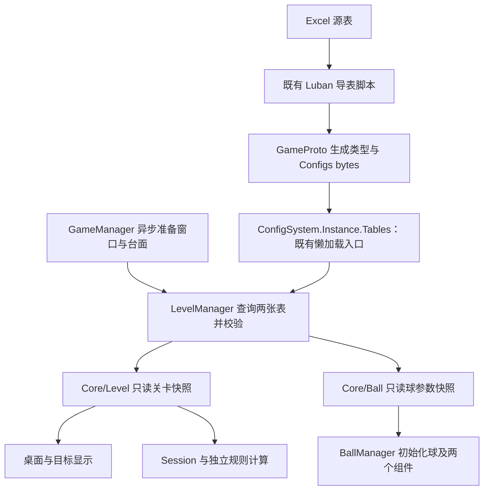

# 数学桌球：Luban 配置表与数据分层设计

> 2026-10-06 最新配置分类建议见[多关卡配置表分类与字段归属方案](数学桌球-多关卡配置表分类与字段归属方案.md)。新玩法为白球碰撞黑球、全部黑球入六洞通关，图形条件用于触发道具或解锁洞；建议使用 5 张关卡主表／明细表和 4 张共用参数表。下文单目标、单白球、单道具的两表设计保留为旧版依据，字段归属由新版分类替代；实际源表尚未迁移，本轮只更新文档，未导表或运行验证。

日期：2026-10-06 · 版本：v0.3 · 任务等级：L3 · 状态：按 luban-dev 对齐业务入口；生成结果缺失，尚未验证

当前源文件为 #billiards_ball.xlsx、#billiards_level.xlsx。业务统一通过 ConfigSystem.Instance.Tables 查询，LevelManager 不再自行异步加载 bytes 字典，不调用 IsReady、Initialize 或 Release。当前生成的 Tables 为空，桌球表及 ExternalTypeUtil 所依赖的向量类型缺失；完整接入仍需有效生成结果。初版的表名、地址和加载验收只属于[历史实施记录](../功能开发/数学桌球-初版验收/初版实施与验收记录.md)，不能据此认定当前配置已可用。实施范围见[技能对齐修复方案](../问题修复/数学桌球-Luban技能对齐修复方案.md)。

关联：[文档导航](数学桌球DEMO-v0.2/00-文档导航与设计决策.md)、[关卡管理器](数学桌球-关卡管理器设计.md)、[目录归属](数学桌球-脚本目录归属约定.md)、[5-A1 实施方案](../功能开发/数学桌球-代码实现方案/05-A1-最小关卡数据管理.md)。

## 1. 本次确认的方案

按用户要求，可编辑的关卡和玩法参数统一使用 Luban 配置表，以 Excel 为源文件，生成 C# 类型和二进制数据。此前 JSON 关卡建议由此取代。已有桌面、击球、运动和大小变化参数在实施时按原值迁入，先验证行为一致，再调整数值。

表的划分按数据归属，不按组件数量。击球、运动、大小变化合并在一张球参数表中；球脚本仍保持 BallShootComponent 和 BallSimulationComponent 两类能力。配置方式不改变管理器、球基类、组合组件或独立目标判定器的职责。

本轮按已确认方案更新业务接口与文档，保留现有配表、导表脚本和模板。没有执行导表、编译、测试或 Unity 操作。

## 2. 实际工程与生成位置

以下路径相对仓库根目录；源配置位于 UnityProject 外的既有 Configs 工程，生成结果进入 UnityProject。

| 内容 | 实际位置与现状 |
|---|---|
| Luban 工程 | `Configs/GameConfig/luban.conf`，已存在；客户端目标为 client，命名空间 GameConfig |
| 表注册与数据 | `Configs/GameConfig/Datas/`，有三个定义工作簿和 #billiards_ball.xlsx、#billiards_level.xlsx |
| 当前表定义状态 | 三个定义工作簿没有有效定义记录；helper 按文件名识别两张自动导入候选表，但不代表导出链已接入 |
| 推荐客户端脚本 | `Configs/GameConfig/gen_code_bin_to_project_lazyload.bat`，已存在；使用自定义懒加载模板 |
| 生成格式 | 脚本为 cs-bin + bin；生成代码目标 `UnityProject/Assets/GameScripts/HotFix/GameProto/GameConfig/` |
| 数据输出 | `UnityProject/Assets/AssetRaw/Configs/bytes/`，为脚本指定的输出位置 |
| 配置加载器模板 | `Configs/GameConfig/CustomTemplate/ConfigSystem.cs`；脚本复制到 `UnityProject/Assets/GameScripts/HotFix/GameProto/ConfigSystem.cs` |
| Unity 中的现状 | ConfigSystem 使用 Tables/Load 接口；生成目录只有空 Tables，缺少桌球表和向量类型，bytes 输出缺失 |

__tables__.xlsx 注册列包括 full_name、value_type、read_schema_from_file、input、index、mode、group、comment、tags、output。技能支持显式注册或 # 前缀自动导入，但须与实际导出工具和入口相匹配。本轮不添加注册记录、不修改自动导入参数，不将 helper 的识别结果当作生成 API。

生成代码不放进 GameLogic/Core 或 Module。手写管理器和业务数据仍按当前目录规则落位；生成目录只由导表脚本维护。

## 3. 最少需要哪些表

下面保留初版的数据划分与字段职责。表全名是历史设计契约，不是当前生成结果。当前 helper 识别出的自动导入候选名为 Tbbilliards_level、Tbbilliards_ball，现有业务仍保留 TbLevel、TbBall 查询；二者的最终绑定必须以有效生成代码为准。

| 历史表定义全名 | 当前源文件 | 历史记录类型 | 负责的数据 |
|---|---|---|---|
| `billiards.TbLevel` | `Datas/#billiards_level.xlsx` | `billiards.Level` | 单关布局、白球出生配置、目标容差、球参数引用 |
| `billiards.TbBall` | `Datas/#billiards_ball.xlsx` | `billiards.Ball` | 一套球的击球、运动和大小变化参数，多关以后可复用 |

UI 类名仍为 StartUI、MainUI、SettingsUI。表名、字段大小写与 bytes 地址以实际生成结果为准。源表 ballConfigId 当前仍引用 billiards.TbBall；若最终采用自动导入命名，需要先确认引用对应关系。本轮保留该引用，不自行改表。

### 3.1 关卡表

所有位置、长度均使用既有桌面本地二维逻辑坐标，时间使用秒；不填写 UI 像素或屏幕坐标。

| 字段建议 | 类型 | 含义与加入时机 |
|---|---|---|
| id | int | 关卡主键；5-A1 加入 |
| ballConfigId | int，引用 billiards.TbBall | 对应球参数记录；5-A1 加入，不在关卡表重复同一套模拟参数 |
| boardMinX / boardMinY / boardMaxX / boardMaxY | float | 逻辑可玩范围，木框不计入；5-A1 加入 |
| triangleAX / triangleAY / triangleBX / triangleBY / triangleCX / triangleCY | float | 三角形三个顶点；5-A1 加入，显示与判定共用 |
| spawnX / spawnY / spawnRadius | float | 出生球心和复位半径；5-A1 加入 |
| goalTolerance | float | 玩法贴合容差，5-A1 准备、5-A2 使用；算法退化阈值不混用此字段 |
| itemX / itemY / itemRadius | float | 当前单个翻转道具的位置与接触半径；第六步再加入，暂不另拆道具表 |
| maxShots | int | 每关尝试次数；第七步加入，本版配置为 3 |
| showGoalHintsByDefault | bool | 目标提示的默认显示状态；第八步加入，玩家本次切换属于运行状态 |

若已有实现区分内切和外接的玩法容差，迁移时保留两字段而不强行合并。资源地址只在已有内容需要配置映射时加入，先核对实际 YooAsset 地址，不能用猜测路径填表。没有多种道具前，不另建泛化道具类型表。

### 3.2 球参数表

| 字段建议 | 类型 | 含义 |
|---|---|---|
| id | int | 参数组主键，当前一条白球参数即可 |
| radiusMin / radiusMax | float | 模拟允许的半径范围 |
| chargeDuration | float | 蓄力到最大力量所需时间，沿用当前击球方式 |
| speedAtMinPower / speedAtMaxPower | float | 力量映射到初速的两端参数 |
| shotRadiusAtMinPower / shotRadiusAtMaxPower | float | 力量映射到出杆初始半径的两端参数，均位于允许范围内 |
| plannedDistance | float | 每杆计划行进路程，保持当前固定路程规则 |
| growRate / shrinkRate | float | 半径增长和缩小速率的正值，方向由运行状态决定 |
| simulationStep | float | 固定模拟步长；当前一个球使用这一处来源 |

这是字段含义建议。制作时核对已经完成的模拟模型：若减速系数由初速和固定路程推导，则不再增加独立可编辑的减速系数造成约束冲突；若现有大小变化使用其他函数，按其真实参数迁移，不能为了匹配字段表改写玩法。力量与初速、初始大小的映射方式保留已有规则。

球参数表保存允许范围和击球映射，关卡表保存该关出生半径；二者通过引用配合，出生半径必须落在球参数范围内。当前不增加逐关覆盖、配置继承或通用合并系统。

## 4. 配置与运行状态分开

| 内容 | 保存与维护位置 |
|---|---|
| 布局、出生参数、球参数、容差、默认杆数 | Luban 表，导表后只读 |
| 当前球心、速度、半径、运动时间、增大/缩小趋势 | BallBase、模拟组件及其运行数据 |
| 剩余杆数、是否成功、当前出杆、道具本杆是否触发 | Session 运行数据 |
| 几何预计算、关卡与球参数只读业务快照 | LevelManager 由生成表构建，属于派生数据，不另存 JSON |
| Music、Sound、UISound、Voice 当前开关和音量 | 现有 AudioModule；Voice 显示名仍为“声音” |
| 玩家调整音量、提示开关、未来存档进度 | 运行状态或以后单独设计的用户偏好/存档数据，不写回 Excel 或 bytes |
| Prefab 绑定、UI 布局、框架 AudioSetting | 保留各自工程配置；不因引入玩法配置表而全部搬入 Luban |

球出生数据与目标显示数据不再同时以 Inspector、硬编码和表格三处作为有效配置。场景保留显示引用和绑定，表格提供参数。现有几何测试夹具和美术资源清单 JSON 不属于玩法配置，不受此数据源调整影响。

## 5. 谁读取配置

| 对象 | 配置职责与目录 |
|---|---|
| ConfigSystem / Tables | 配置基础设施与生成数据访问，沿用 GameProto 的位置和程序集边界；不承担关卡状态 |
| GameManager | `GameLogic/Module/GameModule/`；确保配置可用，组织关卡、球、本局的准备顺序 |
| LevelManager | `GameLogic/Module/LevelModule/`；按关卡 id 查询关卡记录和引用的球参数，校验后一次性发布业务快照 |
| BallManager | `GameLogic/Module/BallModule/`；接收已校验的球参数与出生数据，传给 BallBase 和两个组件 |
| BilliardsLevelData | `GameLogic/Core/Level/`；普通只读业务数据，作为生成记录的投影，不自行读表 |
| 球参数业务数据 | `GameLogic/Core/Ball/`；沿用已有参数类型，没有时建立一个小型只读数据对象 |
| Session、GoalJudge、球组件、UI | 接收所需参数或运行快照，不逐帧通过全局 ConfigSystem 查询表 |

LevelManager 中的小型转换和校验方法足够当前需要，不另建 LevelConfigManager 单例或通用配置仓库。业务依赖普通数据，使规则测试和球模拟无需依赖 Excel、资源包或生成类。配置记录与外部可变集合不得直接交给显示层修改。

这延续[架构评审中的七大原则与设计模式](数学桌球-架构评审与目标判定职责设计.md)：配置基础设施负责加载，LevelManager 负责关卡准备，球组件负责能力，符合单一职责；业务依赖所需数据而不遍历全局管理器，减少耦合并遵守迪米特法则；新增关卡优先增加数据，不修改球行为。管理器承担对外协调入口，球能力继续采用组合，数据转换承担生成结构与业务结构的适配。当前没有多种数据来源，不为套用模式增加工厂、策略接口或第二套单例。

## 6. 既有配置入口与生命周期

项目现有 CustomTemplate/ConfigSystem.cs 中 Tables getter 会调用 Load，LoadByteBuf 使用同步 LoadAsset<TextAsset>。懒加载 Tables 模板在首次访问某张表时才调用该 loader 并 ResolveRef；因此仅创建 Tables 不代表两张表已成功加载。

现有 ProcedurePreload 在非 EditorSimulateMode 中预加载 PRELOAD 标签资源，编辑器模拟模式会跳过；当前 Configs 收集组按文件名寻址，没有 PRELOAD 标签。预加载失败也会被该流程记为完成。因此不能以“流程走过了预加载”作为配置有效的判断。

本轮按用户指定的 luban-dev 技能和实际 ConfigSystem 接口使用同步懒加载。项目通用规范要求异步 IO，而该技能示例及现有模板使用同步 LoadAsset，这是保留的基础设施差异；本轮不扩展模板以实现另一套异步缓存协议。GameProto 不反向引用 GameLogic；台面与 UI 的资源流程继续使用既有异步接口。

进入顺序保持：关闭 StartUI → 异步打开 MainUI → 异步加载世界台面 → 检查取消状态 → LevelManager.LoadLevel 查询并构建经校验的快照 → 准备桌面与目标 → BallManager 初始化 → 创建 Session → Runner 绑定会话。未完成必要准备前不开放击球。

关卡卸载只清理当前快照和场景内容，不释放全局 Tables。当前 ConfigSystem 没有 Release 接口，业务退出不得调用该方法。源 TextAsset 的持有方式沿用现有加载器，本轮没有新增释放机制；相关基础设施改动需另列方案。调参后通过重新导表并重新启动应用读取，本局途中不更换快照。

缺少表资源、反序列化失败、记录不存在或校验失败均属于准备失败；返回表/记录/字段及原因，阻止出杆，可从原入口重试。不静默用硬编码默认关卡兜底，不扣玩家杆数。退出时进入请求失效，迟到结果不发布为当前关卡。

## 7. 校验与导表流程

导表阶段检查主键唯一、字段类型、必需字段、引用存在；ballConfigId 使用实际 Luban 引用定义。业务准备阶段再检查有限值、边界面积、非退化三角形、非负容差、正半径、出生球体完整在桌内、半径上下限、映射端点、正路程/时长/步长与当前模拟约束。成功条件与数值退化处理仍归 GoalJudge 和数学方法。

代码和数据按同一次表结构生成、验证和发布，不能假定“新增字段时旧版二进制读取器一定兼容”。修改结构后同步更新生成类型、数据、热更程序集和资源版本，验证格式匹配。

以下是配置生成前提与后续验收流程，不是本轮已执行事项：

1. 取得有效桌球生成结果，确认实际表成员、字段与引用；若配置源有缺项，单列具体差异供用户确认，不自动修改源表。
2. 获得导表授权后，只调用既有 gen_code_bin_to_project_lazyload 脚本，不手拼 dotnet 命令、不手改生成代码；自动调用时设置 AI_MODE=1 避免 pause。
3. 检查生成类型、Tables 成员、实际输出文件名和地址唯一性；按项目 Unity Pipeline 处理 Assets 导入与 YooAsset 收集，不猜测生成 bytes 名字。
4. 按有效生成接口接入 LevelManager 的查询、转换和校验，使用既有 ConfigSystem.Instance.Tables 入口。
5. 用表改一个目标顶点后重新导表、重新准备，确认显示和业务快照一致；球运行状态不能反向修改表。
6. 验证缺失引用、坏数据、缺失 bytes、解析错误、退出后迟到结果、重复进入与失败重试；回归原有击球、运动和大小变化。

5-A1 验收后仍按原顺序进入 5-A2 静态目标判定。道具、三杆循环、界面反馈的配置随第六、七、八步增量添加，暂不一次实现全部步骤。

## 8. 本轮验证边界

本轮修改业务代码和文档，未执行导表、编译、测试或 Play Mode。历史验收记录仅适用于其记录的代码和资源版本；当前空 Tables 和缺失类型尚未解决，不能标记完整配置接入或验收通过。
