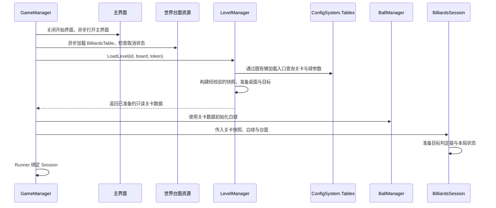

# 数学桌球：关卡管理器设计

日期：2026-10-06 · 版本：v0.5 · 任务等级：L3 · 状态：业务入口已按 luban-dev 调整；有效生成表待补齐，未验证

关联：[整体架构评审](数学桌球-架构评审与目标判定职责设计.md)、[小球核心逻辑设计](../功能开发/数学桌球-小球核心逻辑分步设计.md)、[目标判定](../功能开发/数学桌球-代码实现方案/05-第五步-内切与外接判定.md)。

## 1. 增加独立 LevelManager

按用户要求，关卡数据由独立 `LevelManager` 管理。它负责关卡配置读取、校验、当前关卡数据与关卡内容的准备、卸载。`GameManager` 组织进入关卡，`BilliardsSession` 使用已经准备好的关卡数据执行本局，`BilliardsGoalJudge` 只计算目标是否达成。

`LevelManager` 不承担目标达成公式、本局胜负、剩余杆数或球的运动。关卡管理和本局流程分别有一份权威状态，避免把所有玩法都塞进关卡管理器。

当前只有一个关卡，先建立一个小型管理器，不提前制作选关、关卡解锁、自动下一关、存档进度或完整关卡目录系统。

## 2. 各对象的分工

| 对象 | 职责 |
|---|---|
| `GameManager` | 保留单例与开始函数，持有 LevelManager、BallManager 与本局 Session，组织启动与清理顺序 |
| `LevelManager` | 读取、校验关卡配置；保存当前关卡标识与只读数据；组织桌面、目标等关卡内容准备和卸载 |
| `BilliardsLevelData` | 描述关卡配置，是数据对象；不自行加载资源或控制游戏流程 |
| `BallManager` | 按已准备的关卡数据初始化和管理球，负责球对象与组件的生命周期 |
| `BilliardsSession` | 使用当前关卡快照协调操作、模拟、判定、杆数和结果 |
| `BilliardsGoalJudge` | 接收三角形、容差及球状态/轨迹，返回目标结果 |
| 关卡显示对象 | 显示桌面和目标，读取与判定相同的数据；由 LevelManager 组织准备与清理 |

建议 `LevelManager` 为普通 C# 对象，由 GameManager 创建和持有，退出时清理。当前不另加单例或场景 MonoBehaviour 管理器。Session 在初始化时接收关卡快照，不在每次数学查询时通过全局管理器寻找关卡。

LevelManager 组织关卡显示生命周期，但绘制和显示同步仍由已有显示脚本执行；白球的显示和复位继续由 BallBase 负责。若关卡根对象包含球挂点，先完成 BallManager 的清理，再卸载根对象。

## 3. 关卡数据与本局状态

关卡与玩法参数采用[Luban 配置表](数学桌球-Luban配置表与数据分层设计.md)。LevelManager 通过 ConfigSystem.Instance.Tables 查询记录，构建经校验的 BallConfigData 与 BilliardsLevelData；显示与判定使用同一份快照。源表已存在于仓库 Configs/GameConfig/Datas，文件名为 #billiards_level.xlsx、#billiards_ball.xlsx。当前生成的 Tables 为空，不能将源表存在等同于接入完成；有效生成成员与引用绑定仍待补齐。本轮不修改配置源或导表入口。

| 数据 | 归属与使用 |
|---|---|
| 关卡标识、桌面可玩范围 | LevelManager 准备并提供给本局和显示对象 |
| 三角形顶点、贴合容差 | LevelManager 校验，目标显示与 GoalJudge 使用同一份 |
| 白球出生位置、出生半径、已有模拟配置 | LevelManager 提供配置，BallManager / BallBase / 模拟组件按原有职责使用 |
| 当前球心、速度、半径、累计模拟时间 | 属于球的运行状态，不写回关卡配置 |
| 当前出杆、是否成功、未来的剩余杆数 | 属于 Session，不在 LevelManager 中再保存一份 |

配置校验至少覆盖有限数值、有效可玩范围、有效出生半径、三角形顶点互异且不共线、非负且有限的玩法容差。按现有规则校验出生球体完整位于桌面内；有效球半径上下限继续沿用已有模拟约束。

三角形方向归一化、边参数等预计算由关卡准备调用共用几何方法完成，结果供显示与判定使用。LevelManager 不复制内切/外接的成功条件；GoalJudge 对无效输入保持必要检查，不依赖场景对象才可以判定。

实际 Current 属性提供已经准备成功的 BilliardsLevelData。业务数据构造时执行参数校验，不把可变生成记录交给球或 UI。本局使用稳定快照，运行中不原地改写。配置加载沿用全局懒加载缓存，修改源表并导出后需重新启动应用读取，单纯返回菜单不能保证刷新配置。

## 4. 从开始游戏到本局准备完成

保持用户确定的“关闭开始界面、打开主界面”的顺序。主界面打开期间，在关卡和球准备完成前禁止出杆。GameManager 负责这个跨对象流程；LevelManager 不自行切换 UI 或启动第二个 Session。

目标判定器接收关卡几何数据即可，不持有 LevelManager。球也只接收自己的配置，不持有整个关卡管理器。关卡准备完成的返回结果用于内部初始化；未来需要通知外部模块时沿用 GameEvent，UI 使用 AddUIEvent。

## 5. 当前业务接口与状态

以下为本轮业务方法签名。配置查询仍需要有效生成表；这些入口不是 TEngine 框架 API。

| 当前入口/属性 | 语义 |
|---|---|
| `LoadLevel(id, view, token)` | 同步查询配置、构建校验后的快照并准备已有台面；成功后才赋值 Current |
| `Current` | 读取已准备的关卡快照；卸载后为 null |
| `UnloadLevel(view)` | 解除台面绑定并清空快照；接受 Unity 退出时已被销毁的台面 |

GameManager 的进入锁负责阻止重复异步进入，取消令牌负责使退出中的请求失效。LevelManager 不重复维护一份异步加载状态；它先建立候选数据，台面准备成功后才发布 Current。异常交给 GameManager 的已有失败清理与菜单恢复流程。

台面和窗口沿用既有异步资源流程。配置访问按用户指定的 luban-dev 使用现有同步懒加载入口；与通用异步 IO 规范的差异记录在 Luban 设计文档，本轮不修改模板。LevelManager 不自行加载 bytes、不持有源 TextAsset、不释放全局 Tables，GameManager 也不调用不存在的 ConfigSystem.Release。

## 6. 清理与以后切换关卡的边界

清理顺序由 GameManager 统一组织：

1. 使当前进入请求失效，停止继续提交新的加载结果。
2. 先解除 Runner 的 Session 绑定，再释放 Session，解除监听和对关卡快照的使用。退出清理不调用会更新已销毁白球 Transform 的模拟停止路径。
3. BallManager 清理球和组件、解除注册及对关卡对象的引用。
4. LevelManager 解除台面绑定、清空快照，再由 GameManager 销毁其持有的台面实例。
5. GameManager 按对应入口处理主界面和开始界面。

加载失败时同样只清理本次请求创建的内容，恢复已有开始入口，不把配置错误当作游戏失败或扣杆。加载、退出相遇时，通过取消和请求有效性检查阻止旧关卡重新发布；实际接口沿用已有工程，不假设取消必定阻止底层完成。

未来增加切换关卡时，由 GameManager 先结束旧局，再让 LevelManager 准备新关卡，再初始化球与 Session。LevelManager 不自行递归推进下一关；通关、解锁、保存进度届时单独设计。

## 7. 分步制作

| 阶段 | 当前增加什么 | 验收 |
|---|---|---|
| A. 关卡数据管理 | LevelManager 读取、校验并提供一个关卡的数据，接入已有桌面和目标引用 | 一份配置同时供显示与判定使用；无效配置不进入本局 |
| B. 静态目标判定 | GoalJudge 使用管理器准备的数据判定内切、外接 | 正例和反例正确，球脚本不增加目标规则 |
| C. 连续判定与成功反馈 | Session 查询模拟区间、提交命中状态、停球与提示 | 途中目标不漏判，成功只提交一次 |

上述分步内容保留原设计顺序。现有桌面、球、目标判定和会话继续复用；本轮仅修正配置入口和相关文档，不重新实现已有玩法。

最小关卡数据管理见[5-A1 实施设计](../功能开发/数学桌球-代码实现方案/05-A1-最小关卡数据管理.md)，静态判定见[5-A2 设计](../功能开发/数学桌球-代码实现方案/05-A2-静态内切与外接判定.md)。当前缺失生成表会阻止配置接入，不能将业务入口调整标记为整条链路已可用。

## 8. 文档与验证边界

脚本位置按[当前目录归属约定](数学桌球-脚本目录归属约定.md)：LevelManager 放 `GameLogic/Module/LevelModule/`，BilliardsLevelData 与桌面、目标显示脚本放 `GameLogic/Core/Level/`。GameManager、BallManager 分别归 Module/GameModule、Module/BallModule，规则与本局对象分别归 Core/Rules、Core/Session。目录分类不改变数据来源与准备顺序。

本轮修改 LevelManager、GameManager 及相关设计文档，没有修改配置源、导表脚本、模板、生成目录、资源、Prefab 或场景，没有执行导表、编译、测试或 Unity 验证。完整接入仍依赖有效生成结果。
