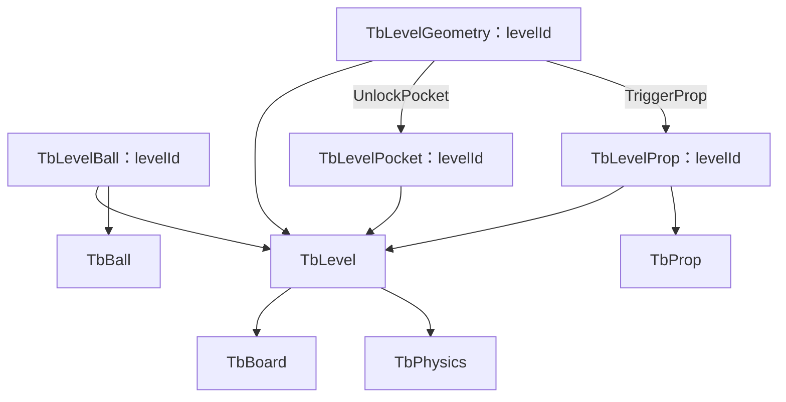

# 数学桌球：多关卡配置表分类与字段归属方案

日期：2026-10-06 · 任务等级：L4 · 状态：配置设计已整理，待确认后修改实际源表。

关联：[黑球入洞与六洞状态主方案](数学桌球-黑球入洞与六洞状态架构方案.md)、[图形交互职责评估](数学桌球-图形交互管理职责评估.md)。本轮只更新文档，没有新增或修改 Excel、Schema、生成代码、bytes、业务代码或资源，没有导表、编译、测试或 Unity 验证。

## 1. 数据来源与分表原则

用户要求每一关的数据均通过配置表配置。关卡里的球、道具、图形、六洞初始状态、机会和所引用的参数都以 Luban 为唯一玩法配置来源，场景不再保存一份独立有效的关卡摆位。

按当前需求建议 **9 张业务表：5 张关卡主表／明细表 + 4 张可复用参数表**。这是职责划分，不是强制每个管理器一张表，也不是每个关卡创建新的文件。

- 同一对象的不同类型或状态放同一张表，通过枚举或 Bean 区分。
- 关卡摆放与可复用类型参数分开：一个道具类型可在不同关卡、不同位置出现多次。
- 一对多内容用明细行表达，不在关卡表加 ball1、ball2、geometry1、geometry2 等固定数量列。
- 图形几何、唯一条件和单个效果关联属于一个完整交互定义，当前合并在同一张表，不额外拆条件表和解锁关系表。
- 当前位置、已解锁、已占用、已消费、剩余杆数等本局变化保存在运行状态中，不写回配置表。
- 配置允许复用参数，但不实现通用字段覆盖／多层继承。需要变体时新增一条完整参数记录，由关卡引用。

## 2. 实际现状（本轮只读所得）

源文件位于仓库根目录 `Configs/GameConfig/Datas/`：

| 文件 | 当前内容 | 调整方向 |
|---|---|---|
| #billiards_level.xlsx | 一条关卡，22 列；同时包含桌面范围、单三角形顶点、白球出生点、单道具位置／半径、杆数 | 拆成关卡主表与球、洞、道具、图形明细；桌面布局移至共用桌面表 |
| #billiards_ball.xlsx | 一条白球参数，13 列；蓄力、速度、出杆尺寸、固定路程、增缩速率和 simulationStep | 球自身参数继续放球参数表；全桌模拟参数移至物理表；固定路程改为力度端点路程 |
| __tables__.xlsx / __beans__.xlsx / __enums__.xlsx | 目前只有定义表头与说明，没有业务定义记录 | 实施时按项目现有工具建立明确注册、Bean 与枚举契约 |
| GameProto/GameConfig/Tables.cs | 当前没有业务表成员；LevelManager 源码仍读取 TbLevel 与 TbBall | 表结构修改与有效生成结果必须一起接入，不能只编辑字段或手改 Tables |

上述只是读取文件结构与源码，不代表导表、编译或验证通过。下文表名是拟定契约，不宣称已经存在对应生成 API。

## 3. 九张表的分类

| 分类 | 拟定表名 | 一行代表什么 | 主要数据 |
|---|---|---|---|
| 关卡主表 | billiards.TbLevel | 一关 | 关卡 ID、名称、顺序、桌面参数引用、物理参数引用、最大杆数、默认辅助提示 |
| 关卡球明细 | billiards.TbLevelBall | 一关里的一颗球 | 球实例 ID、LevelId、BallConfigId、出生位置、出生半径 |
| 关卡六洞明细 | billiards.TbLevelPocket | 一关里的一个固定洞槽位 | 洞实例 ID、LevelId、PocketSlot、InitialState |
| 关卡道具明细 | billiards.TbLevelProp | 一关里的一个道具实例 | 道具实例 ID、LevelId、PropConfigId、位置、触发方式 |
| 关卡图形交互 | billiards.TbLevelGeometry | 一关里的一个图形及其唯一交互条件 | 图形实例 ID、LevelId、形状、变换、唯一条件、容差、作用球类型、关联效果 |
| 共用桌面参数 | billiards.TbBoard | 一种桌面布局与资源规格 | 台面范围、资源地址、六洞槽位布局／口部尺寸、状态外观、预测显示样式 |
| 共用球参数 | billiards.TbBall | 一种球参数规格 | 白／黑球类型、质量、半径范围、球资源、白球击球与大小变化参数 |
| 共用道具参数 | billiards.TbProp | 一种道具规格 | 道具类型、资源、显示尺寸／触发半径、效果参数、使用周期和上限 |
| 共用物理参数 | billiards.TbPhysics | 一套全桌模拟参数 | 固定步长、碰撞恢复系数、减速模型、接触容差、停球阈值和计算预算 |

所有关卡写在同一套表中，通过 LevelId 区分。第 2 关只增加或引用数据，不建立 level2_ball.xlsx，也不复制运行脚本。

## 4. 五张关卡表的具体字段归属

### 4.1 TbLevel：一关一个入口

| 字段 | 含义 |
|---|---|
| id | 关卡主键 |
| name / order | 显示名称与选择顺序；顺序不用主键大小隐式表达 |
| boardConfigId | 引用 TbBoard |
| physicsConfigId | 引用 TbPhysics |
| maxShots | 本关可击球次数 |
| showGeometryHintsByDefault | 额外辅助提示默认值；启用障碍的可见标识不随此字段隐藏 |

白球、黑球、道具和图形数量由所属明细行得出，不同时再填写 BlackBallCount、PropCount 等可与明细矛盾的列。通关仍固定为“所属关卡全部目标黑球入洞”，不增加未经要求的通关条件列表。

主表不再保存 ballConfigId、spawnX/Y、triangleA/B/C、itemX/Y/Radius。也不同时保存子表 ID 列表和子表 LevelId 两份归属信息；**子表 LevelId 是当前唯一关卡归属来源**。

### 4.2 TbLevelBall：白球与黑球共表

字段：`id、levelId、ballConfigId、spawnPosition、spawnRadius`。

一行就是一颗球。BallConfigId 引用的球参数确定 BallKind，摆放表不重复维护另一份 BallKind。白球和黑球的共有摆放字段一致，所以不分成两张摆放表；重复出现的黑球可以引用同一个 TbBall 参数 ID。

球实例行 ID 在该表内全局唯一，直接作为配置关联身份；运行时可沿用它或建立明确映射。每关要求恰好一颗白球、至少一颗目标黑球。出生半径属于该关摆放数据，允许范围、质量与能力参数属于 TbBall。

### 4.3 TbLevelPocket：六洞四状态共表

字段：`id、levelId、slot、initialState`。

每关必须显式填写六行，slot 分别为四角与两条长边中点的六个固定槽位。即使某个洞 Disabled，也保留它的配置行；缺一行属于数据不完整，不暗中补成可用洞。

initialState 使用 PocketState 枚举，当前普通关卡允许 Locked、Unlocked、Disabled。Occupied 是运行中收黑球后的状态；如未来支持初始已占洞，需要同时定义预占黑球与目标计数，本版不开放这个初始值。

洞的位置、洞口宽度与捕获尺寸由关联 TbBoard 中同槽位的数据决定，TbLevelPocket 不再复制一套坐标。Locked、Unlocked、Occupied、Disabled 不各建一张表。四种状态的外观也归同一桌面规格中的状态样式 Bean，不拆成四张资源表。

### 4.4 TbLevelProp：位置与类型参数分开

字段：`id、levelId、propConfigId、position、triggerMode`。

triggerMode 是 Contact 或 Geometry，表明本关的这件道具如何触发。Contact 时使用道具类型的接触范围；Geometry 时由关联图形触发，旧接触触发路径不能同时生效。

大小、效果类型、效果参数和使用周期来自 TbProp。若同一种翻转道具需要两个尺寸规格，在 TbProp 新增两条参数记录，不引入“表值 × Inspector × 关卡覆盖倍率”的多来源计算。

本版放大翻转道具时修改指定道具规格的绝对显示尺寸和触发半径；若保留原尺寸供其他关卡使用，则创建新规格并让需要放大的关卡引用它。

### 4.5 TbLevelGeometry：几何、切法、关联效果在同一行

字段：`id、levelId、shape、position、rotation、uniformScale、conditionKind、tolerance、allowedBallKind、effectBinding`。

shape 是带类型的几何 Bean，初版 Triangle 保存三个局部顶点。变换后桌面顶点、对应圆心和圆半径由同一输入推导；不再手填另一组圆心半径，以免显示、解锁与反弹使用不同数据。支持其他图形前必须先补对应算法，不因容器允许多边形就声称所有多边形都可解。

conditionKind 每行只能选择一种几何条件，内切与外切不各建表。外切与现有外接公式的术语仍需按主方案统一后确定枚举名。

effectBinding 建议采用带类型的 Bean：

| 关联类型 | 本行填写的目标 | ID 引用含义 |
|---|---|---|
| UnlockPocket | pocketPlacementId | 指向 TbLevelPocket 的实例行，且必须属于同一关卡 |
| TriggerProp | propPlacementId | 指向 TbLevelProp 的实例行，且该道具 triggerMode 必须是 Geometry |

关联绑定与类型由同一个 Bean 表达，避免同时填两个目标字段或依靠一个无类型 TargetId 猜对象。解锁用图形和触发道具用图形的主体结构一致，合并为一张交互表。此处不另建 TbCondition、TbUnlockLink、TbEffect 三张表。

触发周期由效果含义确定：UnlockPocket 是本局一次；TriggerProp 遵循其 TbProp 使用周期。图形表不再填一份可与道具配置冲突的周期。初版每个 Geometry 模式道具要求恰好有一条关联图形；每个 Locked 洞要求恰好有一条解锁规则，避免未定义的多条件 AND／OR 语义。

## 5. 四张共用参数表的字段归属

### 5.1 TbBoard：布局与外观作为一个规格

字段建议：`id、prefabLocation、bounds、pocketLayouts、pocketStyles、geometryStyle、predictionStyle`。

- bounds 保存台面局部可玩范围。
- pocketLayouts 是固定六项的 Bean 列表，每项包含 slot、相对该固定槽位锚点的几何偏移、洞口宽度、捕获半径及口部形状参数。slot 决定四角／长边中点的身份，不允许自由增加第七个洞或将中洞变成桌心洞。
- pocketStyles 保存四个状态的视觉资源映射；geometryStyle 保存几何交互显示参数；predictionStyle 保存虚线密度、线宽、末端圆点尺寸等视觉参数。

洞布局是桌面规格的一部分，当前固定六洞且只随桌面规格更换，所以使用嵌套 Bean 不单独建洞类型表。若未来不同桌面大量复用相同洞规格，再拆 TbPocketProfile；本版不提前增加它。

Prefab 保存组件绑定与美术节点，表提供玩法尺寸、布局和可寻址资源；不会把 Unity 序列化组件引用搬进表格。地址沿用 YooAsset Location，不填写机器绝对路径。

### 5.2 TbBall：两种球共用基础参数，能力使用 Bean

共有字段：`id、ballKind、prefabLocation、mass、radiusMin、radiusMax`；白球能力字段使用可选的 `shotParams、sizeChangeParams` Bean。

shotParams 内保存蓄力时长、初速度两端、出杆半径两端、最低／最高力度基准路程 Dmin／Dmax。sizeChangeParams 内保存增长与缩小速率。它们都属于白球自身能力，**不因为代码有 ShootComponent 和 SimulationComponent 就拆击球表、增长表、缩小表**。

黑球行不填写击球能力，半径范围在初版设为固定值；不会因为它是被动球就要求补无意义的 ChargeDuration 或 GrowRate。显示颜色／资源由球类型规格决定，不沿用白球增长趋势直接覆盖黑球颜色。

simulationStep 不再逐球配置，统一迁入 TbPhysics。运动只由全桌计算推进，不能白球一套步长、黑球另一套步长。

### 5.3 TbProp：所有道具类型共表

字段建议：`id、propKind、prefabLocation、visualDiameter、triggerRadius、effectParams、useScope、useLimit`。

Flip 道具是一种 PropKind，在同一表中新增记录或效果 Bean 即可，不另建 FlipPropTable。当前效果参数描述“翻转大小趋势”，不填写运行中的 Growing 或 Used。

视觉直径与触发半径同属道具规格，放在同一张表，按约定核对边界是否一致。useScope 与 useLimit 定义每杆／每局消费规则，实际消费次数由世界运行状态保存。

### 5.4 TbPhysics：全桌模拟参数统一来源

字段建议：`id、simulationStep、ballRestitution、railRestitution、geometryRestitution、contactTolerance、stopSpeed、maxEventIterations、predictionBudget、decelerationModel`。

不同碰撞对象的恢复系数是同一模拟参数组中的不同字段，不拆成球碰撞表、桌边反弹表、图形反弹表。数值接触容差与图形的玩法匹配容差不同，分别放 TbPhysics 和 TbLevelGeometry，不共用一个 Tolerance。

若采用主方案的力度基准路程推导减速模式，减速度由 TbBall 的初速与 D(p) 推导，TbPhysics 不再同时提供独立常量减速度。只有选择另一种明确模型时，才在对应模型 Bean 中填写其参数；避免无效参数仍显示为可调整字段。

## 6. ID 与引用关系



各表使用独立的全局唯一 int 行 ID 与 map 模式，子表的 levelId 引用 TbLevel。`TbLevelPocket.id` 是配置实例 ID，`slot` 是六洞位置枚举，这两种身份不能混为一谈；运行时可用 `(LevelId, Slot)` 找洞，再明确映射到实例 ID。

LevelManager 负责将各明细按 LevelId 组织为关卡索引，准备时查找一次并构建只读快照。不要求所有运行组件扫描整个 Tables，不每帧读 Excel，不为每个子表新增一个全局配置管理器。

父表不持有子表行 ID 列表，子表单向引用关卡；解锁关系只记录在 Geometry 的 effectBinding 中。球洞和道具表不再填写反向 geometryId，从而避免一对关联双向配置不一致。

所有普通引用用 Luban 的 ref 定义；“目标属于同一关卡”“六槽唯一”等跨字段约束由关卡准备逻辑负责。ref 证明 ID 存在，不自动证明目标属于本关。实施时采用已选工具版本和实际模板语法，不将历史 Wiki 的命令直接复制到工程。

## 7. 一个关卡的数据例子

下列 ID 和数值仅用于说明关联，未写入实际源表：

| 所在表 | 示例记录 |
|---|---|
| TbLevel | 关卡 101，引用桌面规格 1、物理规格 1，杆数由本关填写 |
| TbLevelBall | 10101 为白球；10102、10103 为黑球。两颗黑球都引用同一个黑球规格 |
| TbLevelPocket | 10111～10116 对应六槽：左上 Locked、右下 Unlocked，其他槽 Disabled |
| TbLevelProp | 10121 是放大的 Flip 道具，引用 TbProp 中对应规格，触发方式 Geometry |
| TbLevelGeometry | 10131 的唯一几何条件关联 UnlockPocket(10111)；10132 的唯一条件关联 TriggerProp(10121) |

这样修改左上洞是否上锁，只改 TbLevelPocket 的 initialState；修改图形顶点或切法，只改对应 TbLevelGeometry 行；修改本关黑球位置，只改对应 TbLevelBall 行；统一调整某种黑球质量，则改被多个实例引用的 TbBall 参数行。

关卡 102 可复用同一桌面、物理和黑球参数，新增自己的明细行。更改共享规格会影响所有引用它的关卡，需要局部变体时应新增规格 ID。

## 8. 需要合并与需要分开的明确结论

| 数据 | 合并／拆分决定 | 原因 |
|---|---|---|
| 白球与黑球的摆放 | 合并 TbLevelBall | 共有 LevelId、位置、半径和类型参数引用 |
| 白球与黑球基础参数 | 合并 TbBall，以类型和可选能力 Bean 区分 | 避免共有字段重复，黑球不承担白球输入能力 |
| 六洞与四种状态 | 合并 TbLevelPocket | 槽位与初始状态是同一种对象的数据 |
| 内切／外切、解锁洞／触发道具 | 合并 TbLevelGeometry | 每行一个完整几何交互，条件和效果不独立复用 |
| 蓄力、出杆大小、增长与缩小 | 合并在 TbBall 的能力 Bean | 同一个球规格的参数组 |
| 图形几何与圆心半径 | 只保存原始几何，派生圆不另表配置 | 防止重复数据漂移 |
| 道具类型参数与关卡摆放 | 拆 TbProp + TbLevelProp | 同一类型可以在多个关卡多次出现 |
| 球类型参数与关卡摆放 | 拆 TbBall + TbLevelBall | 参数复用，摆放数量可变 |
| 桌面规格与关卡规则 | 拆 TbBoard + TbLevel | 同一桌面可被不同摆位和难度引用 |
| 全桌物理与球能力 | 拆 TbPhysics + TbBall | 全桌共用步长和接触规则，球各有能力 |
| 固定六洞布局与每关洞状态 | 拆 TbBoard 内布局 Bean + TbLevelPocket | 位置规格可复用，上锁／禁用状态逐关不同 |

不新增独立的“已解锁表”“已进黑球表”“每关剩余杆数表”“预测结果表”。这些都不是静态玩法配置。

## 9. 初始化与运行状态边界

```text
ConfigSystem.Instance.Tables
→ LevelManager 按 LevelId 取根记录和明细、解析规格与关联
→ 经校验的只读关卡快照
→ BallManager／PocketManager／PropManager／GeometryManager 初始化
→ 创建 BilliardsWorldState 与 Session
→ 本局状态变化，仅修改运行数据
```

初始洞状态保存在表，当前洞状态保存在世界状态；出生位置保存在表，当前球位置与速度保存在世界状态；可触发周期保存在表，当前消费记录保存在世界状态。预测复制运行状态，不能修改 Tables 记录。

重新开始从同一配置快照重建运行状态；后续存档另行保存运行进度，不回写配置 Excel。关卡途中不热换整套配置，修改源表后走项目生成及重新准备流程。

“全部关卡数据由表配置”不意味着把算法分支、C# 类型、Unity 组件引用或模型网格也搬进表。表决定实例数量、参数、位置、初始状态和已支持行为的选择，代码实现几何求解、碰撞和状态约束。

## 10. 待实施的数据约束

以下是设计要求，本轮没有运行这些检查：

- 表主键唯一、LevelId 和规格引用存在，资源 Location 对应当前 YooAsset 收集方式。
- 每关恰好一个白球、至少一颗黑球；六个 PocketSlot 完整且不重复。
- 黑球数不超过可用加可解锁洞容量；容量足够仍不代表关卡可解。
- 图形 effectBinding 只有一种目标、目标属于同关；Disabled 洞不能配置可生效的解锁关系。
- Locked 洞与 Geometry 触发道具有完整关联；本版一条规则对应一个对象，不隐式采用多个图形的 AND／OR。
- 形状非退化，条件枚举支持，图形匹配容差非负；派生图形与圆和显示共用数据。
- 出生球、道具与交互几何满足当前布局约束；球半径与口部尺寸符合预期。
- 白球拥有有效 shotParams，黑球没有可用玩家输入；所有活动球共用当前 TbPhysics。
- 数据格式和生成代码在同一次表结构版本中产出，不能只发新 bytes 或手补生成类。

## 11. Luban 定义与迁移安排

9 张指业务数据表，`__tables__.xlsx`、`__beans__.xlsx`、`__enums__.xlsx` 是定义文件，不计入 9 张。枚举如 BallKind、PocketSlot、PocketState、PropKind、GeometryConditionKind、TriggerMode 不各建一张业务字典表；坐标、洞布局、球能力和类型化效果关联使用 Bean。

实施时建议采用明确注册的 9 张逻辑表与统一 billiards 命名空间，统一现有 # 自动导入文件名、注册名、ref 和生成 API 的对应关系。旧数据迁移时保留当前数值作为起点，不在尚未形成有效生成契约时直接改命名或删除旧表。

迁移步骤为：明确表契约 → 拆分旧行与参数字段 → 补多球、六洞、图形与道具明细 → 同步业务只读数据与加载入口 → 通过项目现有导表脚本产生同版本代码和数据。具体运行导表、编译、测试或 Unity 检查等操作按用户后续授权执行，本轮不做。

已查看 [Luban 官方 GitHub 示例工程](https://github.com/focus-creative-games/luban_examples)以及[类型定义](https://github.com/focus-creative-games/luban/wiki/define)与[引用约束](https://github.com/focus-creative-games/luban/wiki/validator)说明，参考其 Table、Bean、Enum 和 ref 组织方式。9 表划分来自本项目需求，不是外部工具强制的表数量；具体定义语法以项目使用的版本为准。
