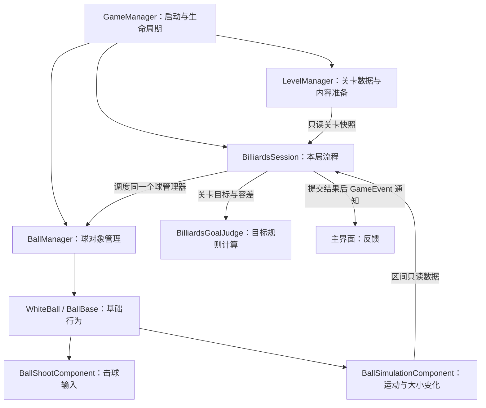

# 数学桌球：架构评审与目标判定职责设计

日期：2026-10-06 · 版本：v0.3 · 任务等级：L4 · 状态：设计建议，未实施

关联：[小球核心逻辑分步设计](../功能开发/数学桌球-小球核心逻辑分步设计.md)、[第五步：内切与外接判定](../功能开发/数学桌球-代码实现方案/05-第五步-内切与外接判定.md)、[玩法说明](数学桌球DEMO-v0.2/07-玩法说明.md)。

## 1. 评审结论

目前的“球管理器 + 球基类 + 具体球子类 + 功能组件”适合本项目。瞄准、蓄力与出杆归为击球组件，运动与大小变化归为模拟组件，初始化、显示、位置与大小同步、复位留在球基类，均可以保留。

需要调整的是目标判定归属：**内切、外接是关卡达成条件，建议从球组件中移出，成为独立的规则计算对象，由本局流程调用。** 先前建议的 `BallTargetComponent` 能支撑单球演示，但会让球知道三角形目标、关卡容差与成功规则。后续更换目标或增加球时，容易重复配置规则和重复结算。

球的碰撞接触、自身运动是否结束等事实可以由球提供；“这个事实是否意味着本局成功、失败、扣杆或复位”属于本局规则。不能因为判定读取球心和半径，就把所有判定都放在球中。

本次只更新文档。桌面、击球、运动和大小变化已完成这一进度来自用户陈述；本次没有验证其运行状态，也不要求为此重写已经完成的实现。

2026-10-06 补充：按用户要求增加独立 `LevelManager` 管理关卡数据与内容准备，见[关卡管理器设计](数学桌球-关卡管理器设计.md)。当前先补最小关卡数据管理，再进入静态目标判定。

## 2. GitHub 源码参考与取舍

本次查阅以下项目的公开源码。链接指向实际文件，分支内容可能继续变化；查阅日期为 2026-10-05。以下观察只针对所列文件，不把项目全部代码视为某项原则的完美实现。

### 2.1 OpenRA：对象能力与玩家胜负条件分别组织

[OpenRA](https://github.com/OpenRA/OpenRA) 是实际可游玩的开源 RTS 项目。其 [Mobile.cs](https://github.com/OpenRA/OpenRA/blob/bleed/OpenRA.Mods.Common/Traits/Mobile.cs) 表达移动能力；[ConquestVictoryConditions.cs](https://github.com/OpenRA/OpenRA/blob/bleed/OpenRA.Mods.Common/Traits/Player/ConquestVictoryConditions.cs) 明确位于玩家系统 Actor，检查玩家及对手状态，并调用任务目标的完成或失败方法；[MissionObjectives.cs](https://github.com/OpenRA/OpenRA/blob/bleed/OpenRA.Mods.Common/Traits/Player/MissionObjectives.cs) 保存任务目标状态。

本项目借鉴：球的模拟能力与关卡达成规则分别组织。OpenRA 的玩家系统 Actor 本身也使用 Trait，因此借鉴的是职责归属，不能推导成“规则永远不能使用组件”。不引入它的完整 Trait 系统、地图规则格式或多人同步机制。

### 2.2 Daggerfall Unity：任务执行有独立系统

[Daggerfall Unity](https://github.com/Interkarma/daggerfall-unity) 是实际发布的 Unity 开源游戏重制项目。[QuestMachine.cs](https://github.com/Interkarma/daggerfall-unity/blob/master/Assets/Scripts/Game/Questing/QuestMachine.cs) 持有任务集合、注册任务动作并调度任务执行，任务流程有独立归属。

本项目借鉴：关卡目标和流程不应散落在每颗球中。该文件也承担大量工作并使用单例，不能照搬其体量、全局访问或任务脚本系统；数学桌球当前只需要一个小型本局对象和目标判定器。

### 2.3 Boss Room：角色状态变化与整局结算分开

[Boss Room](https://github.com/Unity-Technologies/com.unity.multiplayer.samples.coop) 是 Unity 官方多人合作游戏示例，不等同于商业游戏的通用架构标准。[ServerBossRoomState.cs](https://github.com/Unity-Technologies/com.unity.multiplayer.samples.coop/blob/main/Assets/Scripts/Gameplay/GameState/ServerBossRoomState.cs) 订阅角色生命状态变化，判断所有玩家倒下或 Boss 死亡，写入胜负状态并进入结算场景。

本项目借鉴：球提供运动事实，本局流程解释结果并驱动结算。只采用这一职责划分，不移植联网、依赖注入容器、Coroutine 或场景结算实现；本项目仍遵守 TEngine 和 UniTask 规范。

### 2.4 Chop Chop：结果通知通过事件解耦

[Chop Chop 的 VoidEventChannelSO.cs](https://github.com/UnityTechnologies/open-project-1/blob/main/UOP1_Project/Assets/Scripts/Events/ScriptableObjects/VoidEventChannelSO.cs) 使用事件通道发布通知。[项目 README](https://github.com/UnityTechnologies/open-project-1/blob/main/README.md) 明确说明自 2021 年 12 月起停止开发，因此这里只作历史架构示例。

本项目借鉴：已提交的成功结果通知界面，与规则计算分开。使用已有 `GameEvent` 和窗口的 `AddUIEvent`，不建立第二套 ScriptableObject 事件系统。

**由这些源码观察得到的项目建议**：把对象能力、关卡规则、本局流程、显示反馈分开；保留当前项目必要的几个类即可。独立纯逻辑判定器是根据本项目的几何规则作出的设计选择，并非上述项目共同使用了同名架构。

## 3. 推荐职责划分

| 对象 | 负责什么 | 边界 |
|---|---|---|
| `GameManager` | 开始游戏、菜单与主界面切换、组织关卡管理器、球管理器与本局对象的生命周期 | 不写几何公式，不累积每颗球的模拟时间 |
| `LevelManager` | 读取、校验关卡数据，维护当前关卡，组织桌面与目标的准备和卸载 | 不计算目标达成，不管理球运动，不保存本局胜负 |
| `BilliardsSession` | 本局状态；接受出杆请求；统一组织模拟、目标查询与结果提交 | 不计算运动公式，不直接操作 UI 节点 |
| `BallManager` | 球集合、当前白球、注册、初始化、复位、释放；转交对球的调度命令 | 不判断整局成功，不拥有另一套结算状态 |
| `BallBase` / `WhiteBall` | 身份、基础状态、初始化、显示同步、复位和组件生命周期 | 不读取三角形规则，不直接调用全局结算 |
| `BallShootComponent` | 瞄准、蓄力、取消，生成方向和力量请求 | 不自己许可出杆或扣杆，不计算轨迹 |
| `BallSimulationComponent` | 同一模拟时刻的位置、速度、半径；准备区间、查询状态、提交状态与停止 | 不持有关卡目标，不调用目标规则或 UI |
| `BilliardsGoalJudge` | 读取目标几何与球状态/轨迹，返回是否达成、类型及最早时刻 | 不改球，不停球，不结算，不继承 `BallComponentBase` |
| 关卡数据与目标显示 | 使用 LevelManager 准备的同一份三角形几何、容差和可玩范围；显示目标 | 图像尺寸不反向决定逻辑几何 |
| 主界面 | 展示状态和成功类型，发出操作意图 | 不决定成功，不修改球的逻辑状态 |

`BilliardsSession` 与 `BilliardsGoalJudge` 都建议使用普通 C# 对象，由 `GameManager` 创建本局上下文、注入已准备好的依赖并清理。保留此前 `GameManager` 持有本局 `BallManager` 的约定；同一个实例交给 Session 使用，Session 调度，GameManager 负责最终释放。禁止重复创建、重复释放或两个对象同时逐帧驱动球。

旧实施总目录已有 `BilliardsSession` 的规划，实际工程若已存在则复用。若没有，本步只补最小的出杆许可、模拟协调和成功状态，不提前实现三杆循环、存档、重开系统。`BallManager` 和判定器均不新增单例。

`LevelManager` 同样为 GameManager 持有的普通对象。准备完成后提供只读关卡快照给 Session，Session 将必要几何数据交给 GoalJudge；球只接收自身配置。清理时先停 Session，再清球，最后卸载关卡内容，避免多方重复管理和释放。

## 4. 一次模拟步的协作顺序

判定搬到球外之后，仍要保留连续判定能力。不能先提交帧末状态，再让独立 Update 或延迟通知去寻找已经错过的成功时刻。

1. Session 验证本局允许出杆，确认一次请求；通过 BallManager 启动当前白球模拟。
2. 模拟组件准备 `[t0, t1]` 的只读轨迹数据，位置与半径使用同一时间，暂不修改显示和已提交状态。
3. Session 将轨迹和目标数据交给 GoalJudge，同步查询区间内最早目标达成时刻。
4. Session 比较目标、出界和自然停止的时间。当前沿用出界优先于同刻成功、成功优先于同刻自然停止的规则；未来加入道具时再扩展事件排序。
5. 没有提前事件，提交区间末状态；达成目标，命令模拟组件提交命中时刻的状态并停止，BallBase 同步显示。
6. Session 保存成功状态与唯一结果、关闭继续出杆的许可，然后发送一次跨模块结果通知，主界面显示成功类型。

上述顺序由同一个游戏循环同步执行。Session、BallManager、球组件是桌球模块内部协作者；区间查询采用方法调用或只读数据传递，跨模块与 UI 通知继续用 `GameEvent`。事件机制本身不一定异步，关键是求解和提交顺序不能由不明确的监听顺序决定。

`BilliardsGoalJudge` 先实现单时刻判定，再增加区间查询。输入只需球心、半径、目标与容差，连续查询增加分段轨迹数据；可以使用项目现有数值类型，但不读取 Transform、Collider、单例或窗口。输出是只读结果，包含目标类型与命中时间；未达成不是一条失败结算通知。

建议方法语义为“判定给定状态”和“查询区间内最早达成”，实际命名与签名待核对已有工程。先使用具体数据对象和明确方法；出现替换模拟实现的实际需求时再抽小接口，不为每个类强制建立接口。

## 5. 七大设计原则在本项目中的应用

本文按常见的七项组合使用：SOLID 的五项，加迪米特法则和合成复用原则。它们用于判断职责和依赖，不以类、接口、脚本数量衡量设计质量。

| 原则 | 本项目怎么应用 | 需要避免什么 |
|---|---|---|
| 单一职责 SRP | 球模拟处理本杆状态演进；目标判定处理几何达成；Session 处理流程 | 球同时计算内切、开结算窗口、扣杆、读取存档 |
| 开闭原则 OCP | 目标算法集中在规则边界；增加目标类型不修改球的运动公式 | 提前为未知规则搭一套注册、反射和插件框架 |
| 里氏替换 LSP | 新球子类遵守 BallBase 的状态、初始化、复位与释放约定 | 子类把复位变成通关、改变半径含义、偷偷增加全局副作用 |
| 依赖倒置 DIP | 规则依赖几何和轨迹数据契约；流程用明确的输入输出协调 | 判定器依赖具体 Prefab、Transform 层级、UI 或全局管理器 |
| 接口隔离 ISP | 查询目标只需要只读位置、半径和时间；不获得球的所有操作权限 | 一个接口包含瞄准、资源加载、存档、结算等所有能力 |
| 迪米特法则 LoD | UI 只读取本局快照和发送意图；组件只知道直接协作者 | UI 穿过管理器、球、组件列表去修改模拟字段 |
| 合成复用原则 | 能力通过 BallComponentBase 组合，球子类只表达实际类型差异 | 为每种力量、大小趋势或关卡目标增加球子类 |

SRP 按变化原因和职责判断，不要求“一个类只能有一个方法”。运动和半径变化共用模拟时间，归在同一个 `BallSimulationComponent` 合理；内部可以继续用方法组织。BallBase 保留用户确定的基础行为也合理，实际出现多种显示实现时才考虑拆显示适配。

DIP 不等同于“每个类必须有一个接口”。稳定的只读几何/轨迹数据也能隔开规则与场景实现。LSP 不等同于“语法上继承成功”；子类必须遵守基类对外行为契约。

原则来源补充：[Microsoft 架构原则](https://learn.microsoft.com/en-us/dotnet/architecture/modern-web-apps-azure/architectural-principles) 解释关注点分离、封装与依赖倒置；[Northeastern University 的 Law of Demeter](https://www2.ccs.neu.edu/research/demeter/demeter-method/LawOfDemeter/general-formulation.html) 解释有限知识与直接协作者。表中的游戏应用是本项目的设计推导。

## 6. 常用模式怎么选择

| 模式或组织方式 | 本项目建议 | 当前程度 |
|---|---|---|
| 对象组合 / 组件化 | BallBase 组合击球和模拟能力 | 保留已定结构 |
| 策略模式 Strategy | 后续不同关卡有不同目标规则时替换判定策略 | 当前一个 GoalJudge 内包含内切/外接方法即可；无需立即拆两种策略类 |
| 状态机 State | Session 明确待机、出杆准备、滚动、成功等合法转换 | 先用枚举和集中转换；不强制每个状态独立脚本 |
| 观察者 Observer | 已提交的结果通过 GameEvent 通知 UI；窗口生命周期清理监听 | 采用项目已有机制；不广播每次数学求值 |
| 单例 Singleton | GameManager 复用已有 Singleton 基类 | 保留指定入口；其他本局对象通过持有和注入协作 |
| 模板方法 Template Method | BallBase 统一初始化、复位和释放顺序，子类提供有限扩展点 | 保持浅继承；无需为了套模式重写已有生命周期 |
| 工厂 / 对象池 | 大量球、多类型资源生成或频繁创建销毁时再使用 | 当前一颗白球复位复用同对象，不增加工厂框架或池 |
| 命令 Command | 出杆请求保存确认后的方向、力量等输入 | 当前用请求数据即可；回放、撤销出现时再评估命令对象 |

用户说的“组合模式”在这里采用对象组合和组件化。GoF 的 Composite 模式针对树形的整体与部分提供统一接口，本项目目前没有这类能力树需求，不强行设计组合节点与叶子节点。

状态只保留一份权威数据：Session 的本局状态与模拟组件的本杆时间各有归属；不要让 GameManager、BallManager 和每个组件都保存一份可独立修改的“本局已成功”。UI 显示快照不能反向成为规则状态。

## 7. 对已有设计的最小调整

| 项目 | 本次文档调整 |
|---|---|
| BallManager、BallBase、WhiteBall、BallComponentBase | 保留名称与用户确定的职责 |
| BallShootComponent | 保留瞄准、蓄力、出杆合并方案 |
| BallSimulationComponent | 保留运动与大小变化；设计只读区间查询和显式提交能力 |
| BallTargetComponent | 不再作为目标判定的推荐实现；已有实现若存在，后续先移出公式和目标数据，再减少转接逻辑 |
| BilliardsGoalJudge | 作为关卡规则计算对象，先完成静态内切/外接 |
| BilliardsSession | 复用旧规划的本局协调对象，只逐步补充当前需要的流程 |
| LevelManager | 管理关卡数据读取、校验、当前关卡与关卡显示生命周期，具体见独立设计 |

需要的脚本职责包括 LevelManager、BilliardsGoalJudge 与已有/新建的 BilliardsSession；物理摆放按[当前目录归属约定](数学桌球-脚本目录归属约定.md)：管理器归 Module/对应名称Module，LevelManager 放 Module/LevelModule，判定器和结果放 Core/Rules，本局放 Core/Session，关卡数据与显示放 Core/Level。结果数据和方法按现有代码复用，当前不另建 TargetManager、RuleManager、EventManager 或通用求解服务。

旧九步实施文档是早期规划，不能据其推翻后续已确认的球组件划分。当前结构以本评审、小球分步文档与更新后的第五步为准；未来制作道具、三杆循环时再更新对应步骤。

## 8. 下一步只做目标数据与静态判定

先按关卡管理器文档接管数据读取、校验与提供，复用已有桌面和目标内容，再进入下述静态目标判定阶段。

**当前最小阶段 A：**复用三角形数据和显示，在一个独立 GoalJudge 中完成“给定球心和半径，返回内切、外接或未达成”。不接运动循环，不停球，不发通关事件，不增加正式结算窗口。

验收：精确内切/外接成功；只贴一条边、只包住目标、明显偏离容差失败；非等边三角形与顶点顺序变化正确；无效三角形在初始化时报告配置问题。

A 通过后才制作 B：区间最早时刻查询；B 通过后制作 C：命中时刻提交、停球与一次成功提示。第五步保留完整规则和最终验收要求，但不代表一次实现三个阶段。

## 9. TEngine 适配与验证边界

按项目 tengine-dev 已查询的架构、模块、热更、UI、事件、命名规范，以及本次补充的事件反模式规范编写方案。业务继续放入 HotFix/GameLogic；启动和资源 IO 使用 UniTask；模块访问沿用 GameModule；资源加载配对释放；跨模块结果使用 GameEvent，窗口用 AddUIEvent 监听。

本次查阅 GitHub 源码并核对文档职责、名称与链接，只修改 Markdown 设计文档。没有编写 C#、新增组件、修改 Prefab/场景，也未执行 Unity 编译或运行验证。待实施时先核对用户已完成实现的实际接口，避免按建议名称重复建立现有功能。
