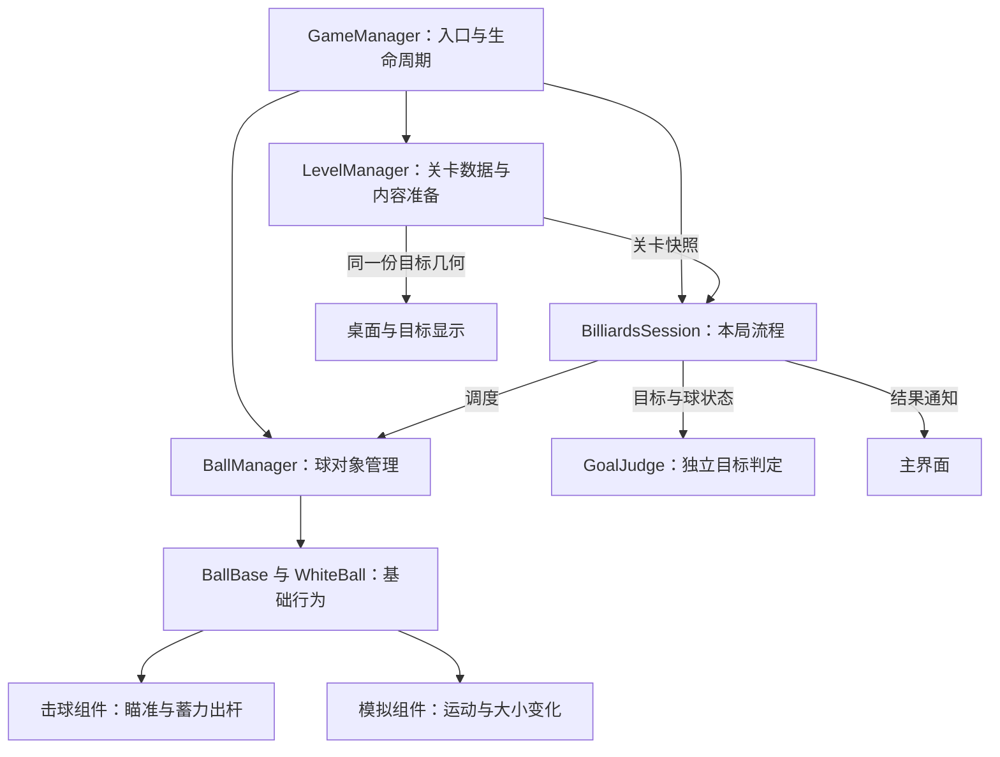
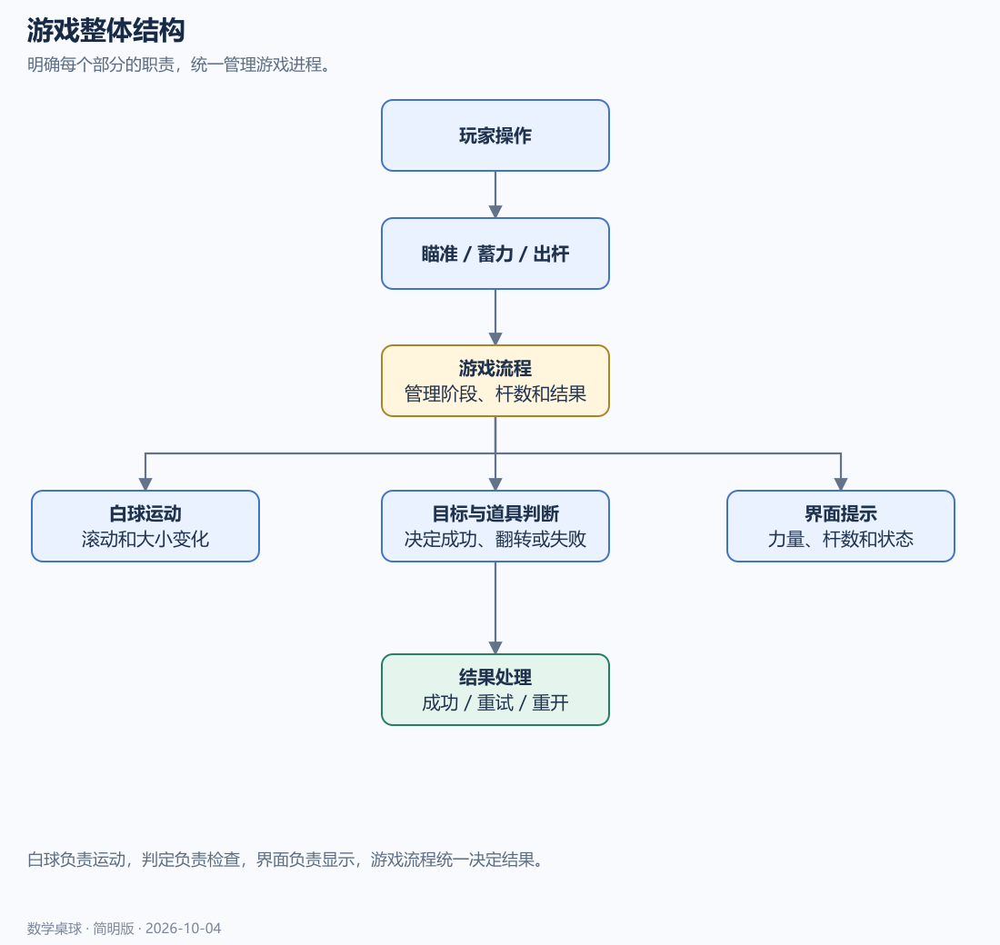
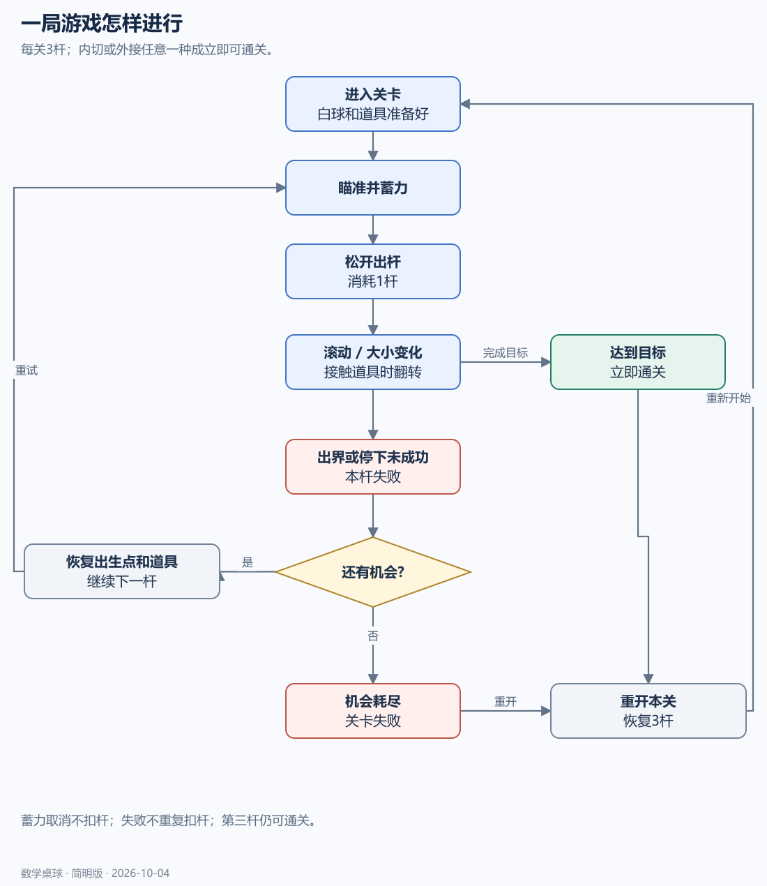
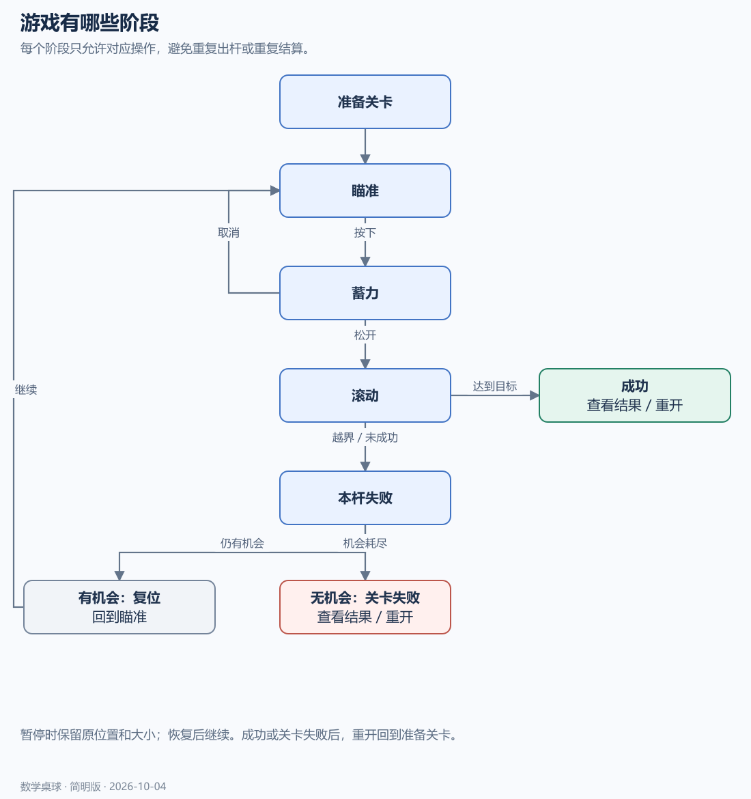
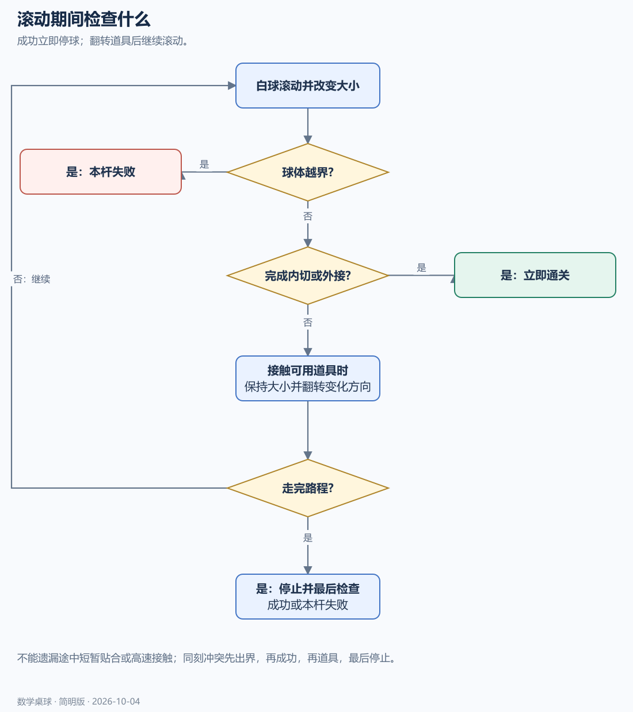
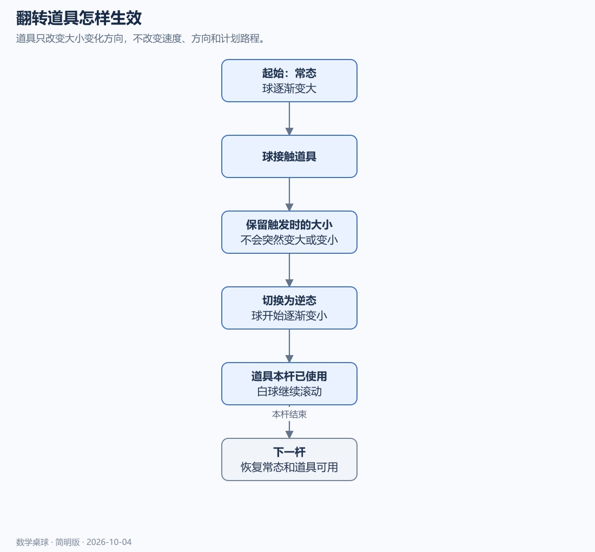
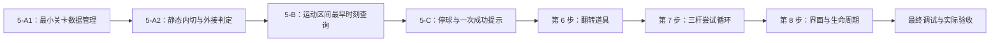
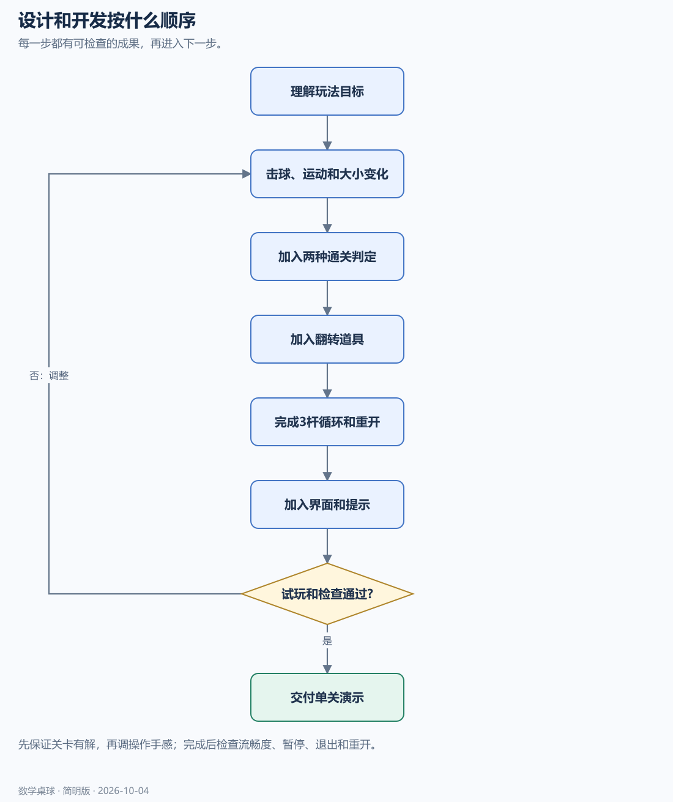
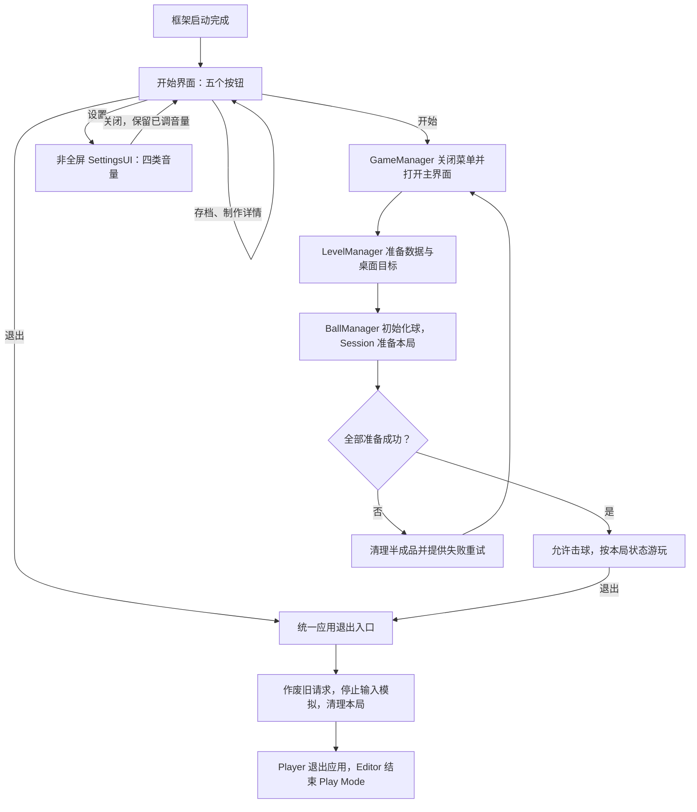

# 数学桌球：流程图（简明版）

> 2026-10-06 最新方案：以[黑球入洞、六洞状态与几何解锁架构方案](../数学桌球-黑球入洞与六洞状态架构方案.md)为当前实施依据。用户已确认：玩家击打白球，碰撞推动黑球；全部黑球入洞才通关；洞固定在四角与两个长边中点，各洞状态为上锁、解锁可用、已进黑球、禁用；每个图形只用一种几何条件，条件用于触发道具或解锁球洞。下文的“完成全部图形通关”“几何达成立即停球”、单白球无黑球及无球洞规则保留为历史记录，已被新方案替代。Prop 架构、反弹与力度虚线预测继续纳入新版。白球犯规等未指定细节仍标为建议。本轮只修改方案文档，未改代码、配置或资源，未运行验证，旧版验收不能证明新版已实现。

更新日期：2026-10-06。下方职责图同步最新设计；原有 PNG/SVG 保留为完整玩法的概念示意。具体规则见[05—程序策划](05-程序向功能策划文档.md)，当前步骤见[文档导航](00-文档导航与设计决策.md)。

本版全部步骤设计已展开，当前文字和 Mermaid 体现最新入口与组件职责。既有概念图片不是脚本目录、已实现状态或退出按钮行为的依据；应用退出以已确认按钮设计及第八步为准。

## 1. 整体结构

当前职责按下图组织。管理器位于 Module/xxModule；关卡数据、球对象、目标计算、本局流程和道具分别在 Core 下分类，具体路径见[目录约定](../数学桌球-脚本目录归属约定.md)。目录分类不改变下图中的职责关系。

以下为完整玩法的概念结构，不用于指定脚本物理位置：

[打开清晰版](流程图/01-整体架构.svg)

## 2. 一局游戏

瞄准、蓄力、出杆；成功则通关，失败则根据剩余机会决定重试或结束。

[打开清晰版](流程图/02-玩家功能流程.svg)

## 3. 游戏状态

每个阶段只接受对应操作，避免滚动中重复击球或结算后继续运动。

[打开清晰版](流程图/03-会话状态.svg)

## 4. 滚动期间的判断

检查出界、目标、道具和停止。道具触发后继续滚动；成功或失败后结束本杆。

[打开清晰版](流程图/04-连续事件处理.svg)

## 5. 翻转道具

保持触发时的球大小，只改变接下来变大或变小的方向。

[打开清晰版](流程图/05-出杆道具时序.svg)

## 6. 设计与开发顺序

先验证基础玩法和可解性，再加入道具、结果和提示，最后试玩验收。

当前第 1～4 步按用户报告已完成。接下来是第 5 步内部的如下顺序，每项通过后才继续：

[打开清晰版](流程图/06-设计开发流程.svg)

## 7. 开始与退出入口

这是后续制作流程；本轮没有搭建 UI、关卡对象或运行游戏。
