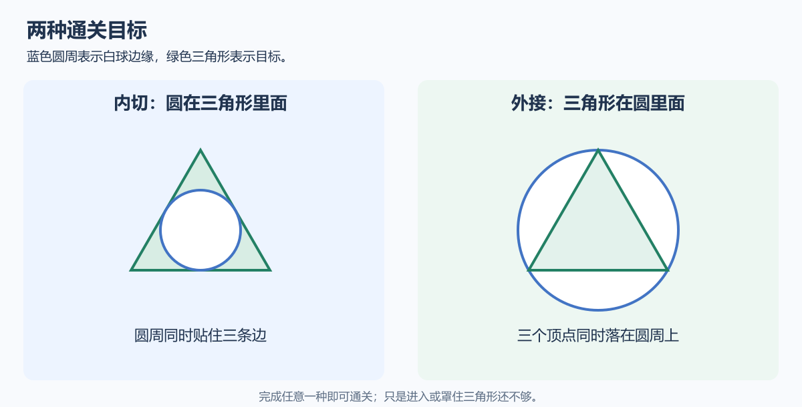

# 数学桌球：玩法说明

> 2026-10-06 最新方案：以[黑球入洞、六洞状态与几何解锁架构方案](../数学桌球-黑球入洞与六洞状态架构方案.md)为当前实施依据。用户已确认：玩家击打白球，碰撞推动黑球；全部黑球入洞才通关；洞固定在四角与两个长边中点，各洞状态为上锁、解锁可用、已进黑球、禁用；每个图形只用一种几何条件，条件用于触发道具或解锁球洞。下文的“完成全部图形通关”“几何达成立即停球”、单白球无黑球及无球洞规则保留为历史记录，已被新方案替代。Prop 架构、反弹与力度虚线预测继续纳入新版。白球犯规等未指定细节仍标为建议。本轮只修改方案文档，未改代码、配置或资源，未运行验证，旧版验收不能证明新版已实现。

## 1. 这是一款什么游戏

数学桌球是一款俯视视角的击球解谜游戏。桌面上有一颗白球、一个三角形和一个翻转道具。玩家调整方向与力量击球，让滚动中的白球在某一时刻变成大小和位置都合适的圆。

画面使用长方形绿毡桌球台面，白球从较远的一侧出发，目标放在另一侧。球杆出杆后，白球在台面上滚向目标，并逐渐减速。台面、球体和目标都是 2D 场景对象；按钮、力量条和状态提示属于 UI。

游戏的核心是：让球在正确的位置，拥有正确的大小。

## 2. 怎样才算通关

有两种通关方式，完成任意一种即可。

**内切：圆在三角形里面。** 白球正好放进三角形，圆周同时贴住三条边。只碰到一条边，或者只是进到三角形里，都不算完成。

**外接：三角形在圆里面。** 白球包住三角形，三个顶点同时落在圆周上。仅仅把三角形罩住，但球太大，也不算完成。

球在滚动途中达成目标就会立即停下并通关，不需要等它自然停住。实际判定允许少量误差，具体宽松程度由试玩决定。

## 3. 玩家怎样操作

| 操作 | 作用 |
|---|---|
| 移动鼠标 | 调整击球方向 |
| 按住左键 | 蓄力，力量逐渐增加 |
| 松开左键 | 按当前力量出杆 |
| 蓄力时右键或取消键 | 放弃本次蓄力，不消耗机会 |

蓄力开始后方向锁定；力量满了会保持，等待玩家松开。白球滚动时不能再次击球。

## 4. 力量会改变什么

力量越大，出球越大，开始滚动的速度也越快。每杆计划路程相同，所以大力完成这段路程用的时间更短，小力用的时间更长。白球会沿直线逐渐减速。

同时，白球在滚动期间会持续改变大小。因此同一个位置，球来得早或晚，大小可能不同。玩家需要调整力量，让球到达目标位置时尺寸正好合适。

成功或出界会提前结束本杆，实际走过的路程可能短于计划路程。

## 5. 翻转道具有什么用

白球开始时处于“常态”，会逐渐变大。接触翻转道具后进入“逆态”，开始逐渐变小。

切换时球保持当前大小，然后慢慢朝相反方向变化。道具不会改变球的运动方向、速度或计划路程。本版只有一个道具，每杆只能触发一次，下一杆恢复可用。

如果球经过目标时已经太大，可以尝试让它先接触道具，在到达目标之前开始缩小。是否能完成，还要看方向、力量和道具接触时机。

## 6. 一次游玩的例子

1. 看清三角形和目标虚线圆，选择想完成内切还是外接。
2. 瞄准目标位置，蓄力后出杆。
3. 观察球在接近目标时是太大、太小，还是位置偏了。
4. 没有成功时，下一杆调整方向或蓄力；需要改变大小趋势时，尝试让球接触道具。
5. 圆周贴合三条边或三个顶点的一刻，立即通关。

目标虚线圆是帮助理解位置和大小的提示，可以隐藏。它不会改变通关条件。

## 7. 失败和机会

每关有3杆，每次有效出杆消耗1杆。球体任何部分越出桌面，或者走完计划路程仍未完成目标，本杆失败。桌面边缘不会让球反弹。

还有机会时，白球回到出生点，恢复变大状态，道具重新可用。机会耗尽则本关失败，可以重开。第三杆只要完成目标，同样可以通关。

## 8. 这一版做到哪里

本版完成一个能反复尝试的单关卡，重点验证方向、力量、大小变化和翻转道具的组合是否有趣、是否容易理解。多关、黑8、钥匙和球袋留到后续版本。
