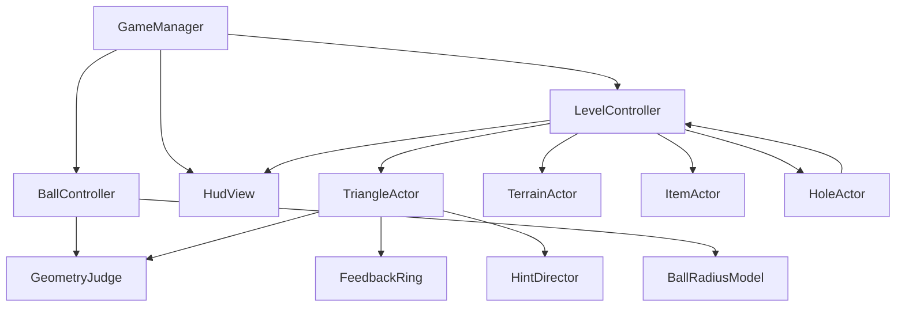

# 数学桌球 DEMO v0.3：整体功能设计架构

> 本文依据 v0.3 策划案整理，描述目标职责，不代表当前工程已经具备这些模块。

## 1. 模块职责

| 模块 | 职责 | 不负责 |
|---|---|---|
| `GameManager` | 入口、关卡生命周期、UI 与本局对象组装 | 几何公式、逐帧球模拟 |
| `LevelController` | 读取关卡快照、杆数、重置、通关判定 | 具体几何计算、资源加载细节 |
| `BallController` | 白球和黑 8 的运动状态、速度、半径、碰撞响应 | 整局胜负结算 |
| `BallRadiusModel` | 根据力量、趋势和道具计算 `r(t)` | 位置、UI、碰撞结果 |
| `GeometryJudge` | 内切/外接目标半径与接触判定 | 停球、发奖、修改场景 |
| `TriangleActor` | 三角形几何数据、接触入口、奖励和销毁 | 维护全局杆数 |
| `TerrainActor` | 地形公共触发接口；跳台、隧道、地陷、反向带、传送口实现效果 | 关卡结算 |
| `ItemActor` | 道具拾取并派发效果 | 自行决定关卡胜负 |
| `HoleActor` | 洞状态、钥匙绑定、黑 8 入洞提交 | 生成钥匙或修改杆数 |
| `FeedbackRing` | 未命中后的同心目标环显示和淡出 | 决定命中与否 |
| `HintDirector` | 按三角形失败次数调度预亮 | 改变判定容差 |
| `HudView` | 力量条、杆数、持续效果、洞态和提示显示 | 写入运行规则 |

## 2. 依赖方向

几何计算只接收只读几何和球状态；它不读取 `Transform`、Prefab、UI 或全局单例。`LevelController` 统一持有本局状态，避免 UI、球对象和三角形分别维护杆数与胜负状态。

## 3. 一杆内的协作

1. `HudView` 提交方向和力量，`LevelController` 确认当前允许出杆。
2. `BallRadiusModel` 计算本杆初始半径、基础变化速率和初速度。
3. `BallController` 在固定步中推进位置、速度、半径和地形状态。
4. 接触事件按统一时序交给地形、三角形和洞处理；腾空状态会跳过地面三角形。
5. `GeometryJudge` 返回目标半径是否在容差内，`TriangleActor` 决定通过或弹开。
6. `LevelController` 结算停球、奖励、杆数、入洞和通关；`HudView` 只展示结果。

## 4. 数据与运行状态

配置数据保存布局、几何预计算值、奖励、洞绑定、道具和地形参数。运行状态保存当前半径、速度、趋势、剩余杆数、失败计数、洞态和道具时效。配置快照只读，重置全关重新从初始快照创建运行状态。

这套拆分遵循单一职责、依赖倒置和组合复用：新增地形或道具优先增加数据和局部行为，不把它们塞入球类或 UI；只有出现多套目标算法时再把 `GeometryJudge` 抽成策略集合。
