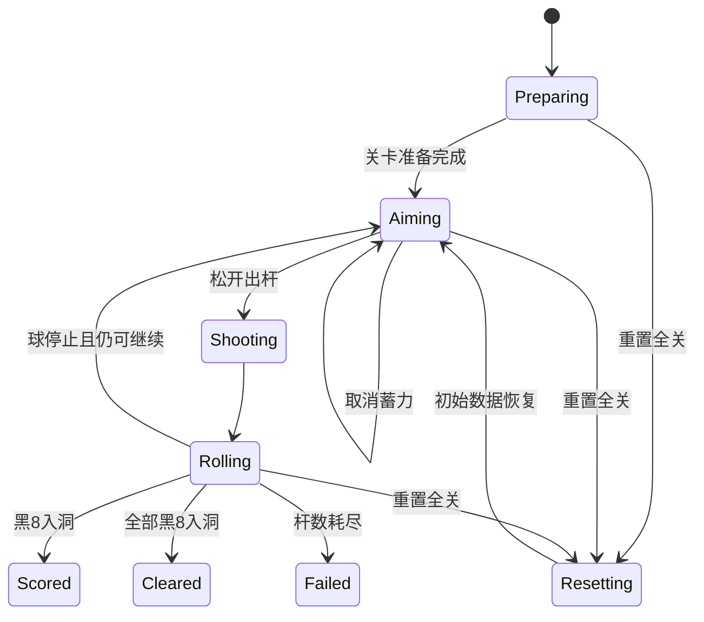

# 数学桌球 DEMO v0.3：功能流程与状态规则

## 1. 一局流程

1. `LevelController` 加载初始数据，创建白球、黑 8、三角形、洞、道具和地形。
2. 显示初始杆数、洞态和持续效果，等待玩家瞄准。
3. 玩家拉动底部力量条并出杆；本杆记录 `P`、方向、`R0`、`K` 和速度。
4. 固定步推进球运动和半径演化；地形、三角形和洞按接触时序处理。
5. 球停止、成功命中或黑 8 入洞后结算本杆，恢复下一杆输入。
6. 杆数耗尽且未通关时失败；玩家也可以随时用单键重置全关。

## 2. 状态

## 3. 三角形接触

| 条件 | 处理 |
|---|---|
| 白球处于跳台腾空 | 不与地面三角形碰撞 |
| `Min(abs(R-InRadius), abs(R-CircumRadius)) <= eps` | 球立即停下，发放奖励，三角形消失，失败计数清零 |
| 未通过 | 三角形作为障碍弹开，显示同心目标环，失败计数增加 |

目标环的半径取更接近当前半径的内切半径或外接半径；环在球外表示目标半径更大，环在球内表示目标半径更小，环带宽度表达差距。

## 4. 事件顺序

同一固定步出现多个事件时使用以下顺序：

1. 确认对象是否仍属于当前关卡以及球是否处于腾空状态。
2. 处理地形接触：跳台、隧道、地陷、反向带、传送口。
3. 处理三角形接触和几何判定。
4. 处理道具拾取和持续效果。
5. 处理洞口接触与黑 8 入洞。
6. 结算停球、杆数和通关。

成功、失败和重置都只能提交一次。重置后旧的反馈环、预亮计数、迟到回调和持续效果全部失效。

## 5. 道具和地形规则

- 状态逆转改变演化方向；冻结只对一杆生效；复原立即回到 `BaseR`；疾变使本杆变化速率变为 `2K`。
- 显影显示本关三角形的内切圆和外接圆；预演只在下一杆瞄准阶段显示轨迹与半径曲线。
- 加杆增加杆数；钥匙解锁绑定洞。所有道具拾取即生效。
- 跳台按入射方向起飞，隧道比较球径和口径，地陷进入陷住状态，反向带反转方向，传送口从配对出口保速保向射出。

## 6. 重置全关

重置不扣杆、不依赖当前球是否停止，并重新载入初始布局、洞态、钥匙、三角形、道具、地形和杆数。它是局部死局的统一脱困入口；悔棋不再存在。
