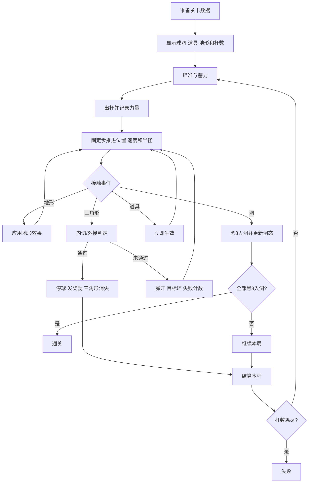
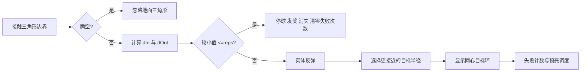
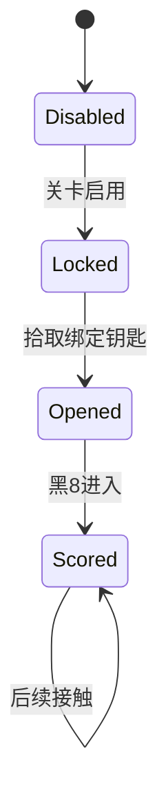
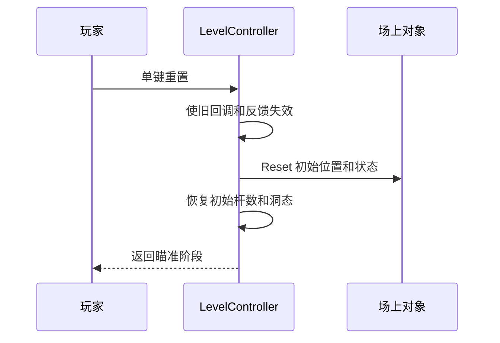

# 数学桌球 DEMO v0.3：流程图集

## 1. 一局总流程

```mermaid
flowchart TD
    A[准备关卡数据] --> B[显示球洞 道具 地形和杆数]
    B --> C[瞄准与蓄力]
    C --> D[出杆并记录力量]
    D --> E[固定步推进位置 速度和半径]
    E --> F{接触事件}
    F -->|地形| G[应用地形效果]
    F -->|三角形| H[内切/外接判定]
    F -->|道具| I[立即生效]
    F -->|洞| J[黑8入洞并更新洞态]
    G --> E
    I --> E
    H -->|通过| K[停球 发奖励 三角形消失]
    H -->|未通过| L[弹开 目标环 失败计数]
    L --> E
    J --> M{全部黑8入洞?}
    M -->|是| N[通关]
    M -->|否| O[继续本局]
    K --> P[结算本杆]
    O --> P
    P --> Q{杆数耗尽?}
    Q -->|否| C
    Q -->|是| R[失败]
```

## 2. 三角形判定

```mermaid
flowchart LR
    A[接触三角形边界] --> B{腾空?}
    B -->|是| C[忽略地面三角形]
    B -->|否| D[计算 dIn 与 dOut]
    D --> E{较小值 <= eps?}
    E -->|是| F[停球 发奖 消失 清零失败次数]
    E -->|否| G[实体反弹]
    G --> H[选择更接近的目标半径]
    H --> I[显示同心目标环]
    I --> J[失败计数与预亮调度]
```

## 3. 洞态和钥匙

```mermaid
stateDiagram-v2
    [*] --> Disabled
    Disabled --> Locked: 关卡启用
    Locked --> Opened: 拾取绑定钥匙
    Opened --> Scored: 黑8进入
    Scored --> Scored: 后续接触
```

## 4. 重置全关

```mermaid
sequenceDiagram
    participant Player as 玩家
    participant Level as LevelController
    participant Actors as 场上对象
    Player->>Level: 单键重置
    Level->>Level: 使旧回调和反馈失效
    Level->>Actors: Reset 初始位置和状态
    Level->>Level: 恢复初始杆数和洞态
    Level-->>Player: 返回瞄准阶段
```
